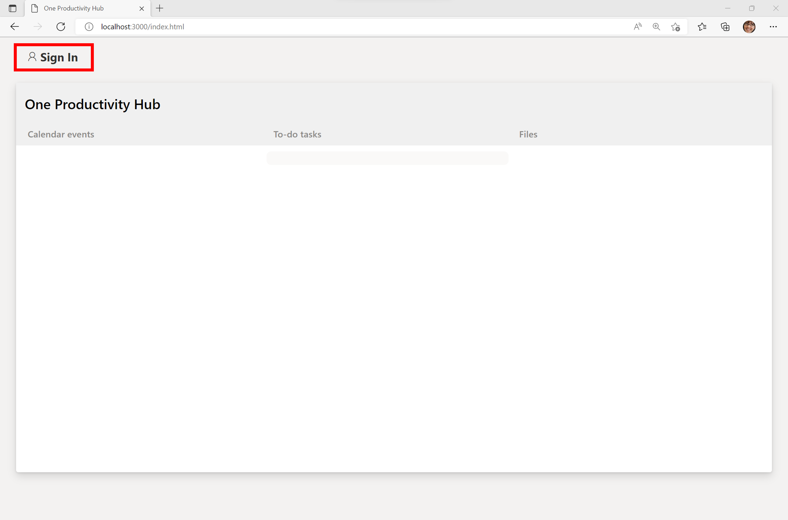
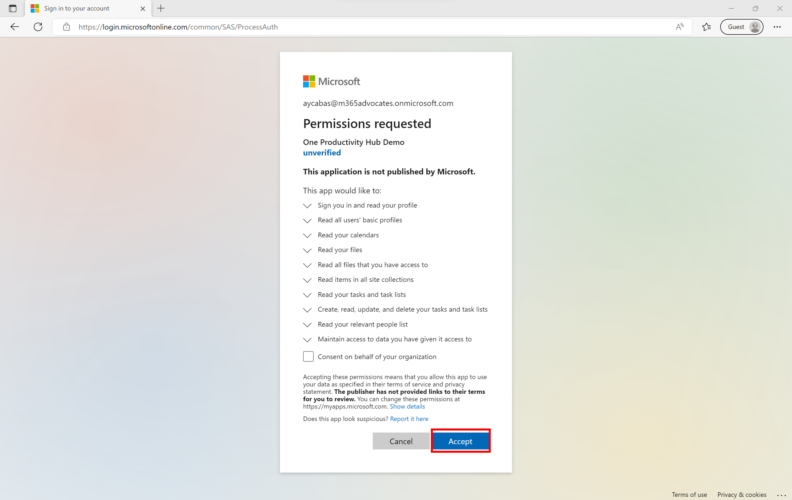

In this step, you will build and run the sample. This code sample be initialized by Live Server and One Productivity Hub page will pop up in your browser.

1. Select `CTRL + SHIFT + P` to open the panel in Visual Studio Code, type and choose `Live Server: Open with Live Server`. Live Server will run the app in your browser.

1. Select **Sign in** and use your Microsoft 365 Developer Program tenant to login.

    

1. Consent the required permissions to use the application features such as viewing calendar events,to-do tasks and file folders.

    

1. To make sure that One Productivity Hub app works properly, add some calendar events, to-do tasks and file folders in your M365 Developer tenant account.

    
