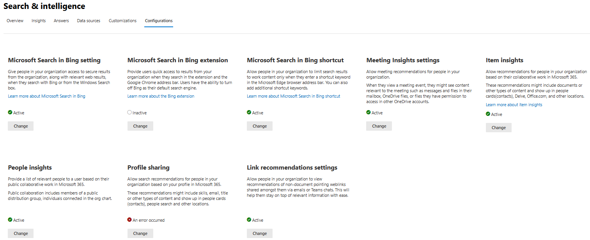
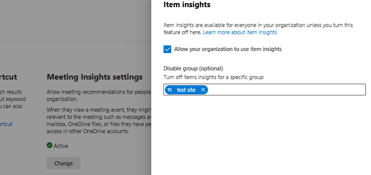

# Customize item insights privacy in Microsoft Graph

Item insights are relationships that Microsoft calculates using advanced machine learning techniques. When users collaborate over documents, SharePoint sites and lists, Teams chats and channels, Microsoft aggregates these activities as signals. From these signals, Microsoft derives insights to make user-centric content recommendations for users in an organization.

Item insights can help users quickly find files that matter to them, such as in the **Recommended** experience in Microsoft365.com. Users can see potentially useful content to which they have access but might not have seen before in the **Discover** area in Outlook Mobile or the **Recent** section under a name in Bing. Users can easily discover their recent files from personalized insights such as **Recent files** in a persona card in Bing and **Recent** in Microsoft 365 apps.

These item insights reflect only content to which users have access. No user gets recommendations to content that they can't access.

> [!NOTE]
> This article does not address other insight-based experiences in Microsoft 365, such as Viva Insights, the Insights add-in for Outlook, WorkWith feature, MyAnalytics, and Insights dashboard.

## Item insights privacy

Item insights privacy settings configure the visibility of insights derived from Microsoft Graph between users and other items (such as documents or sites) in Microsoft 365.

There are a few ways to customize users' item insights privacy settings:

- A user can view or update one's own settings, in two ways:
  - [MyAccount, under Settings & Privacy](https://myaccount.microsoft.com/settingsandprivacy/privacy).
  - Microsoft Graph REST API - [reading](/graph/api/usersettings-get?view=graph-rest-1.0&preserve-view=true) or [updating](/graph/api/usersettings-update?view=graph-rest-1.0&preserve-view=true) one's own settings that are exposed through an **itemInsights** navigation property of [userSettings](/graph/api/resources/usersettings?view=graph-rest-1.0&preserve-view=true). These user-centric item insights privacy settings are of the type [userInsightsSettings](/graph/api/resources/userinsightssettings?view=graph-rest-1.0&preserve-view=true).
- An administrator can customize these settings at scale for an organization or a group through one of the following ways:
  - [Microsoft 365 admin center](#configure-item-insights-settings-via-microsoft-365-admin-center)
  - [Microsoft Graph PowerShell SDK](#configure-item-insights-settings-via-powershell)
  - [Microsoft Graph REST API](#configure-item-insights-settings-using-the-rest-api)

The rest of this article describes how an administrator can customize item insights privacy in an organization. 

## Background

At the time of its first release in 2014, Microsot Graph was a backend service for Delve. (Delve was deprecated in December 2024.) They shared a set of privacy controls over both the Office Graph insights and the Delve user experience. Microsoft Graph has since become more independent and powerful, as part of every Microsoft 365 experience and of Microsoft Graph. To offer a coherent Microsoft Graph schema, Microsoft introduced an [itemInsights](/graph/api/resources/iteminsights?view=graph-rest-1.0&preserve-view=true) entity, which inherits all the properties of the pre-existing [officeGraphInsights](/graph/api/resources/officegraphinsights?view=graph-rest-1.0&preserve-view=true) resource, and has kept **officeGraphInsights** around for backward compatibility. The introduction of **itemInsights** also decouples the privacy story for the two independent pieces.

Although existing apps can continue to use **officeGraphInsights**, they should upgrade to **itemInsights** to gain the flexibility to fine-tune item insights in Microsoft Graph.

## How to customize item insights in an organization

Item insights settings provide flexibility for administrators to use Microsoft Entra tools. Administrators can disable item insights for an entire organization, or for only members of a specified Microsoft Entra group. They can configure item insights in the Microsoft 365 admin center, or by using the PowerShell SDK or Microsoft Graph REST API with due permissions. Keep in mind that the _global administrator role_ is required.

The next section describes how to use the admin center to configure item insights settings and is followed by the section about PowerShell cmdlets. If you're using the REST API, skip the next two sections and continue with [Configure item insights settings using the REST API](#configure-item-insights-settings-using-the-rest-api). For more information, see the [read](/graph/api/peopleadminsettings-list-iteminsights?view=graph-rest-1.0&preserve-view=true) or [update](/graph/api/insightssettings-update?view=graph-rest-1.0&preserve-view=true) REST operations.

### Configure item insights settings via Microsoft 365 admin center

An administrator with the _global administrator role_ can tune item insights privacy settings via toggles for an organization or group. To change privacy settings for item insights in the Microsoft 365 admin center, expand **Settings**, select **Search & intelligence**, then select **Configurations**. In the **Item insights** tile, choose **Change**.



Then toggle item insights for your organization, or enable it or disable it for specific groups.



### Configure item insights settings via PowerShell

Confirm the following additional prerequisites. Then you can use the [Microsoft Graph PowerShell SDK](/powershell/microsoftgraph/installation) to set item insights for an entire organization or for specific groups.

#### Additional prerequisites

* **PowerShell module** - Install [module version 0.9.1 or higher](https://www.powershellgallery.com/packages/Microsoft.Graph).
* **.NET Framework** - Install [.NET Framework 4.7.2](https://dotnet.microsoft.com/download/dotnet-framework) or a higher version.

#### Command examples

To get item insights configuration for an organization, use the Microsoft Graph PowerShell module and the following command, where you replace `$TenantId` with your Microsoft Entra tenant ID. You can retrieve this ID from the overview page of your Microsoft Entra ID.

```powershell
   Get-MgOrganizationSettingItemInsight -OrganizationId $TenantId
```

By default, item insights are enabled for the entire organization. You can use the Microsoft Graph PowerShell module to change that and disable item insights for everyone in the organization.

> [!NOTE]
> The update method requires additional `User.ReadWrite.All` permissions. To create a Microsoft Graph session with a specific required scope, use the following command and consent to requested permissions.
> ```powershell
>    Connect-MgGraph -Scopes "User.Read.All","User.ReadWrite.All"
> ```

Use the following command, where you replace `$TenantId` with your Microsoft Entra tenant ID and specify `-IsEnabledInOrganization` as `false`.

```powershell
   Update-MgOrganizationSettingItemInsight -OrganizationId $TenantId -IsEnabledInOrganization:$false
```

Alternatively, you can change the default and disable item insights for a specific Microsoft Entra group. Use the following command, where you replace `$TenantId` with your Microsoft Entra tenant ID, and `$GroupID` with the Microsoft Entra group ID.

```powershell
   Update-MgOrganizationSettingItemInsight -OrganizationId $TenantId -DisabledForGroup $GroupId
```

### Configure item insights settings using the REST API

Because item insights privacy settings are enabled for the entire organization, they're exposed through a navigation property named **itemInsights** in [peopleAdminSettings](/graph/api/resources/peopleadminsettings?view=graph-rest-1.0&preserve-view=true). You can change the default in one of two ways:

- Disable item insights for all users in the organization, by setting the **isEnabledInOrganization** property of the [insightsSettings](/graph/api/resources/insightssettings?view=graph-rest-1.0&preserve-view=true) resource to `false`. 
- Disable item insights for a _subset_ of users, by assigning these users in a Microsoft Entra group, and setting the **disabledForGroup** property to the ID of that group. Find out more about [creating a group and adding users as members](/azure/active-directory/fundamentals/active-directory-groups-create-azure-portal). 

Use the [update](/graph/api/insightssettings-update?view=graph-rest-1.0&preserve-view=true) operation to set the **isEnabledInOrganization** and **disabledForGroup** properties accordingly.

| How item insights are enabled | isEnabledInOrganization | disabledForGroup |
|:-------------|:------------|:------------|
| Entire organization (default) | `true` | empty |
| Disabled for a subset of users in the organization | `true` | ID of the Microsoft Entra group that contains the subset of users |
| Disabled for the entire organization | `false` | ignored |

Keep the following points in mind when updating item insights settings:
- Get the ID of a Microsoft Entra group from the Microsoft Entra admin center, and make sure the group exists, because the update operation doesn't check the existence of the group. Specifying a nonexistent group in **disabledForGroup** doesn't disable insights for any users in the organization.
- Regardless of item insights settings, Delve continues to respect Delve tenant and user level [privacy settings](/sharepoint/delve-for-office-365-admins#control-access-to-delve-and-related-features?view=graph-rest-beta&preserve-view=true).


## Behavior changes in UI and APIs
For a full list of experiences affected when disabling item insights, see [Overview of item insights](item-insights-overview.md#disabling-item-insights). 

## Transition period
To accommodate configuring item insights settings, through the end of 2020, Microsoft 365 respects both Delve settings and item insights settings, and enforces the stricter of the two if they differ. This means that a user is considered as opted out of item insights if the user opted out by either Delve controls or item insights settings.

After this transition period, Delve settings controlled only the Delve experience, and item insights settings affect only Microsoft Graph item insights. Make sure to configure item insights according to your organization's requirements. (Delve was deprecated in December 2024.)


> [!NOTE]
> During the transition period, due to technical reasons, the SharePoint start page might provide stale suggestions if an organization disables item insights for all users. This issue will be addressed in upcoming server-side changes. 
