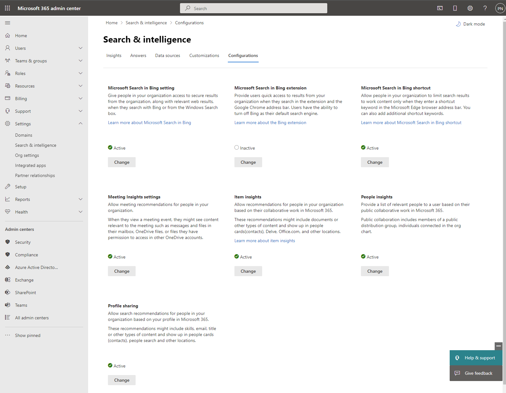
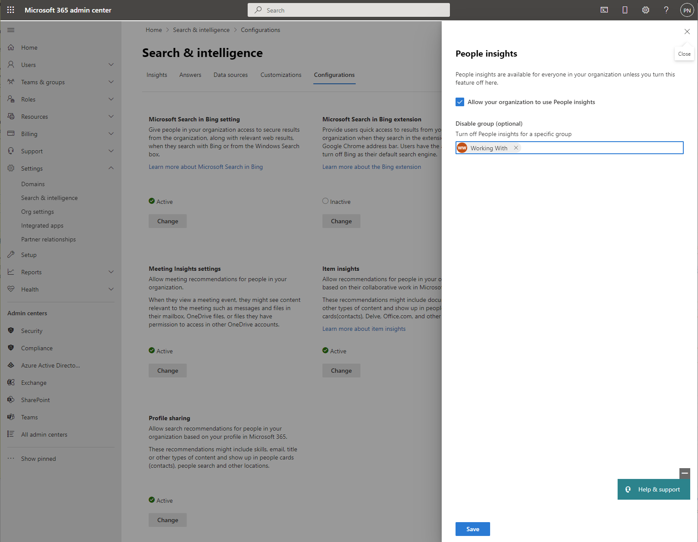

# Customize people insights privacy in Microsoft Graph (preview)

People insights represent connections of people who are [relevant to or working with](people-insights-overview.md#including-a-person-as-relevant-or-working-with) one another within the same organization, based on public relationships between the people. These insights can be displayed in Delve and the profile card, and returned by the [people API](/graph/api/user-list-people).

## Customize people insights for an organization

By default, the display or return of people insights is enabled for an organization. Administrators with the global administrator role can customize this behavior for an organization using REST APIs and the appropriate permissions. They can customize by setting properties of the [insightsSettings](/graph/api/resources/insightssettings?view=graph-rest-beta&preserve-view=true) resource in the following ways:

### Configure people insights via the Microsoft 365 admin center

An administrator with the _global administrator_ role can enable or disable the people insights privacy setting via a toggle. To do so, in the Microsoft 365 admin center, expand **Settings**, select **Search & intelligence**, select **Configurations**, and under **People insights**, choose **Change**.

The **Allow your organization to use People insights** toggle allows you to enable or disable people insights for the whole tenant. Optionally, you can also disable it only for a group of users following the previous steps and searching for a specific group. Choose **Save** to save your settings.

### Configure people insights via REST API

- Disable people insights for all users in the organization, by setting the **isEnabledInOrganization** property of the **insightsSettings** resource to `false`. (By default, the **isEnabledInOrganization** property is `true`.)

- Disable people insights for a subset of users, by assigning these users to an Azure Active Directory (Azure AD) group, and setting the **disabledForGroup** property to the ID of that group. Find out more about [creating a group and adding users as members](/azure/active-directory/fundamentals/active-directory-groups-create-azure-portal). 

Use the [update](/graph/api/insightssettings-update?view=graph-rest-beta&preserve-view=true) operation to set the **isEnabledInOrganization** or **disabledForGroup** properties accordingly for people insights. 

Keep the following in mind when updating item insights settings: 
* People insights settings are available only in the beta endpoint. 
* The update operation doesn’t verify that a group exists. Make sure to get the correct ID of the Azure AD group from the Azure portal, verify that the group exists, and that the intended users have been added to the group. If the group doesn’t exist, no changes will be made for any user in the organization. 
* It can take up to 24 hours or longer for updates to **insightsSettings** to be reflected. 

## Behavior changes in the Microsoft 365 UI and people API 

Disabling people insights means that the data is not generated for a specified user. It doesn’t affect search and ranking of results.

When customizing privacy for people insights, you can observe behavioral changes in the following areas:
* Microsoft 365 [profile card](https://support.microsoft.com/office/profile-cards-in-microsoft-365-e80f931f-5fc4-4a59-ba6e-c1e35a85b501)
* User profile in Delve
* [Listing relevant people](/graph/api/user-list-people)
