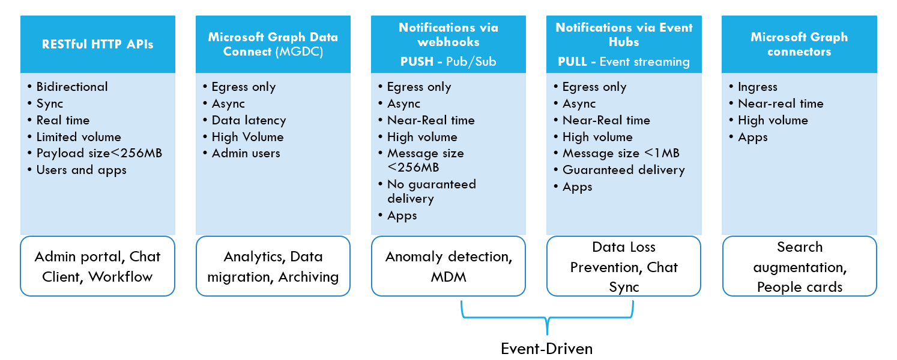
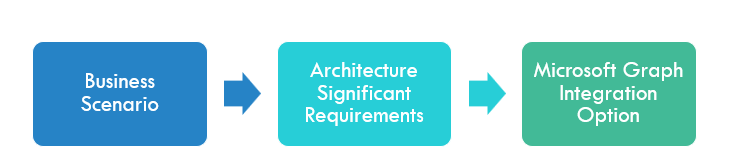

# Common integration patterns with Microsoft Graph

Microsoft Graph is a technology platform that allows organizations to connect their business systems with Microsoft 365 SaaS data and services. Microsoft Graph includes all the options available in modern cloud integration platforms, including interactive APIs, data ingress and egress capabilities, and event-based integration, and includes the following integration options:

- Transactional RESTful HTTP APIs - Provide control and data plane interfaces for various Microsoft 365 SaaS offerings. These APIs support synchronous communication and are granular by nature.  
- Enhanced RESTful HTTP APIs - A subclass of RESTful HTTP APIs that provide extra capabilities for effective data extraction. The enhanced APIs consist of Microsoft Teams APIs that enable specialized operations to retrieve large amounts of data, and  Microsoft SharePoint and Exchange Online APIs, which raise throttling limits for paid apps.
- Microsoft Graph Data Connect - A bulk data export mechanism that follows an ETL (extract, transform & load) pattern, with a data gathering phase that stages data before transferring it in bulk to the customers' provided storage, and serves data with high latency.  
- Event-driven integration APIs - Allows client applications to receive notifications of changes or full object data after an event in the Microsoft 365 ecosystem. This push mechanism is supported by webhooks and doesn’t guarantee message delivery or message order. 
- Event streaming integration APIs - Allows client applications to react to activities in Microsoft 365 at their own pace and guarantees the persistence of immutable event data. Microsoft Graph change notifications with Azure Event Hubs support this pull mechanism. 
- Microsoft Graph connectors - Enable the ingestion of large amounts of customer data into Microsoft 365 storage, which enriches Microsoft Copilot for Microsoft 365, the augmentation loop, and search-based Microsoft 365 experiences. These connectors are available through product-specific connectors, such as Microsoft Graph connector for ServiceNow, or generic-content REST APIs.

The following image shows the Microsoft Graph integration patterns, their associated architectural characteristic, and the types of solutions they map to.

The wide range of integration options can make it difficult to choose the best option for your needs. We recommend that you start with a business scenario and identify your functional and non-functional requirements. Then you can select an integration option based on those requirements.

Based on many known scenarios in the Microsoft Graph ecosystem, the following architecture requirements impact the selection of integration options:

- Integration type - Application integrations involve client applications that depend on both the data and functionality of the Microsoft 365 services; for example, the **sendMail** API accesses user data and also send an email. Data integrations involve applications that produce or consume Microsoft Graph data but don't rely in Microsoft 365 services. All Microsoft Graph integration options support data integration scenarios.
- Direction of data flow - Outbound flow is when customer data leaves the Microsoft Graph compliance boundaries and inbound flow is when customer data enters Microsoft Graph.
- Volume of data - The amount of customer data processed in a critical period, such as a business day.
- Data latency - The time difference between when data is created and when it is extracted.

Use the following decision tree to choose an integration option based on your architecture requirements.

- Application integration requirements - Use Microsoft Graph APIs.
- Data integration scenarios:
  - Outbound flow of Microsoft 365 data:
    - For high data latency and high data volume - Use Data Connect.
    - For high data latency and low data volume - Use Microsoft Graph APIs or notifications
    - For low data latency and high data volume -Use Microsoft Graph notifications via Event Hub.
    - For low data latency and low data volume - Use Microsoft Graph notifications via webhooks.
  - Inbound flow of custom data - Use Microsoft Graph connectors.

Many business scenarios require multiple integration building blocks to implement a solution. For example, Data Loss Prevention (DLP) scenarios might need Microsoft Graph Data Connect for the initial data collection and malicious behavior patterns analysis, and subsequent event streaming integration for near real-time data ingestion and processing to recognize a potential security incident. Choose your integration options based on your constraints and requirements such as complexity, cost, and time to market, to best accelerate your path to value.

To explore each of the integration options in more detail, see the following topics:

- [Analyze Microsoft Graph data in your data storage](./patterns/analyze-storage-data.md)
- [Build interactive apps](./patterns/interactive-applications.md)
- [Build interactive Microsoft Graph apps with real-time feed](./patterns/interactive-app-with-change-notifications-via-webhooks.md) 
- [Get real-time updates for data changes by using Microsoft Graph](./patterns/notifications-in-push-mode.md)
- [Retrieve events at your speed by using Microsoft Graph](./patterns/notifications-in-pull-mode.md)
- [Use Microsoft Graph to augment Microsoft Search with custom data](./patterns/augment-search-experience-with-custom-data.md)

## Related content

- [Azure and Microsoft 365 scenarios](/azure/architecture/solutions/microsoft-365-scenarios)
- [Cloud design patterns](/azure/architecture/patterns/)
  
