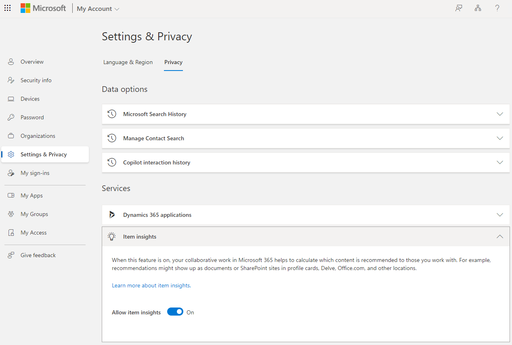
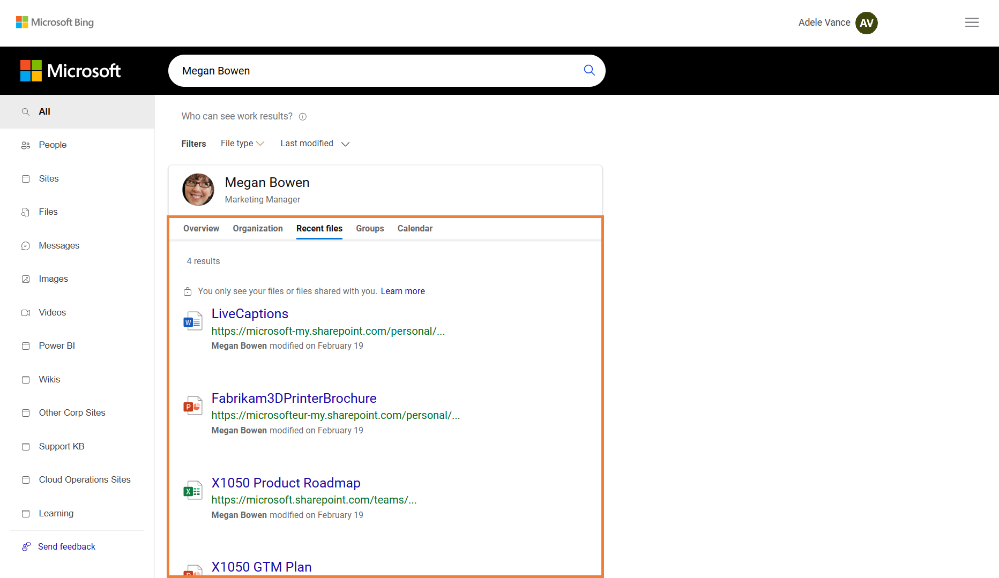
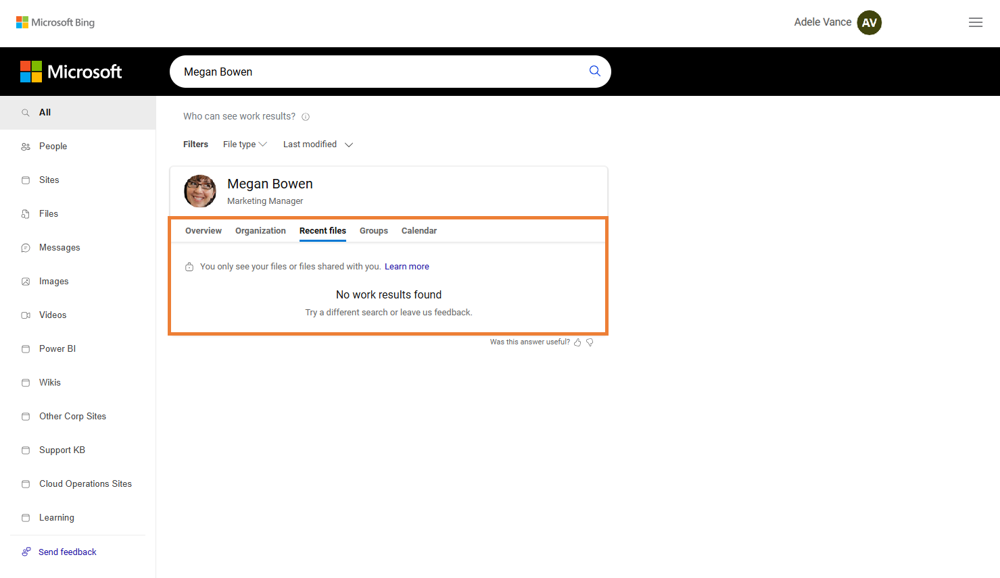

# Item insights overview

Item insights are user-centric recommendations for you and those you work with, based on your collaborative work in Microsoft 365.

> [!VIDEO 9b177941-087d-49f3-8f65-010f423a8fdf]

## Computation of item insights
Microsoft 365 is the world's productivity cloud, where many features are designed around you, the user. By interacting with resources such as files in Microsoft 365, you produce signals that Microsoft aggregates and assembles into a graph for your organization. In Microsoft Graph, the signal data is represented as relationships between you and the other resources. Derived from signals in the graph are insights that power a few Microsoft 365 experiences. Examples of experiences include: suggesting the best time for the next team meeting; helping you sort out personal and work information on your phone; and many other intelligence scenarios. 

What are interactions with Microsoft 365 resources like, and how do item insights result from them? Microsoft 365 lets you collaborate with colleagues in many ways – chatting with colleagues in Teams chats or channel conversations, over documents such as lists in SharePoint, Power BI reports in OneDrive, SharePoint sites, Teams, or Outlook email. Microsoft derives insights from analyzing activities (such as modifying, commenting, or sharing), and applies these insights to empower user-centric experiences with recommendations for users of Microsoft 365. Item insights are a type of insights that Microsoft calculates using advanced machine learning techniques, and applies as content recommendations for you and your colleagues within the organization.

> [!NOTE]
> This article doesn't address other insight-based experiences in Microsoft 365, such as Viva Insights, the Insights add-in for Outlook, WorkWith feature, MyAnalytics, and Insights dashboard. 

## Item insights in Microsoft 365 
Item insights power a few prominent file-based experiences in Microsoft 365.

### Recommended files 
An example of an experience empowered by item insights is the files under **Recommended** in Microsoft365.com. Microsoft Graph gathers signals of those files accessible to you that have ongoing activity, derives item insights from these signals, and applies these insights to recommend files so you can quickly find the ones that matter the most. With item insights, you can quickly get to your most relevant documents.

### Recent files in card-based interfaces
In card-based interfaces such as [the profile cards in Microsoft 365](https://support.microsoft.com/en-us/office/profile-cards-in-microsoft-365-e80f931f-5fc4-4a59-ba6e-c1e35a85b501), item insights bring forward OneDrive, SharePoint, or Outlook files that you have modified recently or shared with the person looking at your profile. The viewer of your profile can only see these items if they can access that content. Such personalized insights help your colleagues save time searching for the right person or information.  

## Microsoft runs on trust
Microsoft uses only your activities in a shared working space (activities such as sharing, modifying, commenting actions) within your organization to calculate recommendations for others. That means, for example, that if you simply glanced at or clicked on a shared document without changing or commenting on it, your colleagues don't see the document as a recommendation.

Microsoft doesn't use your activities from working in a private space to calculate recommendations for others. That means no one can get insights from your private documents.  

Your colleagues can see recommendations built only on content that they already have access to. If Megan collaborates with Adele on writing a document, Megan and Adele can both get recommendations based on this collaborative work. Lynne, who doesn't have access to the document, doesn't see recommendations associated with this file or the collaboration between Megan and Adele. This rule applies to all users in an organization. In our example, that includes Lynne's manager and administrators, who don't see recommendations based on content that they don't have access to.

Mike, a close collaborator of Megan and Adele, who has access to that file, but did not see the file or the latest updates, will get this file as a recommendation, as it might be relevant for their collaboration.

## Disabling item insights
By allowing Microsoft to compute item insights from signals in your shared workspaces, you turn activities and content into usable recommendations, and make this knowledge easily discoverable and usable to you and your colleagues in your organization. By doing so, you're helping to boost the productivity of your entire organization.  

Microsoft never discloses your private documents and only uses insights of content that users already have access to. However, sometimes the risk that unauthorized users could discover the content outweighs the possible benefits. In such cases, consider turning off item insights. Remember that disabling item insights isn't a security measure, and you should always start by reviewing your work patterns and ensure that your security access is configured as intended.

In the previous example with Megan, Adele, Lynne, and Mike, who are top collaborators, once Megan turns off item insights with the toggle and makes changes such as comments or editing of the file, no other colleague will get this file as a recommendation, even though they still have access to it. The only user that gets information about the new updates is Adele, because this file was shared directly with her.

If you want to make your content and activities less discoverable, you can disable item insights by using the [toggle available in MyAccount, under Settings & Privacy](https://myaccount.microsoft.com/settingsandprivacy/privacy).  

### Disable or re-enable item insights 
By default, item insights are enabled. Administrators use specific settings to control item insights. If an administrator disables your item insights, you can re-enable them only by working with the administrator. 
[Learn more about ways for an administrator to control item insights](insights-customize-item-insights-privacy.md).

Updating settings can take up to 48 hours to apply within the user's organization across Microsoft 365 experiences.

After your item insights are disabled, the following happens:
* Microsoft stops using your signals when computing recommendations for others. Your colleagues stop receiving item insights based on activities that you perform in shared workspaces. Your colleagues' insights-based experience becomes less rich in places such as the **Recommended** section of files in Microsoft365.com, as shown in the following example, if you were signed in with the user profile "Mike."

* Your colleagues can still see files that you shared with them from OneDrive for Business and SharePoint in experiences such as [the profile cards in Microsoft 365](https://support.microsoft.com/en-us/office/profile-cards-in-microsoft-365-e80f931f-5fc4-4a59-ba6e-c1e35a85b501). To prevent these places from displaying shared files, remove the sharing permissions on the files.  
* Experiences that show content trending around you are inaccessible to others in places such as the **Recommended** section in Microsoft365.com. The lack of trending insights also reduces your personalized relevance in Microsoft Search since it can't use your trending content as a signal for relevance. When searching for your name in Microsoft 365 experiences, your colleagues can't discover relevant files they have access to in experiences such as the **Recent files** tab under your name in Bing.
* Insights about your file-based activities in collaborative workspaces are no longer shared with others, protecting you from undesirable discovery of your data. On the other hand, your access to experiences showing trending content isn't revoked. You can see the activities and data of users who haven't disabled item insights. For example, in the previous example with Megan, Adele, Lynne, and Mike, even though Megan has turned off item insights, recommendations for all the relevant files updated by Megan's colleagues will still appear in Megan's experiences.

The following example shows the Bing experience that Adele Vance gets when her colleague Megan Bowen enables item insights.

The following example shows the Bing experience that Adele Vance gets when her colleague Megan Bowen disables item insights. 

## API reference

Looking for the API reference for this service?

- [Insights API in Microsoft Graph v1.0](/graph/api/resources/iteminsights?view=graph-rest-1.0&preserve-view=true)
- [Insights API in Microsoft Graph beta](/graph/api/resources/iteminsights?view=graph-rest-beta&preserve-view=true)

## Next steps

- Use the [Graph Explorer](https://developer.microsoft.com/graph/graph-explorer) to try out the insights API with your own files. Sign in, expand **Insights** in the column on the left, and try the sample queries.
- Learn more about [customizing item insights privacy for users](insights-customize-item-insights-privacy.md), and the [insights settings API](/graph/api/resources/insightssettings) that supports the customization.
