# Overview of managed private endpoints in Microsoft Graph Data Connect

The following steps outline how to enable Azure V-net Integration Runtime (IR) to manage private endpoints in Microsoft Graph Data Connect (Data Connect). We recommend customers use Azure Synapse workspaces to enable Azure V-net IR in mapping data flow. Azure Data Factory (Data Factory) is compatible with Azure V-net IR. With Azure V-Net IR, customers no longer need to add public IP addresses to an allow list, and customers can close their destination storage accounts to the public network and instead set up their data extraction over a private virtual network. This helps to ensure that data extraction from Data Connect to the customer's storage account is more secure.

> [!NOTE]
> Managed private endpoints are only supported with Azure V-Net IR. Existing Azure Synapse or Azure Data Factory (ADF) flows with copy activity and Azure public IR require that you add IP addresses to an allow list.

## Enabling Azure V-net IR for Azure Synapse

Use the following steps to enable Azure V-net Integration Runtime (IR) to manage private endpoints in Data Connect:

Step 1. Ensure that you've created a Synapse workspace, then sign in to the Azure portal to configure an existing storage as part of the process.

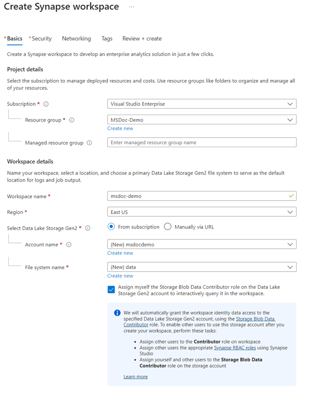

Step 2. On the **Networking** tab, next to **Managed virtual network**, select **Enable**.

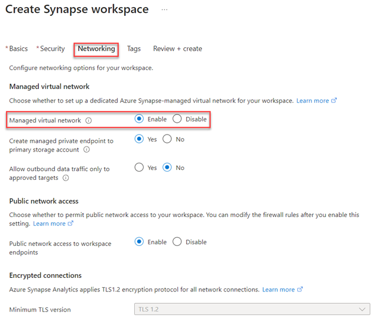

Step 3. Open the Synapse workspace. Go to **Manage** > **Managed private endpoints** and do one of the following:

- If you've added a storage option as part of the Synapse workspace creation, the managed private endpoint connection to storage is already created and in a **Pending** approval state.

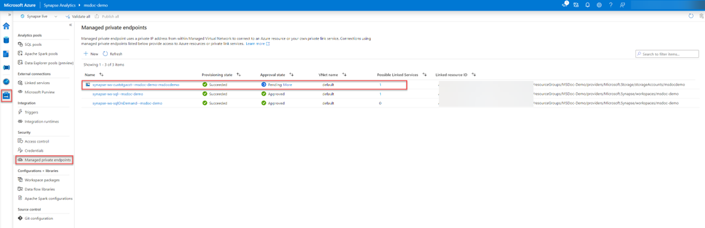

- If you are using existing storage, create a managed private endpoint. Select **New**, choose the storage type, then select **Continue**.

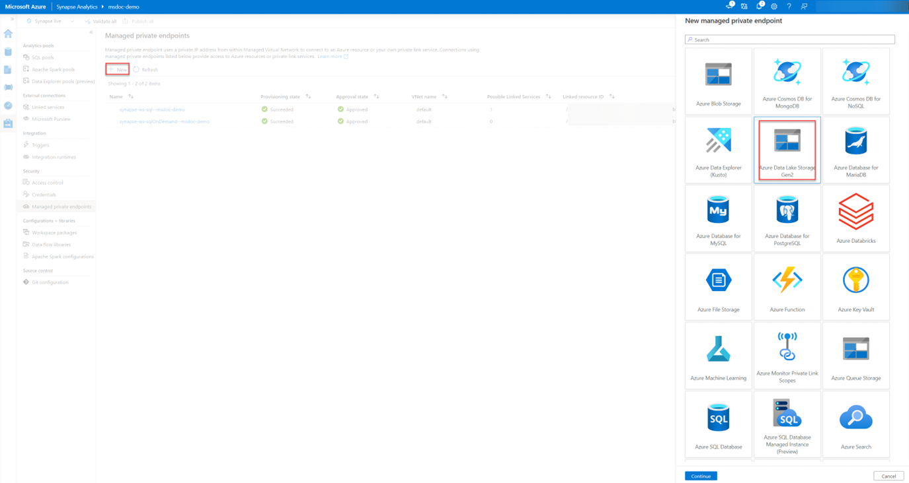

- Provide the connection name and description, specify the storage account, then select **Create**:

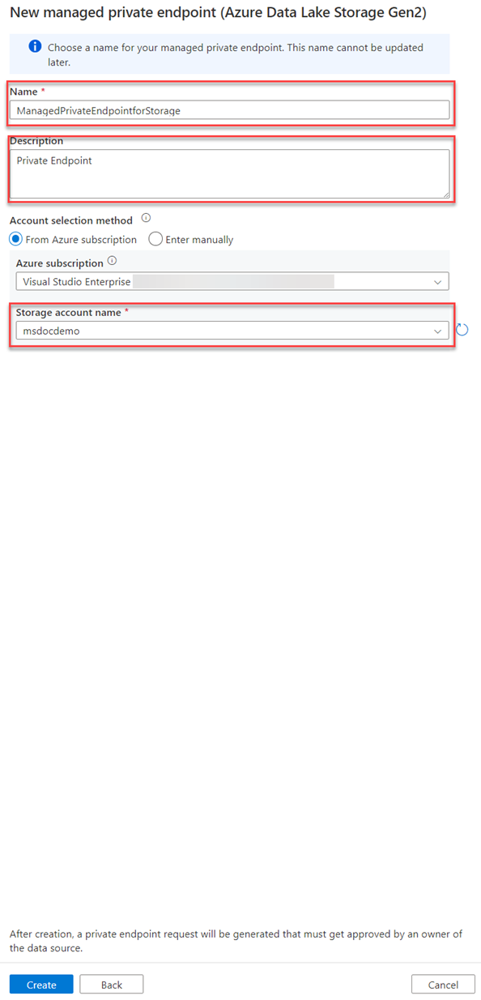

- Note that the initial state will be provisioning of a private IP address from within the Managed Virtual Network.

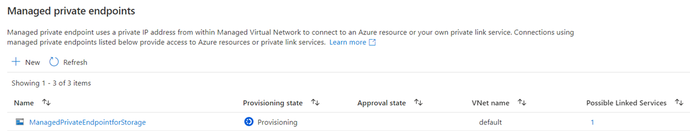

- After the endpoint is successfully provisioned, the approval state is **Pending**. Continue to Step 4 using the created name—rather than the name previously automatically generated in step 3.

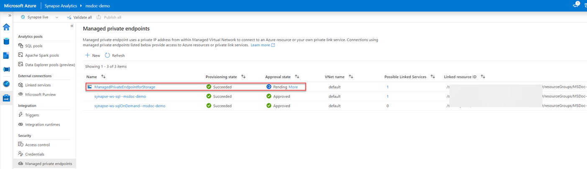

Step 4. Approve the managed private endpoint from the storage account.

- Go to **Storage account** > **Networking** > **Private endpoint connections** to view the private endpoint request in a pending state.

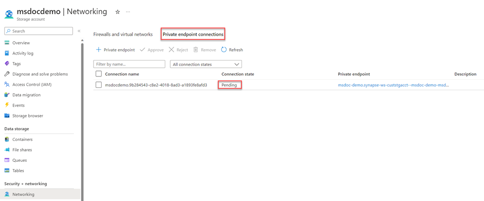

- Select the connection, then select **Approve**:

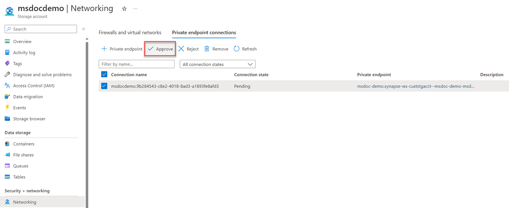

- Provide a description when prompted—and verify that the connection state has changed to **Approved**:

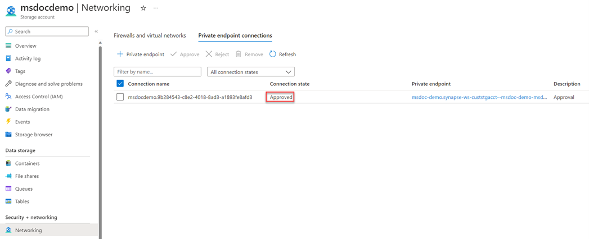

Step 5. In the storage account **Networking blade**, go to **Firewalls and virtual networks**. Under **Public network access**, select **Enabled from selected virtual networks and IP addresses** and configure the network firewall according to your preference. Uncheck **Allow Azure services on the trusted services list to access this storage account**.

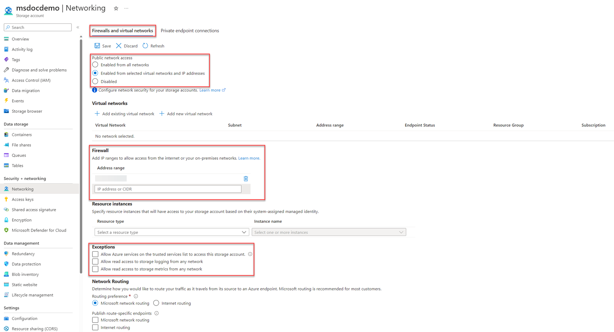

Step 6. Return to the previous Synapse workspace and wait for the managed private endpoint to switch to **Approved**:

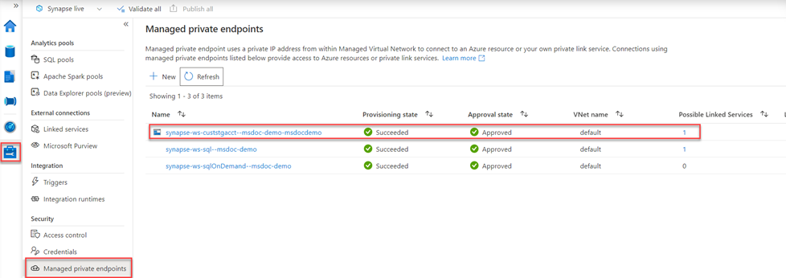

The managed private endpoint shows as successfully created to the desired storage account from Synapse Analytics.

Step 7. Verify that the available integration runtime is configured to **Managed Virtual Network** (configured by default).

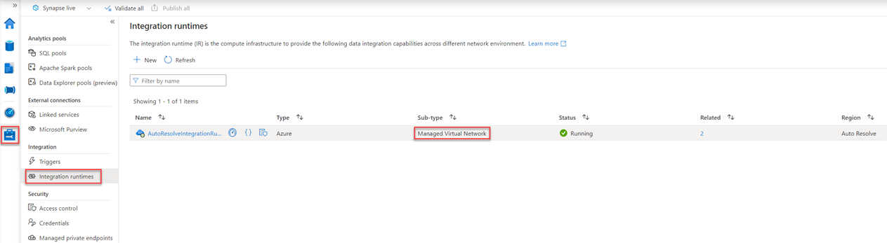
