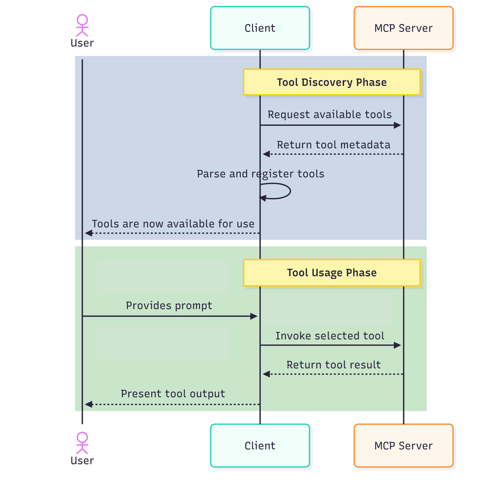

# Overview of Microsoft Graph MCP Server (preview)

Microsoft Graph MCP Server is the official programmatic interface for AI agents and Copilots to interact with Microsoft Graph by using natural language. It implements the [Model Context Protocol (MCP)](https://modelcontextprotocol.io/), translates user questions or commands into Microsoft Graph API calls, and gets responses in natural language. The server supports both agents that act on behalf of a signed-in user and autonomous agents.

This overview explains how Microsoft Graph MCP Server works, helping you get started with integrating it into your applications.

> [!IMPORTANT]
> Microsoft Graph MCP Server is in PREVIEW. See the [Supplemental Terms of Use for Microsoft Azure Previews](https://azure.microsoft.com/support/legal/preview-supplemental-terms/) for legal terms that apply to Azure features that are in beta, preview, or otherwise not yet released into general availability.
>
> The Microsoft Graph MCP Server is offered under the [Microsoft APIs Terms of Use](/legal/microsoft-apis/terms-of-use).

## How it works

The following diagram shows what happens when you make a request through an MCP-enabled AI agent.

Considering the query, "How many users are in my tenant?", these steps happen:

1. **Input**: A user signed in to an AI client, or an autonomous agent, provides a query or command within the context window in natural language. Natural language in this context includes [any language supported in the latest version of Windows](https://support.microsoft.com/en-us/windows/language-packs-for-windows-a5094319-a92d-18de-5b53-1cfc697cfca8).
- The AI client uses LLMs and the Microsoft Graph MCP Server endpoint `mcp.graph.microsoft.com`. The Microsoft Graph MCP Server configuration on the AI client lists the available tools. This setup makes the AI client both an MCP client and host.
- The user enters a query in the LLM's context window. For example, "How many users are in my tenant?"

1. **NLP Processing**: The LLM processes the query using Natural Language Processing (NLP) techniques to extract intent, which it might conclude is "count the number of users in the Microsoft Entra ID tenant". From the MCP server connections that run in the agent, it determines which server and tool to use. In this case, it's the **search_for_graph_examples** tool of the Graph MCP Server.

1. **Execution**: The MCP Server executes the query using the tool. It uses Retrieval-Augmented Generation (RAG) to execute a search for relevant Microsoft Graph API calls that match the user's intent and returns this matching list to the LLM.
   1. The MCP Server has a semantic index of example Graph queries in natural language and their corresponding API calls.
   1. It converts the intent into an embedding, finds the relevant API calls that match the user's intent, and returns this list to the LLM. In our example, it might retrieve stored queries like "count total number of users," "count guest users," "get all users".

1. **API Translation**: The LLM evaluates the list of API calls and selects the API call with the highest relevance score as the best fit to fulfill the request. In this case, it identifies that the user wants the total user count that corresponds to the `/users/$count` API call.

1. **Execution**: Now that it has an API query, the LLM invokes the **make_graph_call_readonly** tool to execute the query.

1. **API Processing**: The MCP Server processes the request and:
   1. Forwards the request to the Microsoft Graph service to execute the `/users/$count` API call.
   1. Microsoft Graph returns the results in standard Microsoft Graph response payload format to the MCP Server, which then returns the response to the LLM.

1. **Natural Language Response Generation**: The LLM interprets the JSON payload and converts it into a natural language response for the user. In this case, it might simply respond: "There are 10,930 users in the directory."

*QQ: How does the AI client know to refresh the list of tools when new tools are available?*

## Tools

The Microsoft Graph MCP Server exposes the following tools that an AI agent can invoke:

- **search_for_graph_examples** - This tool uses RAG methodologies to search for Microsoft Graph API calls that match the customer intent and returns a list of candidate queries to the LLM.
- **make_graph_call_readonly** - This tool runs the read-only API call with the highest relevance score and returns the result.

## Usage scenarios

1. **Answer common IT queries:** End users and administrators can ask questions about their tenant in plain language. For instance, an IT admin reporting on license optimization to the leadership could ask "Show me the unassigned licenses in my tenant" and get results, even if they don't know the API for querying license utilization details.
1. **Discover and test APIs for integration scenarios:** If you're building traditional applications, you can use the Microsoft Graph MCP Server to explore and test APIs that power your scenarios before integrating them into your application.
1. 

## Scope of coverage

You can query all Microsoft Graph read-only APIs in public preview and general availability using natural language interactions. Currently, invoking write operations isn't supported.

## License requirements

There is no additional cost or license for using the Microsoft Graph MCP Server. You still need appropriate licenses for the underlying data. For example, a Microsoft Entra P2 license to access user sign-in logs or a Microsoft 365 E5 license to query Microsoft Defender Advanced Threat Protection.

## National cloud support

The Microsoft Graph MCP Server is available in all clouds. The availability of an underlying service depends on whether the API is available in the specified cloud. For example, if the API isn't available in the US Government cloud, the MCP Server can't run requests for that API in that cloud.

## Next step

- [Get started]()
