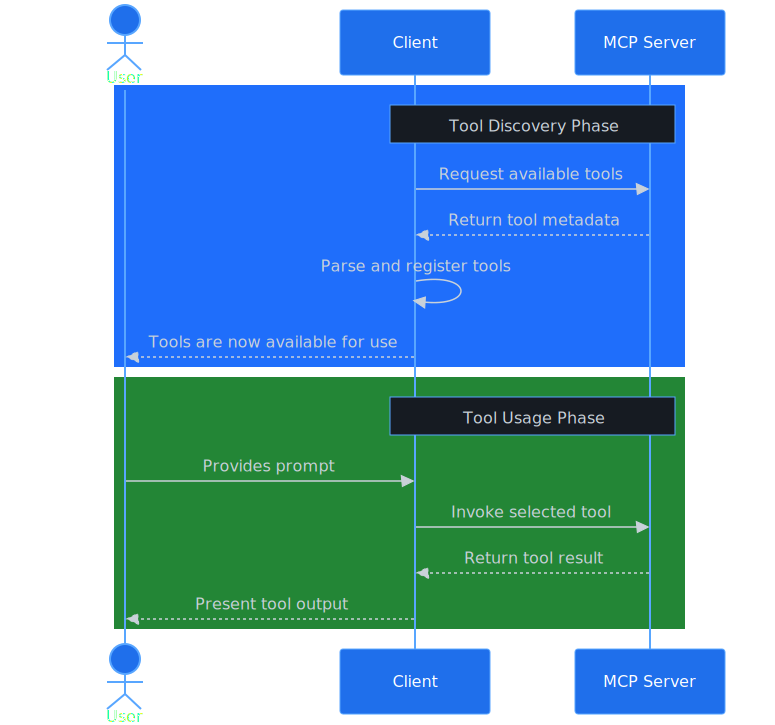

# Overview of Microsoft MCP Server for Enterprise (preview)

The Microsoft MCP Server for Enterprise is a programmatic interface for AI agents to query enterprise data in your Microsoft Entra tenant by using natural language. Built on the [Model Context Protocol (MCP)](https://modelcontextprotocol.io/), an open standard that standardizes how AI models interact with external tools and services, it translates natural language requests into Microsoft Graph API calls.

This overview explains how Microsoft MCP Server for Enterprise works and how you can integrate it into your AI-powered workflows.

> [!IMPORTANT]
> Microsoft MCP Server for Enterprise is currently in PREVIEW.
> This information relates to a prerelease product that may be substantially modified before it's released. Microsoft makes no warranties, expressed or implied, with respect to the information provided here.
>
> Microsoft MCP Server for Enterprise is offered under the [Microsoft APIs Terms of Use](/legal/microsoft-apis/terms-of-use).

## How it works



<!--  Learn platform doesn't render raw Mermaid-->

When the AI client starts, it automatically locates the Microsoft Graph MCP Server endpoint at `mcp.svc.cloud.microsoft/enterprise` from the list of installed MCP Servers and retrieves the available tools. This step is the **automatic discovery** phase.

Suppose an administrator asks: "*How many users do we have in our Microsoft Entra tenant?*" Here's an example showing the workflow when you query information through an MCP-enabled AI agent:

1. **NLP Processing**: The LLM processes the query by using Natural Language Processing (NLP) techniques to extract intent. It might conclude the intent is "count the number of users in the Microsoft Entra tenant." From the MCP server connections actively running in the agent, it determines to use the `search_for_graph_examples` tool of the Enterprise MCP Server.

1. **Semantic search**: The `search_for_graph_examples` tool converts the question into an embedding and searches its library of example Graph queries mapped to natural language. It finds matches like "count total number of users," "count guest users," and "get all users" which correspond to the user intent, and returns the corresponding queries to the Large Language Model (LLM).

1. **Query selection**: The LLM evaluates the list of API calls and selects the API call with the highest relevance score as the best fit to fulfill the request, which is `GET /users/$count`.

1. **Execution**: The LLM determines from the list of running Enterprise MCP Server tools, to use the  `microsoft_graph_get` tool to execute the `GET /users/$count` call. It honors the user's privileges when making the call.

1. **API Processing**: The MCP Server processes the request and:
   - Forwards the request to the Microsoft Graph service to execute the call.
   - Microsoft Graph returns the results in standard Microsoft Graph response payload format to the MCP Server, which then forwards the response to the LLM.

1. **Natural Language Response Generation**: The LLM interprets the JSON payload and converts it into a natural language response for the user. In this case, it might simply respond: "There are 10,930 users in the directory."

## Tools

The Microsoft MCP Server for Enterprise exposes the following tools that an AI agent can invoke:

- **search_for_graph_examples**: Uses retrieval-augmented generation (RAG) methodologies to search for Microsoft Graph API calls that match the user's intent. It has a semantic index of example queries mapped to natural language and returns a list of candidate queries to the AI model.
- **microsoft_graph_get**: Executes read-only Microsoft Graph API calls, respecting user roles, scopes granted to the MCP Client, and throttling limits.
- **get_graph_entity_properties**: Retrieves properties of specific Microsoft Graph entities to help the AI model understand the data structure.

## Usage scenarios

The Microsoft MCP Server for Enterprise enables several key scenarios:

- **IT helpdesk and support**: Support staff can answer common questions like "*Which users didn't sign in last month?*" or "*Is MFA enabled for all administrators?*" without needing to know specific Graph API endpoints. It can also help to answer more complex queries by combining multiple API calls. For example, "List all inactive user accounts that have Copilot licenses assigned."

- **Administrative reporting**: IT administrators can generate reports and insights through conversational queries. For example, "*Show me the unassigned licenses in my tenant*" or "*How many guest users do we have?*"

- **API discovery and prototyping**: Developers can explore and test Microsoft Graph APIs by using natural language before integrating them into applications. The AI can show you the actual Microsoft Graph queries it executed, helping you understand the underlying API calls. AI can also show you how to script the queries and run them, cutting down your development time.

- **Automation and scripting**: Integrate the MCP server into scripts, Power Platform flows, or Logic Apps to enable no-code/low-code solutions that query Microsoft Entra data by using natural language instructions.

## Current scope and capabilities

The Microsoft MCP Server for Enterprise is currently in private preview and supports only read-only enterprise IT scenarios focused on Microsoft Entra identity and directory read-only operations including user management, group management, application management, device information, and administrative actions.

All operations respect Microsoft Graph permissions and privileges and security policies.

## Licensing and costs

You **don't need an extra cost or separate license** to use the Microsoft MCP Server for Enterprise. 

However, you still need the right licenses for the data you're accessing. For example, you need a Microsoft Entra ID Governance or Microsoft Entra ID P2 license to access Privileged Identity Management (PIM) data.

The MCP server follows the same throttling limits as Microsoft Graph APIs.

## Cloud availability

Microsoft MCP Server for Enterprise is available only in the public cloud (global service).

## Logs

To log and monitor usage of Microsoft MCP Server for Enterprise, enable [Microsoft Graph activity logs](../microsoft-graph-activity-logs-overview.md) in your tenant. The MCP server uses Microsoft Graph APIs, so all API calls made through the MCP server are logged in the Microsoft Graph activity logs.

For logs specific to MCP server usage, filter the activity logs by the **appId** (Referred to as "application (client) ID" in the Entra admin center or **AppId** in the Log Analytics schema) of the MCP server: `e8c77dc2-69b3-43f4-bc51-3213c9d915b4`. The following sample Kusto query retrieves these logs:

```kusto
MicrosoftGraphActivityLogs
| where TimeGenerated >= ago(30d)
| where AppId == "e8c77dc2-69b3-43f4-bc51-3213c9d915b4"
| project RequestId, TimeGenerated, UserId, RequestMethod, RequestUri, ResponseStatusCode
```

## Next step

- [Get started with MCP Server for Enterprise](get-started.md)
