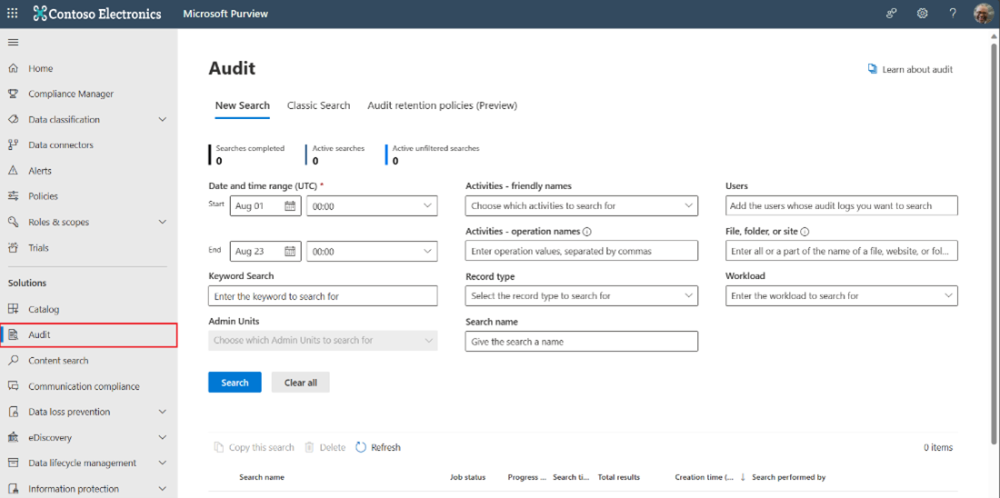
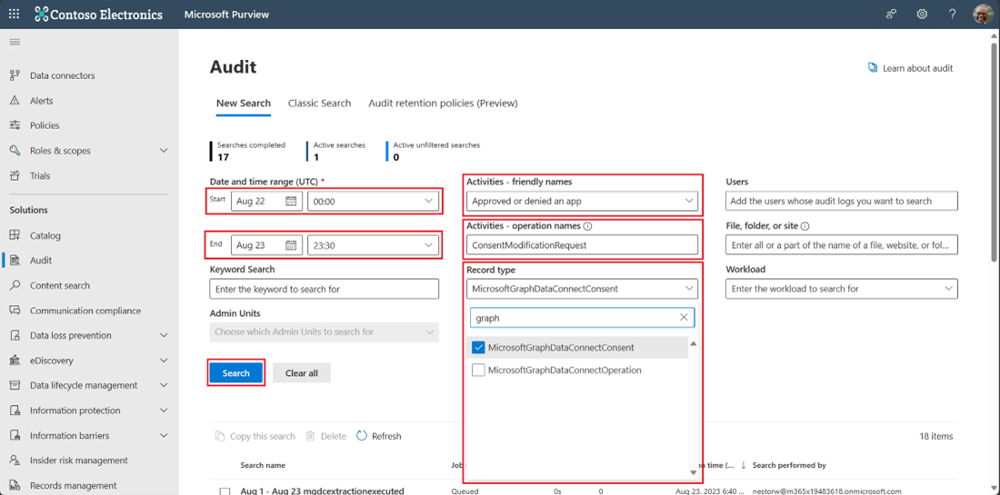
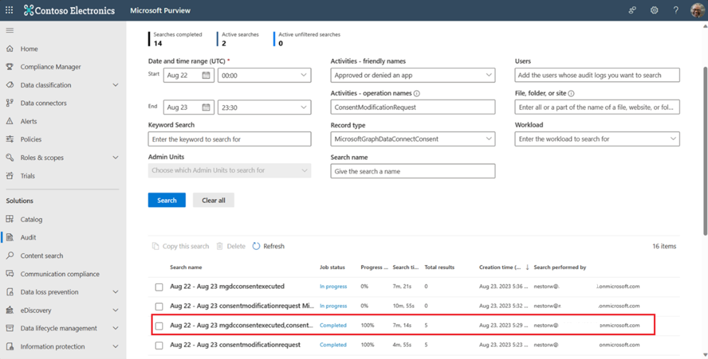
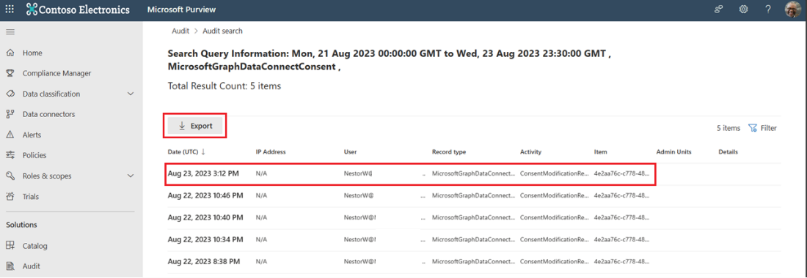
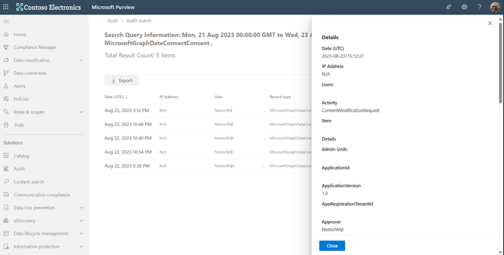
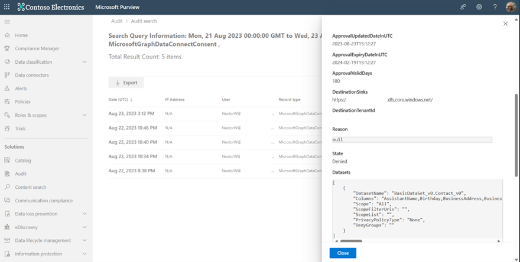
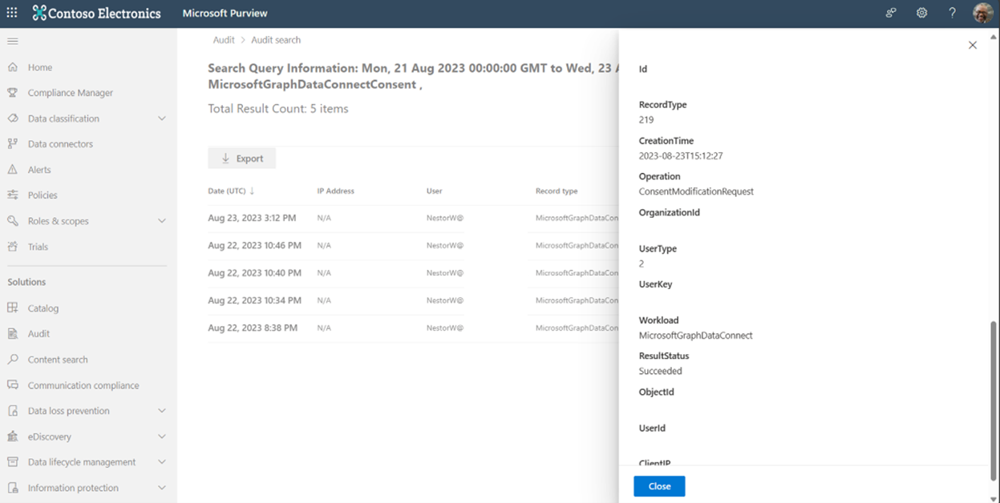
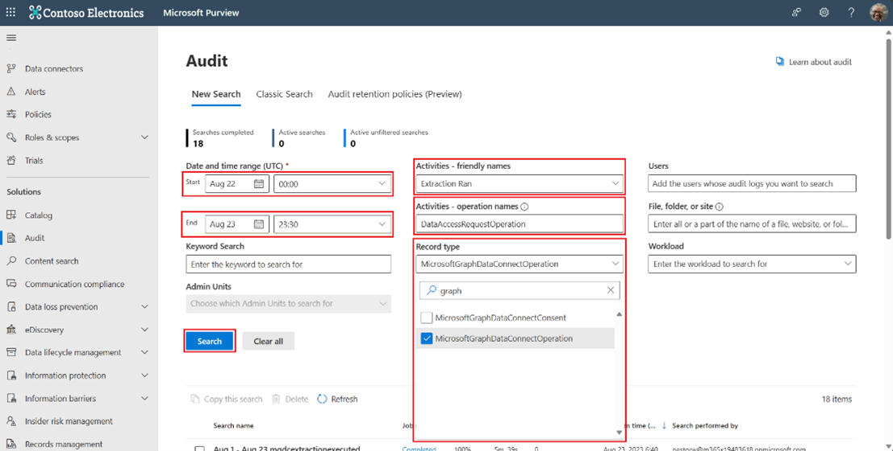

# Use Microsoft 365 audit logs with Microsoft Graph Data Connect

Microsoft Graph Data Connect (Data Connect) customers build large-scale data applications with sensitive Microsoft 365 content. Data Connect customers must apply industry-standard best practices for compliance across security, privacy, and governance. Microsoft 365 audit logs offer  a detailed understanding of different applications that access this sensitive data, to help you address any compliance concerns.

Make use of Microsoft 365 audit logs with Data Connect to track authorization and data extraction events. For details about how to improve your overall audit experience in the Microsoft Compliance Center, see [Audit logs for all Data Connect application access and approvals](https://devblogs.microsoft.com/microsoft365dev/security-governance-and-privacy-built-into-microsoft-graph-data-connect/#audit-logs-for-all-data-connect-application-access-and-approvals). Export your data to .csv files for better clarity and enable audit logs with an E3 license to [Set up Microsoft Purview Audit (Standard)](/purview/audit-standard-setup) or with an E5 license to [Set up Microsoft Purview Audit (Premium)](/purview/audit-premium-setup).

> [!NOTE]
> Microsoft 365 global admins have access to the [Microsoft Purview compliance portal](https://go.microsoft.com/fwlink/p/?linkid=2077149), which hosts Microsoft 365 audit logs. If you're working with Data Connect applications and need access to audit logs, see [Assign permissions to search the audit log](https://github.com/purview/audit-standard-setup#step-2-assign-permissions-to-search-the-audit-log).

## Authorization events

Use Microsoft 365 audit logs to track and audit admin authorization actions on Data Connect apps. Use the following steps to search for authorization events audit logs for Data Connect:

Step 1. Go to the [Microsoft Purview compliance portal](https://go.microsoft.com/fwlink/p/?linkid=2077149), and sign in with the correct privileges.

Step 2. In the left pane of the compliance portal, choose **Audit**.

.

> [!NOTE]
> For details about audit log search fields, see [Search the audit log](https://github.com/purview/audit-log-search?view=o365-worldwide#search-the-audit-log).

Step 3. Enter values in the following fields:

- **Activities-friendly names: Approved or denied the app** — Scopes events related to changes in authorization (consent).
- **Activities-operation names: ConsentModificationRequest** — Scopes events related to changes in authorization (consent).
- **Record Type: MicrosoftGraphDataConnectConsent.** — Scopes all consent events related to Data Connect.
- **Workload: Microsoft Graph Data Connect** — Scopes audit logs related to Data Connect-recorded events.
- **Start and end dates** — Scopes the time range of events. Note that the date in the search result is the date the search was performed.

.

Step 4. Rows appear that range from the time period you input previously to the current date. To view details about a time range, choose a row of results.

.

Step 5. A new window opens that contains search results related to an authorization event.

.

Step 6. Choose a sample result to see more details. You can also choose **Export** to export the results to a .csv file. To understand your audit logs and the schema provided in the details, see the schema in [Data Connect audit logs support](https://github.com/office/office-365-management-api/office-365-management-activity-api-schema#microsoftgraphdataconnectconsent-complex-type) and [dataset schema](https://github.com/office/office-365-management-api/office-365-management-activity-api-schema#complex-type-mgdcdataset).

.

.

.

## Pipeline run events

Track your data extraction events through pipeline runs that are generated in Data Connect applications.

### Search for operation audit logs for Data Connect

To search the generated pipeline runs for Data Connect operations:

Step 1. Go to the [Microsoft Purview compliance portal](https://go.microsoft.com/fwlink/p/?linkid=2077149) and sign in.

> [!NOTE]
> Verify that you have Microsoft 365 admin privileges or authorization to access sensitive log data.

Step 2. In the left pane of the compliance portal, select **Audit**.

.

> [!TIP]
> For details about audit log search fields, see [searching the audit log in Microsoft 365](https://github.com/purview/audit-log-search?view=o365-worldwide#search-the-audit-log).

Step 3. Verify that you've entered data in the following fields:

- **Activities-friendly names: Extraction Run** — Scopes events related to extraction.
- **Activities-operation names: DataAccessRequestOperation** — Scopes events to view data access requests.
- **Record Type: MicrosoftGraphDataConnectOperation** — Scopes only the data extraction and pipeline runs for Data Connect.
- **Workload: Microsoft Graph Data Connect** — Scopes audit logs only in relation to Data Connect–related recorded events.
- **Start and End Dates** — Scopes the time range of the events. Note that the date in the search result is the date the search is performed.

.

Step 4. View the details of your audit logs. Choose an audit log row to view details about the log event. To understand your audit logs and the schema provided in the details, see the schema in [Data Connect audit logs support](https://github.com/office/office-365-management-api/office-365-management-activity-api-schema#microsoftgraphdataconnectconsent-complex-type).
