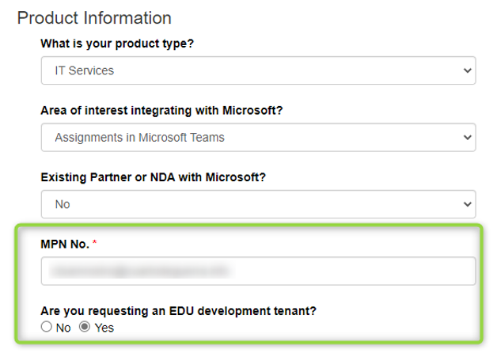

# Demo EDU Dev tenant

A Demo EDU Dev tenant is meant to simulate an M365 EDU customer tenant for the purpose of developing and testing solutions.

## How to create a new Demo EDU tenant for development purposes?

To get an EDU tenant go to [Partner Sign Up](https://aka.ms/edupartnersignup), fill all the sections with contact details, products, and organization information accordingly. Special attention is needed at Product Information section, MPN ID must be provided at MPN No field and check Yes for **Are you requesting an EDU development tenant?**

Press Submit after providing all the required information.

## Developer Resources

| Purpose | Resource |
|--------------|-------------|
| Develop for the Microsoft 365 Platform     | [https://developer.microsoft.com/en-us/microsoft-365/?utm_source=developermscom](https://developer.microsoft.com/en-us/microsoft-365/?utm_source=developermscom) |
| Develop for Microsoft Graph                | [https://docs.microsoft.com/en-us/graph/](https://docs.microsoft.com/graph/) |
| Create a Teams app                         | [https://github.com/microsoft/edu-devcamp/tree/master/HOL/HOL2#ex4](https://github.com/microsoft/edu-devcamp/tree/master/HOL/HOL2#ex4) |

## See also

* [Join the Microsoft Partner Network](/graph/msgraph-onboarding-mpn)
* Create a [Demo EDU Tenant](/graph/msgraph-onboarding-edutenant)
