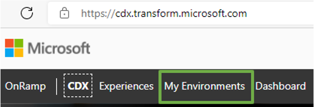
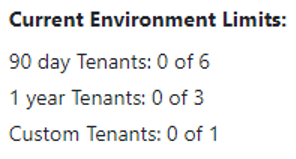
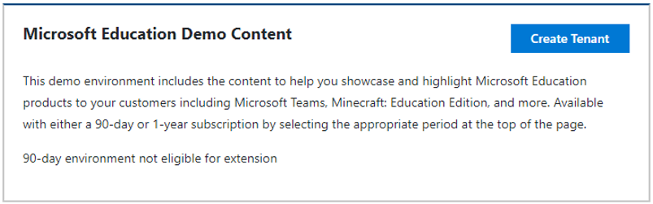
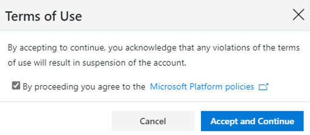

# Demo EDU tenant

A Demo EDU tenant is supposed to be used for personal learning and customer demos only.

Using your Microsoft Partner Network (MPN) ID, use the [Customer Digital Experiences (CDX)](https://cdx.transform.microsoft.com/) to create a demo EDU tenant.

## How to create a new Demo EDU tenant for testing and learning purposes?

1-Click on My Environments tab.

2-In My Tenants tab, press Create Tenant.

3-See the environment limits.

4-Select the tenant type.
  - **Quick Tenant:** A quick tenant is a pre-provisioned custom Microsoft 365 tenant. These tenants contain the same robust demo content and Add-On options (i.e. EMS, PSTN Calling, etc.) as custom tenants but without the wait. While the Microsoft 365 tenant is immediately available, the Add-On's content is provisioned only upon a request basis.
  - **Custom Tenant;** Custom tenants are only available for Microsoft Users (@microsoft.com).
A custom tenant allows you the ability to customize the following:
Tenant Name Country/Region Notification Email Any of the demo personas By having the ability to customize some aspects of your tenant, custom tenants will not start the provisioning process until you hit the Finish button.
Standard Microsoft 365 tenants take approximately 12-48 hours (NOT including Add-Ons). Dynamics 365 tenants take approximately 24-60 hours.

5-Select the Tenant period.
  - **90 days:** 90 day tenants include the latest services and content at time of provisioning. Recommended choice for specific customizations relating to a customer engagement. 90 day tenants will not receive extensions.
  - **1 year:** 1 year tenants include the latest services and content at time of provisioning. Recommended choice for customization and learning such as creating Hybrid environments. Only 1 year tenants can be extended. If a tenant is required long term, please select 1 year tenants.

6-Look for Microsoft Education Demo Content and press **Create Tenant**.

7-Accept the terms of use.
> Important: Demo EDU Tenant should NOT be used for development purposes.

8-Tenant details are displayed after its creation.

## Setting up user licenses

* [Understand subscriptions and licenses](https://docs.microsoft.com/en-us/microsoft-365/commerce/licenses/subscriptions-and-licenses?view=o365-worldwide)
* [Assign licenses to users](https://docs.microsoft.com/en-us/microsoft-365/admin/manage/assign-licenses-to-users?view=o365-worldwide)
* [Unassign licenses from users](https://docs.microsoft.com/en-us/microsoft-365/admin/manage/remove-licenses-from-users?view=o365-worldwide)
* [Buy or remove licenses from your subscription](https://docs.microsoft.com/en-us/microsoft-365/commerce/licenses/buy-licenses?view=o365-worldwide)

## See also

* [Join the Microsoft Partner Network](/graph/msgraph-onboarding-mpn)
* Create a [Demo EDU Dev Tenant](/graph/msgraph-onboarding-devtenant)

## Next steps

* [School Data Sync](/graph/msgraph-onboarding-sds)