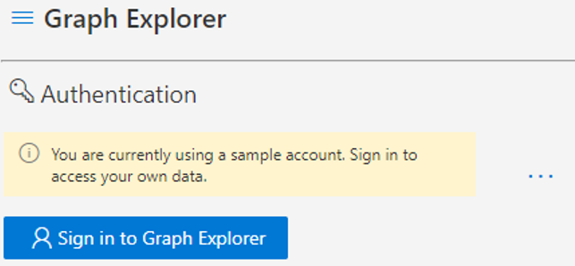
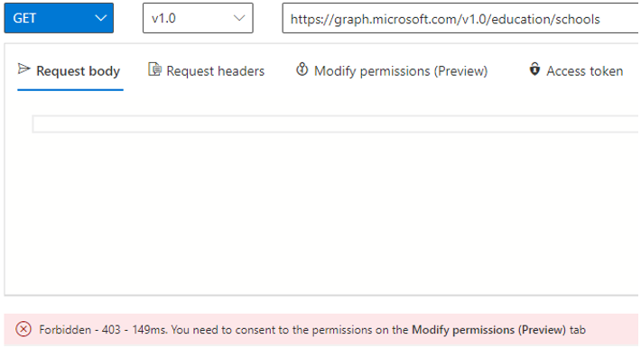
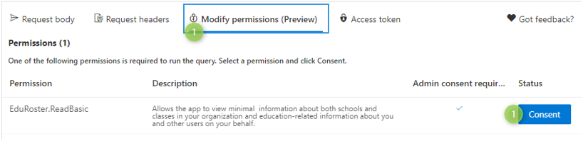
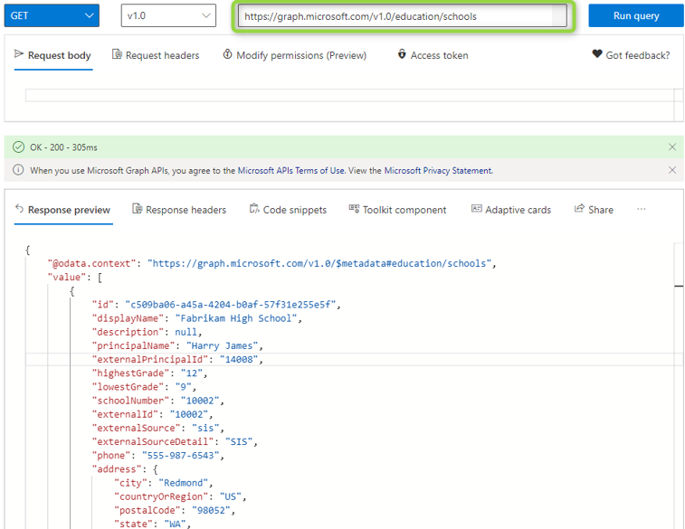
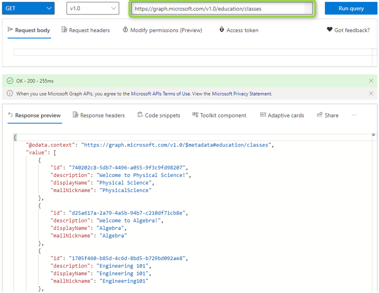
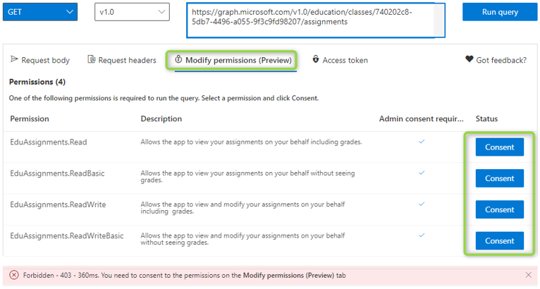
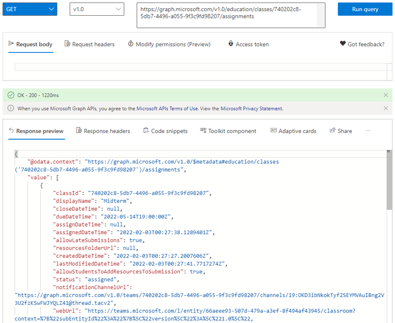

# Microsoft Graph Explorer usage

When you want to utilize your data within your own applications you use the Microsoft Graph API. For example, you can display information from SDS and Microsoft Teams in your application or automate common tasks like adding students and creating assignments.

Microsoft provides the online Graph Explorer so you can test the queries to the API before you implement them in your application.

1. To access the Graph Explorer launch a private web browser, navigate to [developer.microsoft.com/en-us/graph/graph-explorer](https://developer.microsoft.com/en-us/graph/graph-explorer), click Sign in with Microsoft, then enter your O365 Global Admin account credentials.

   

2. Access to the rostering API features requires that you grant corresponding permissions to the Graph Explorer app. When you execute a query that requires more permissions you will be prompted by the Graph Explorer.

   

3. Go to Modify permissions tab and search for EduRoster.ReadBasic click Consent permission.

   

   You may have to wait for the permissions to update before you can execute all queries.

4. Enter `https://graph.microsoft.com/v1.0/education/schools` in the query field and click **Run Query** to fetch a list of your schools. Note how the query field auto-completes your queries.

   

5. Enter `https://graph.microsoft.com/v1.0/education/classes` in the query field and press **Run query** to fetch a list of classes.

   

6. Take the first class Id `740202c8-5db7-4496-a055-9f3c9fd98207` to get its assignments.
   - Enter `https://graph.microsoft.com/v1.0/education/classes/740202c8-5db7-4496-a055-9f3c9fd98207/assignments` in the query field.
   - Press **Run query**.

7. Access to the Assignments API features requires that you grant corresponding permissions to the Graph Explorer app.
   - Go to Modify permissions tab and search for EduAssignments.Read, EduAssignments.ReadBasic, EduAssignments.ReadWrite and EduAssignments.ReadWriteBasic.
   - Click on **Consent** button.

   

8. Try again to run the query to get the assignments.

   

9. Now you can try to create a new assignment.
   - Enter `https://graph.microsoft.com/v1.0/education/classes/740202c8-5db7-4496-a055-9f3c9fd98207/assignments` in the query field.
   - Make sure POST is selected in the request type.
   - Paste the JSON below into the **Request body** tab.
        ```json
            {
                "dueDateTime": "2024-02-15T00:00:00Z",
                "displayName": "Reading and comprehension",
                "instructions": {
                    "contentType": "text",
                    "content": "Read the chapter and answer the questions"
                },
                "grading": {
                    "@odata.type": "#microsoft.graph.educationAssignmentPointsGradeType",
                    "maxPoints": 50
                },
                "assignTo": {
                    "@odata.type": "#microsoft.graph.educationAssignmentClassRecipient"
                },
                "allowStudentsToAddResourcesToSubmission": true
            }
        ```

    - Press **Run query** button, you must get a `Created – 201` response and a JSON object representing the new assignment.
      

10. Try more queries. You can find the API reference and more example queries at [developer.microsoft.com/en-us/graph/docs/api-reference/beta/resources/education-overview](https://developer.microsoft.com/en-us/graph/docs/api-reference/beta/resources/education-overview).
    The Graph Explorer is a great tool to help you tweak your queries.

## Next steps

* [Microsoft Teams setup](/graph/msgraph-onboarding-msteams)