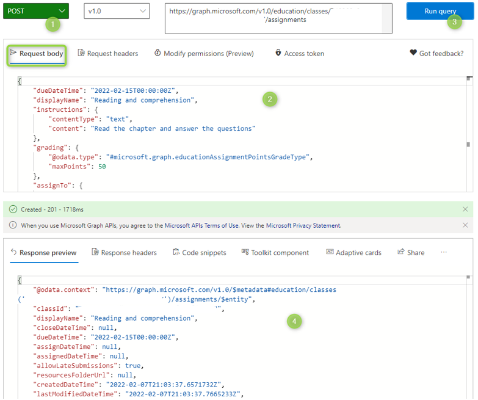

# Use Graph Explorer to work with the education API in Microsoft Graph

You can use the education API in Microsoft Graph to build applications that access EDU data. For example, you can display information from School Data Sync (SDS) and Microsoft Teams, or automate common tasks like adding students and creating assignments.

You can use Graph Explorer to test Microsoft Graph queries before you implement them in your application. 

Use the following steps to try education API calls in Graph Explorer:

1. Open a private web browser, go to [developer.microsoft.com/en-us/graph/graph-explorer](https://developer.microsoft.com/en-us/graph/graph-explorer), choose **Sign in to Graph Explorer**, and enter your Office 365 Global Admin account credentials.

2. To access the rostering API, grant the corresponding permissions to Graph Explorer. Go to **Modify permissions**, search for **EduRoster.ReadBasic**, and choose **Consent**.

   You might have to wait for the permissions to update before you can run all queries.

4. To get a list of your schools, in the query field, enter `https://graph.microsoft.com/v1.0/education/schools` and choose **Run query**.

5. To get a list of classes, in the **query** field, enter `https://graph.microsoft.com/v1.0/education/classes` and choose **Run query**.

6. Take the first class ID `740202c8-5db7-4496-a055-9f3c9fd98207` to get that class's assignments. In the query field, enter `https://graph.microsoft.com/v1.0/education/classes/740202c8-5db7-4496-a055-9f3c9fd98207/assignments`, and choose **Run query**.

7. To access the assignments API, grant the corresponding permissions to Graph Explorer. Go to **Modify permissions**, search for **EduAssignments.Read, EduAssignments.ReadBasic, EduAssignments.ReadWrite and EduAssignments.ReadWriteBasic**, and choose **Consent**.

8. Run the query to get the assignments.

9. Now you can try to create a new assignment. In the query field, enter `https://graph.microsoft.com/v1.0/education/classes/740202c8-5db7-4496-a055-9f3c9fd98207/assignments`. Make sure that POST is selected for the request type.

10. In the **Request body** field, paste the following JSON.

        ```json
            {
                "dueDateTime": "2024-02-15T00:00:00Z",
                "displayName": "Reading and comprehension",
                "instructions": {
                    "contentType": "text",
                    "content": "Read the chapter and answer the questions"
                },
                "grading": {
                    "@odata.type": "#microsoft.graph.educationAssignmentPointsGradeType",
                    "maxPoints": 50
                },
                "assignTo": {
                    "@odata.type": "#microsoft.graph.educationAssignmentClassRecipient"
                },
                "allowStudentsToAddResourcesToSubmission": true
            }
        ```

11. Choose **Run query**. If your query is successful, you'll get a `Created – 201` response and a JSON object that represents the new assignment.

      

12. Try more queries. For more examples, see the [education API reference content](/graph/api/resources/education-overview).


## Next steps

- [Working with education APIs in Microsoft Graph](/graph/api/resources/education-overview)
