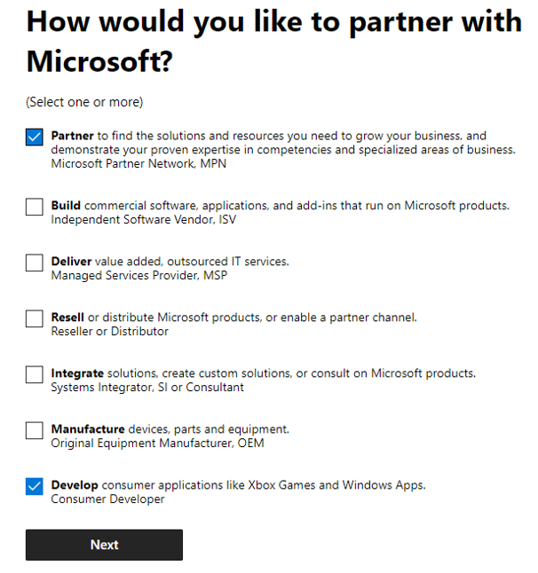
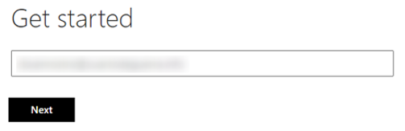
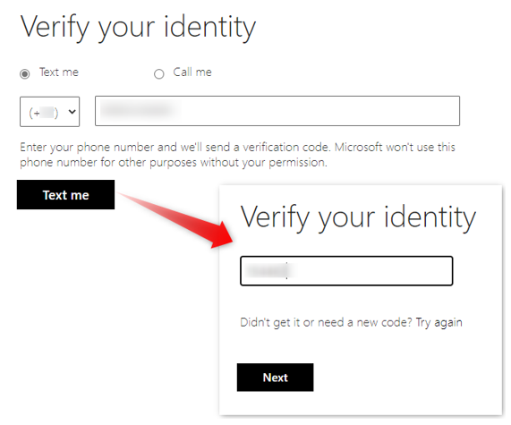
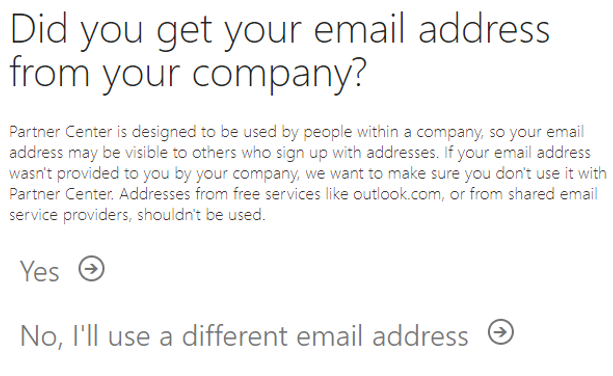
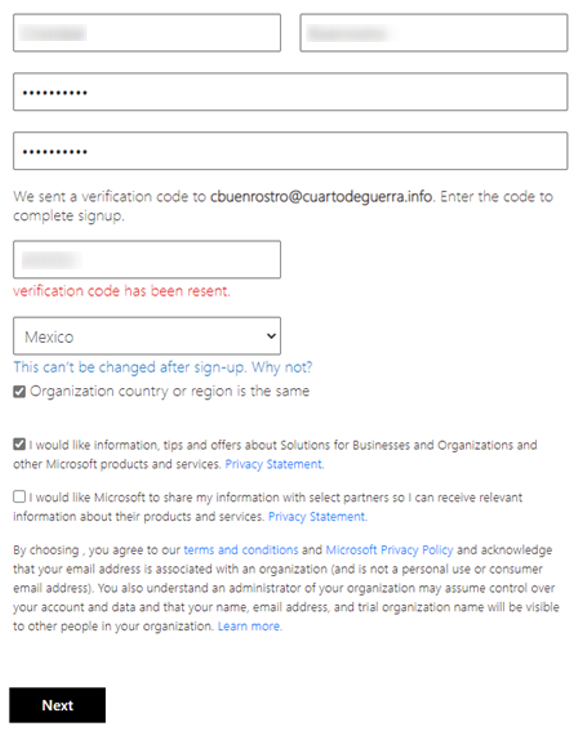
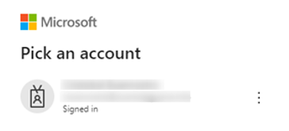
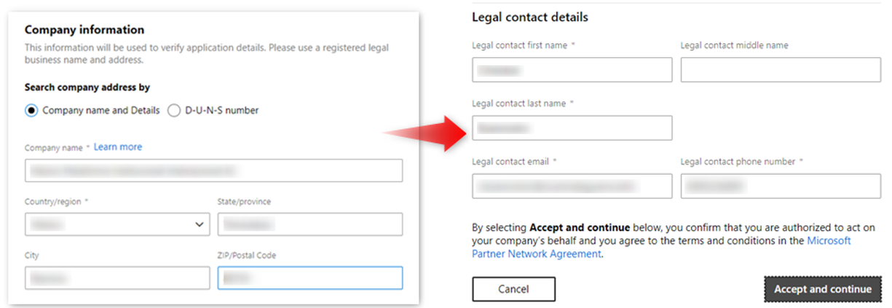
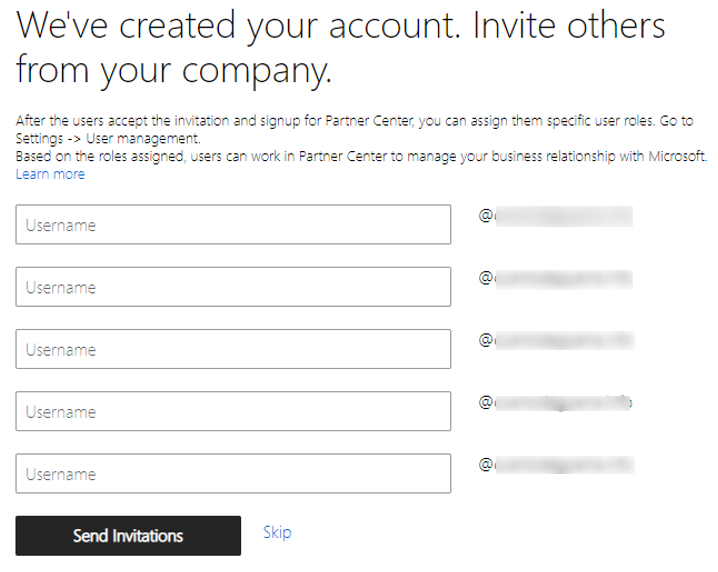
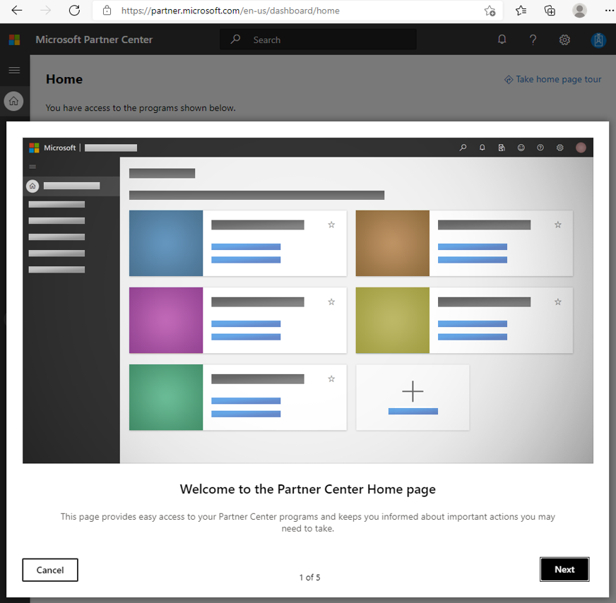

# Microsoft Partner Network

Microsoft partner Network is a powerful community of companies and organizations like yours that connects you to the relationships, insights, tools, resources, and programs you need to amaze your customers and drive business growth.

> **Note**: MPN is required if you need an EDU dev tenant and publishing apps in Microsoft marketplaces.

## How to join the Microsoft Partner Network?

To join the Microsoft Partner Network, go to the [Partner with Microsoft](https://partner.microsoft.com/) page on the Partner Network website and select **Become a partner**.

1-The first step is to specify how would you like to partner with Microsoft, select one or more of the options and press **Next**.

2-Specify your company work account and press **Next**.

3-To verify your identity set your phone number and select how would you like to get the verification code, press **Text me** or **Call me** according to your selection, and put your code when receive it and press **Next**.

4-Select Yes to specify that your email address was provided by your company.

5-Complete you MPN account information, set a password and confirm the verification code sent to your email, press **Next**.

6-Login with your MPN account.

7-Provide your company information and press **Accept and continue**.

8-The MPN account is created, send invite to your company members if needed.

9-You can access [Partner Center](https://partner.microsoft.com/) with your MPN account.

## See also:

* [Partner With Microsoft](https://docs.microsoft.com/en-us/partner-center/mpn-overview)
* [More details about create an MPN account in Partner Center](https://docs.microsoft.com/en-us/partner-center/mpn-create-a-partner-center-account)
* [Manage your Partner Center account](https://docs.microsoft.com/en-us/partner-center/partner-center-account-setup)

## Next Steps

* Create a [Demo EDU Dev Tenant](/graph/msgraph-onboarding-devtenant)
* Create a [Demo EDU Tenant](/graph/msgraph-onboarding-edutenant)
