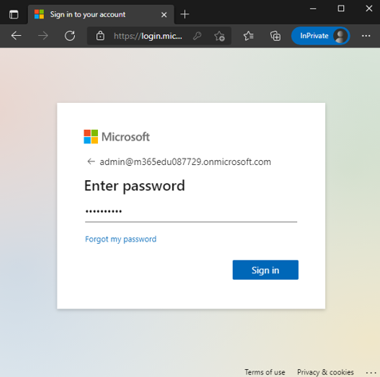
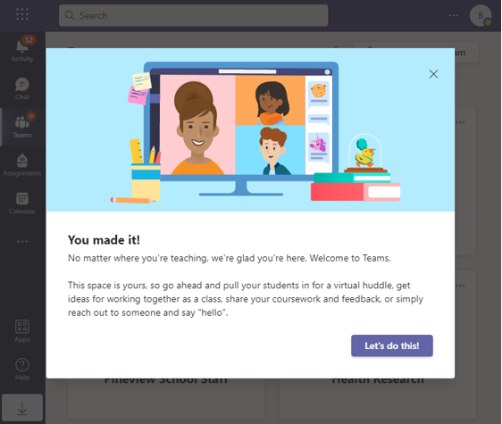
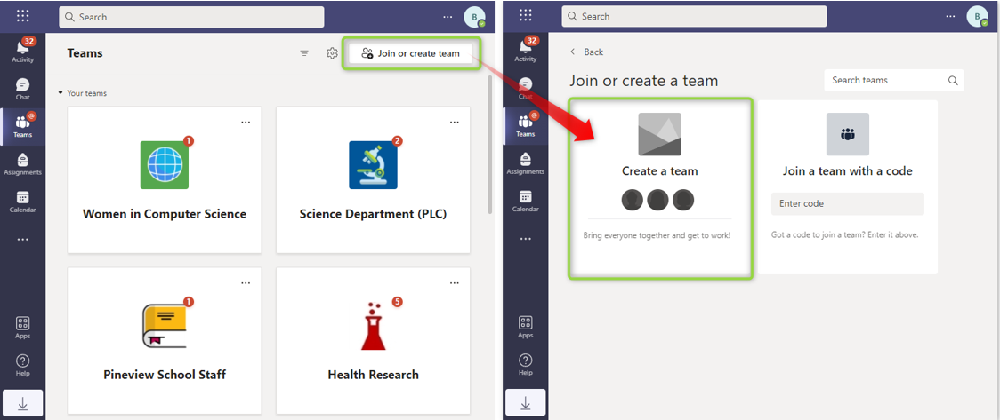
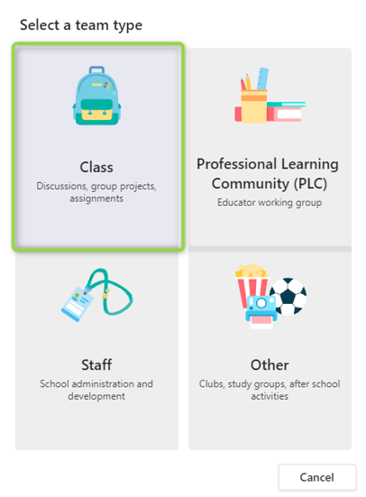
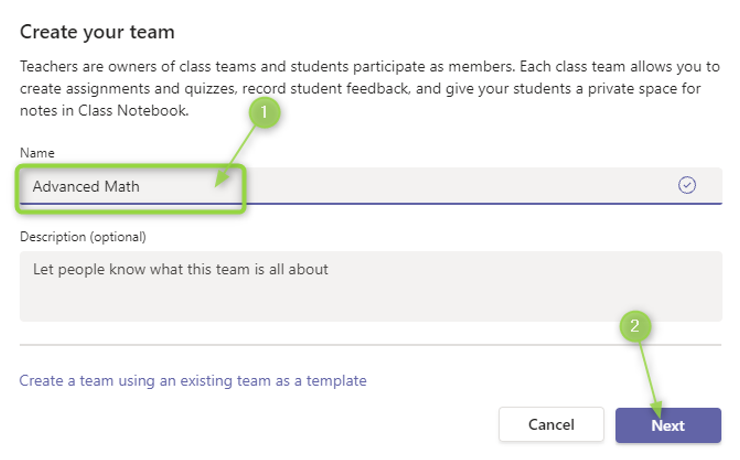
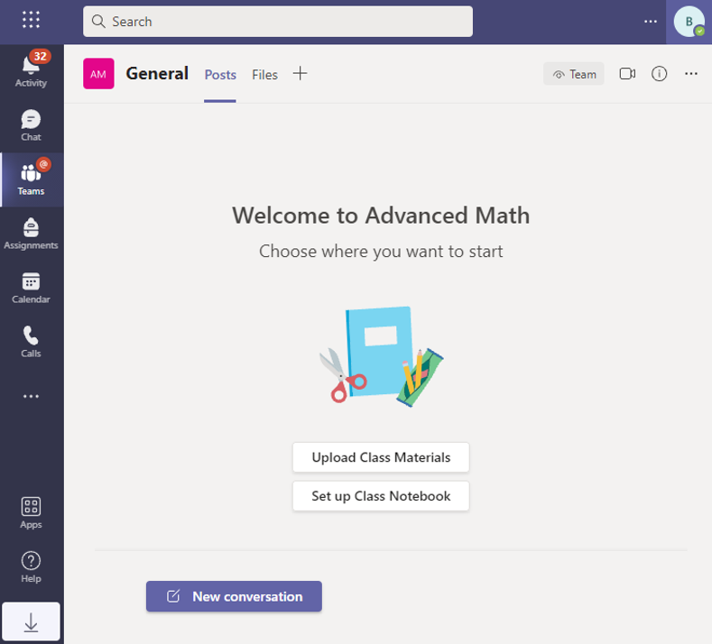

# Microsoft Teams setup

In this section, you will set up Microsoft Teams on your system and create your first team.

## Install Microsoft Teams

Open an InPrivate or Incognito browser window and browse to either to [teams.microsoft.com/download](https://teams.microsoft.com/download) if you want to install Microsoft teams in your computer or [teams.microsoft.com](https://teams.microsoft.com) to Log In online.

Execute the downloaded installer and when prompted login with your O365 Global Admin account credentials.

After the installation finished, complete the welcome wizard.

## Create a team

1. On the menu on the left click Teams and then click the **Create team** button in the center (if you already have a team click the button at the top right corner of the list of teams called Join or create a team to make the Create team button show up in the center).

   

2. Select Classes as the team type. Note that you will only see these choices if you are logged in into an educational tenant.

   

3. Enter a Name for your team.

   

4. Find some students by entering a letter in the search box and add them to your team by clicking the names and clicking Add. Repeat this step for each student and teacher in the class.

   

5. Confirmation about Team created successfully.

   

## Next steps

* [Assignments API](/graph/msgraph-onboarding-assignments)
* [Graph Explorer](/graph/msgraph-onboarding-graphexplorer)