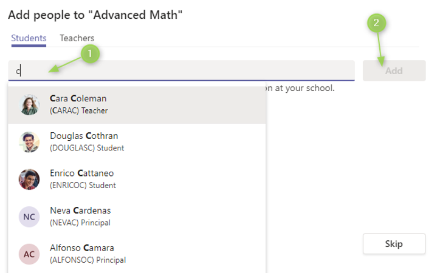

# Set up Microsoft Teams to work with tenant users

To work with the education API in Microsoft Graph, you need to set up Microsoft Teams and create a team. If you [set up School Data Sync](/graph/msgraph-onboarding-sds), you might already have teams set up in your demo environment. To create more teams manually, follow the steps in this article, using a teacher or admin account in your [EDU demo tenant](/graph/msgraph-onboarding-edutenant).

## Install Microsoft Teams

To install Microsoft Teams, open a private browser window and go to [teams.microsoft.com/download](https://teams.microsoft.com/download), or go to [teams.microsoft.com](https://teams.microsoft.com) to sign in online.

When prompted by the installer, sign in with your Office 365 Global Admin account credentials.

After the installation finishes, complete the welcome wizard.

## Create a team

To create a team:

1. On the left menu, choose **Teams**, and then choose **Create team**. If you already have a team, on the top right, choose **Join or create a team**, and then choose **Create team**.

2. For the team type, select **Class**. Note that you will only see this choice if you are signed in to an EDU tenant.

3. Enter a name for your team.

4. Add students to the team. In the search box, start typing a name, select a result, and choose **Add**. Repeat this step for each student and teacher in the class.

   

You have successfully created your team.

## Next steps

[Use Graph Explorer](/graph/msgraph-onboarding-graphexplorer) to test Microsoft Graph calls.
