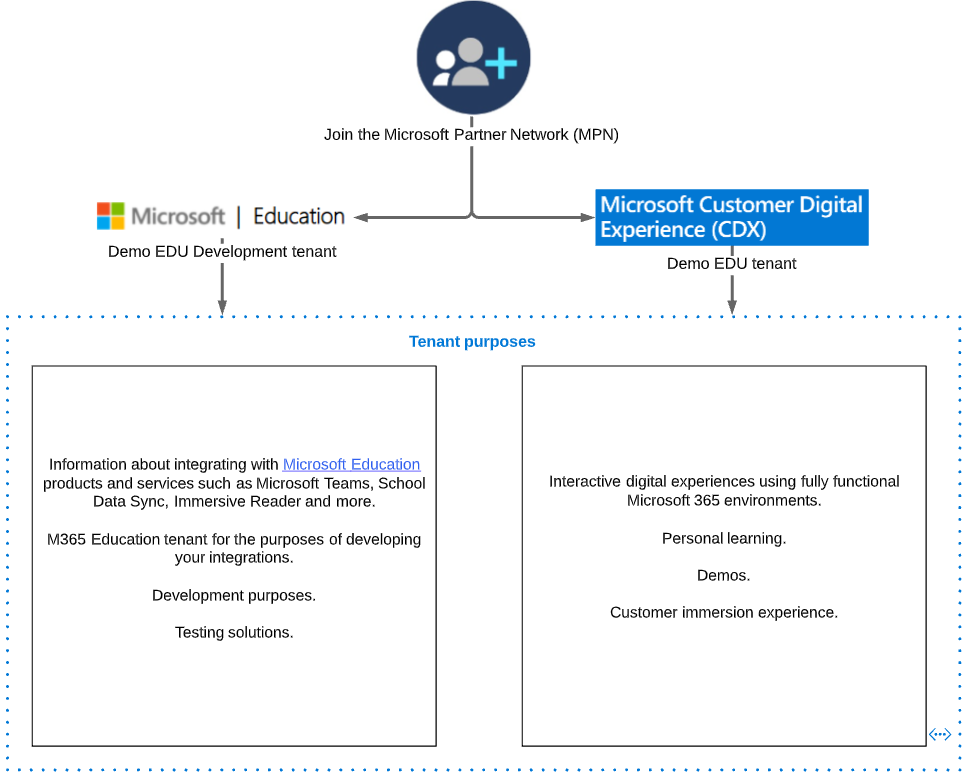

# Microsoft Graph API Onboarding overview

Microsoft Graph is a RESTful web API that enables you to access Microsoft Cloud services resources.

Microsoft allows you to create demo tenants for different purposes and start making requests to Microsoft Graph API.

## Next Steps

- To start creating a new tenant, see:
  - Join the [Microsoft Partner Network](/graph/msgraph-onboarding-mpn)
  - Create a [Demo EDU Dev Tenant](/graph/msgraph-onboarding-devtenant)
  - Create a [Demo EDU Tenant](/graph/msgraph-onboarding-edutenant)
