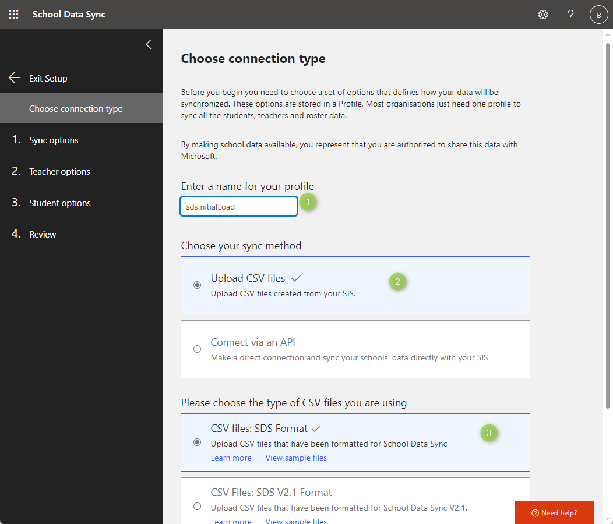
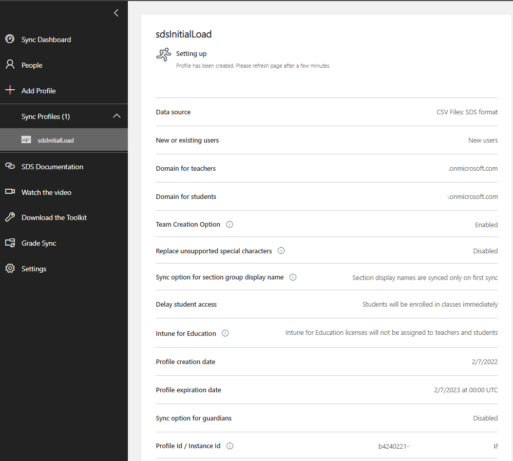

# Set up School Data Sync

Microsoft School Data Sync simplifies class management in Office 365. School Data Sync reads rosters from your SIS and creates classes and groups for Microsoft Teams, Intune for Education, and third-party applications. You must set up School Data Sync to use Microsoft Graph education APIs.

To access the School Data Sync admin portal, launch a private web browser, go to `sds.microsoft.com`, choose **Sign In**, and enter the Office 365 Global Admin account credentials that you created when you set up your [demo EDU tenant](/graph/msgraph-onboarding-edutenant). After you sign in:

1. In the left pane, choose **+ Add Profile** to create a sync profile.

2. On the **Choose connection type** page, complete the form.
   - Enter a name for your sync profile. This name will be used to identify the sync profile in the SDS Dashboard; you can't change it after you finish the setup process.
   - Select **Upload CVS files** and **CVS files: SDS Format**.
   - Choose **Start**.

   

3. On the **Sync options** page, select **New users**, and then choose **Upload files** to upload your six CSV files.

4. Choose a future stop date, and then choose **Next**.
   - In a production scenario, you would choose to sync existing users.
   - For more details about the sync process, see [How to deploy School Data Sync by using CSV files](/SchoolDataSync/how-to-deploy-school-data-sync-by-using-csv-files).

5. On the **Teacher options** page, make sure that faculty licenses are selected and choose **Next**.

6. On the **Student options** page, make sure that student licenses are selected and choose **Next**.

7. On the **Review** page, verify that you made the appropriate selections, and choose **Create profile**.

8. After you create a sync profile, SDS will begin a pre-sync validation process. During this process, SDS will verify that there are no obvious errors with your CSV files.

   - If any errors are found during the pre-sync validation process, you will have the option to fix them and re-upload the files before you resume the sync. 
   - If errors occur and you choose not to update the CSV files, you can still choose to resume sync. Just be aware that SDS can only sustain up to 15,000 errors before the profile enters a quarantine status.

9. The sync process will take some time. When prompted, press F5 to manually refresh the status page.

    

## Next steps

- [Set up Microsoft Teams](/graph/msgraph-onboarding-msteams) to set up classes (optional).
