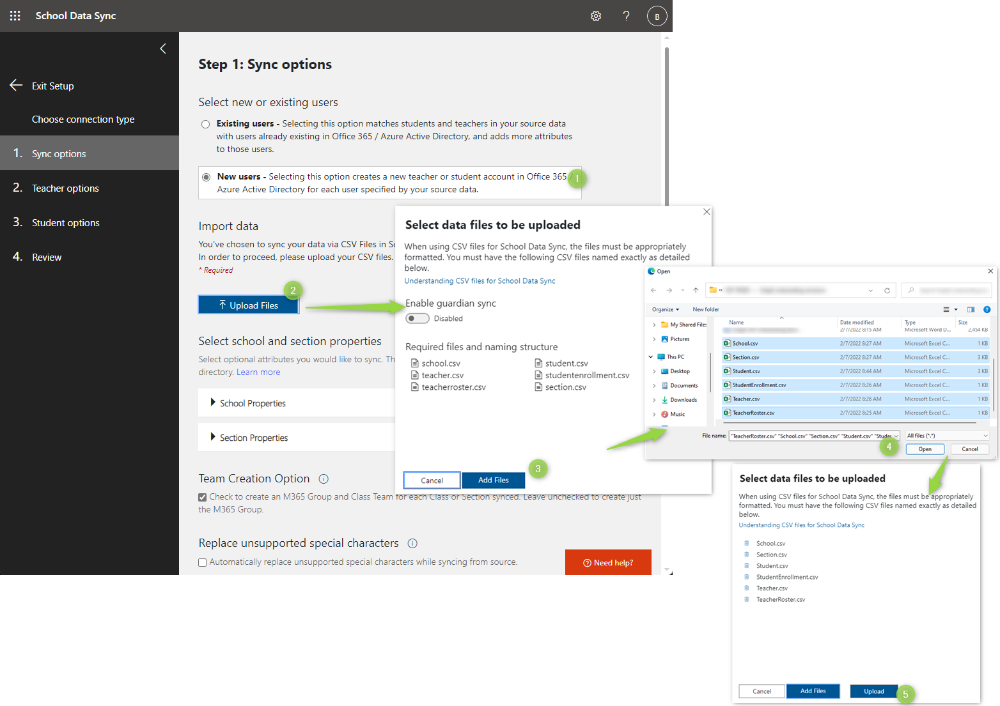

# Use School Data Sync to work with education APIs in Microsoft Graph

Microsoft School Data Sync simplifies class management in Office 365. School Data Sync reads rosters from your SIS and creates classes and groups for Microsoft Teams, Intune for Education, and third-party applications. School Data Sync set up is required for Microsoft Graph education APIs usage.

To access the School Data Sync Admin Portal launch a private web browser, navigate to sds.microsoft.com, click **Sign-In**, then enter your Office 365 Global Admin account credentials created during your [Demo EDU tenant creation](/graph/msgraph-onboarding-edutenant). After you sign in:

1. See the example CSV files containing demo data: [School](https://github.com/microsoft/edu-devcamp/blob/master/HOL/HOL0/assets/School.csv), [Section](https://github.com/microsoft/edu-devcamp/blob/master/HOL/HOL0/assets/Section.csv), [Student](https://github.com/microsoft/edu-devcamp/blob/master/HOL/HOL0/assets/Student.csv), [Student Enrollment](https://github.com/microsoft/edu-devcamp/blob/master/HOL/HOL0/assets/StudentEnrollment.csv), [Teacher](https://github.com/microsoft/edu-devcamp/blob/master/HOL/HOL0/assets/Teacher.csv) and [Teacher Roster](https://github.com/microsoft/edu-devcamp/blob/master/HOL/HOL0/assets/TeacherRoster.csv). Take as base and adapt them according to your needs.

2. Click **+ Add Profile** in the left navigation pane to create a Sync Profile.

3. On the **Choose Connection Type** page, complete the form.
   - Enter a name for your sync profile. This name will be used to identify the sync profile in the SDS Dashboard and cannot be changed once the profile setup is complete. 
   - Select **Upload CVS files** and **CVS files: SDS Format**. 
   - Click **Start**.

   

4. On the **Sync Options** page, select the **New users** option. Then click **Upload files** to upload your six CSV files.

   

5. Once uploaded, select an arbitrary stop date in the future, click **Next**.
   - In a production scenario you would usually choose to sync existing users.
   - For a more detailed instruction on the sync process see [How to deploy School Data Sync by using CSV files](https://docs.microsoft.com/SchoolDataSync/how-to-deploy-school-data-sync-by-using-csv-files).

6. On the **Teacher options** page make sure that faculty licenses are selected and click **Next**.

7. On the **Student options** page make sure that student licenses are selected and click **Next**.

8. On the **Review** page, ensure you've made the appropriate selections. If no additional changes are needed, click **Create Profile**.

9. Once you create a sync profile, SDS will begin a pre-sync validation process. During this process, SDS will ensure there are no obvious errors with your CSV files.

   - If any errors are found during the pre-sync validation process, you will have the option to fix them and re-upload the files before clicking the resume sync button and begin the real synchronization process. 
   - If you receive errors and choose not to update them, you can still choose to resume sync without fixing the errors. Just be aware that SDS can only sustain up to 15,000 errors before the profile will enter a quarantine status.

10. The sync process will take some time and you will be prompted to manually refresh the status page. Press F5 to do so.

    

## Next steps

You can use Microsoft Teams for classes set up as well, it can be used for creating new or make minor changes to classes.

Classes set up in Microsoft Teams is not required if you covered them in the School Data Sync process.

- [Microsoft Teams setup](/graph/msgraph-onboarding-msteams)