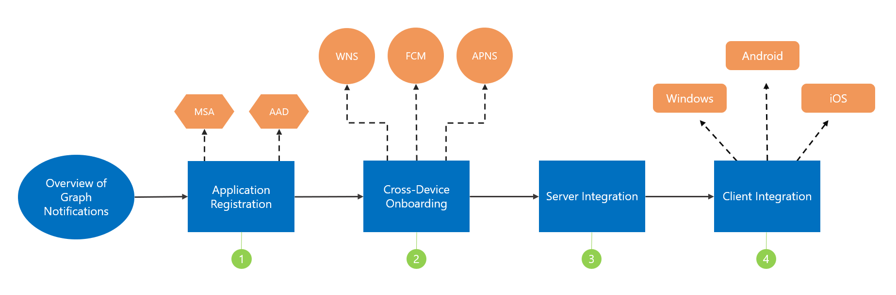

# Integration overview

## Getting started with user-centric notifications in the Microsoft Graph

You can integrate your apps with Microsoft Graph notifications in a few simple steps:

1.  [Register](https://docs.microsoft.com/en-us/graph/notif-integration-app-registration) your application on the Microsoft Azure portal.

2.  [Onboard](https://docs.microsoft.com/en-us/graph/notif-integration-cross-device-experiences-onboarding) to Partner Center/Windows Dev Center for cross-platform application identity and push notification credentials.

3.  [Setup your app server](https://docs.microsoft.com/en-us/graph/notif-integrating-app-server) to send notifications through Microsoft Graph.

4.  [Integrate](https://docs.microsoft.com/en-us/graph/notif-integrating-with-windows) the [Project Rome SDK](http://aka.ms/projectRome) into your Windows, Android or iOS app clients to receive and manage notifications.
