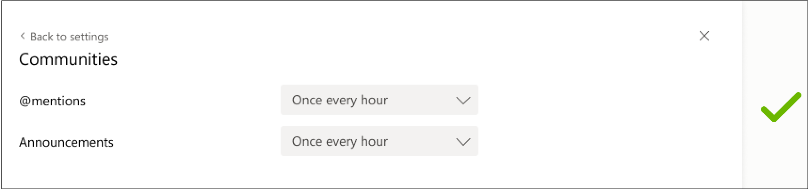

# Best practices for working with the Notification API in Microsoft Graph
This document consolidates the best practices that the Microsoft partners are expected to adhere to, as they build experiences using the Notification API, across visual elements and notification behavior. These practices cover aspects needed for 1P, 2P, and 3P partners. - clarification from Nihit - do we need to elaborate on 1P, 2P, and 3P? What they stand for?

Document links - Clarification about the document links to be checked with Nihit.

At a high-level the best practices are as follows:
* Ensure that Partner scenarios respect the activity feed guidelines.
* Ensure trade-offs between the Notification API and other bot *notification* tools are adhered to. - need clarification from Nikhit on this point
* Ensure that expectations in terms of performance and other such considerations are met. - need clarification from Nihit on this point.

## Notification API Partner scenarios
The Notification API is a platform that enables Partner apps to send notifications to users as toast items and activity feed items that point users to relevant content that can be consumed within Teams.

| **No.** | **Requirement** | **PRI**-what is the fullform of PRI? |
|------------|---------------|-------------------------------------|
| **1** |Understand the direct relationship  between a notification toast or feed and the content deeplinked to:   The notification must not confuse the user about what they need to address or triage. For example, if an @mention notification is received, the panel on the right in the activity feed app must display or reference the corresponding @mention.  If the notification pertains to removal or deletion of scenarios, users must be directed to the content indicating this, so that they understand the outcome before taking action.For example, remove a user from a group or delete a list. | 1       1       1 |
| **2** |Ensure that the right pane experience in the feed is self-contained and does not break the feed experience. For example, if the notification leads to a modal or pop-up dialog, the modal must exist only within the app and not over the activity feed experience. | 1   1 |
| **3** |Ensure that apps are not sending more than 10 notifications per minute, per user. Notifications will be throttled if the per user notification count exceeds the limit. | 1   1 |
| **4** |Ensure that the apps are performing. The time it takes for an app to load is measured and can impact the user experience when a user switches between notifications in the activity feed. Turn off the notifications if a partner's notifications adversely regress **Activity Switch** time.*More information will be published in the forthcoming release.* | 1   1 |

### Feature behavior in Partner scenarios	
|**No.**|**Requirement**|
|-------|---------------|
|**1**|Select the following: A toast notification to lead to the activity feed. A notification in the activity feed to switch to the activity within the activity feed. *The selection will not switch to the app.*|
|**2**|Ensure that you localize the content in a notification toast or feed. The localization happens only if the app’s content is [localized](/platform/concepts/build-and-test/apps-localization). |
|**3**|Ensure that you create the settings based on the **Activity Types** defined in the app manifest. The setting titles read from the description field must be named appropriately to convey what setting is affected. For example:  ✔    ❌ |
|**4**|Ensure the notifications are not promotional in nature. They must convey something important that the user must be aware about. For example: *Try the new feature in the Cycling app!* ❌ *Lynne mentioned you in a message.* ✔|
|**5**|Ensure that users see the notification settings for an app only when a notification is received from the selected app.|
|**6**|Select an appropriate icon, as it cannot be currently customized. Every notification from an app has the same icon. However, you can customize 1P apps.- clarification required from Nihit - can we provide example of 1P apps?|
|**7**|Understand that currently, notifications can only be sent at a user level and not at a group or team level. *Priority notifications cannot be sent.* - clarification required from Nihit- priority notifications cannot be sent at any level or only specific level?|
|**8**|Understand that notifications are stored in the activity feed for 30 days.  *The 30 days storage limit applies to all notifications and is not specific to Notification API.*|

## Minimize noise and build high quality notification experiences
|**No.**|**Requirement**|**PRI**|
|-------|---------------|-------|
|**1**|Users receive notifications from multiple sources across chats, channels, meetings, or other apps. To improve the chances of users acting on your notifications, send notifications that are directly relevant to users. Avoid sending a large volume of non-directed broadcast notifications. For example:  *Joni left the sales team.* ❌ - This notification may be noisy unless this is materially important. *Diego assigned a sales ticket to you* ✔|1|
|**2**|Avoid duplicate notifications from bot messages and the Notification API. See the [Best practices to use the bot framework and Notification API](#use-bot-framework-and-notification-api) table.|1|
|**3**|Utilize the third line for the preview to give users information that allows them to gauge the importance and take action. Select a toast or mark for follow-up. - need clarification from Nihit on this point|1|
|**4**|Ensure there is no *period* at the end of the notification title to achieve parity with all other notifications in Teams.|1|

## Use Bot Framework and Notification API
|**No.**|**Requirement**|
|-------|---------------|
|**1**|Ensure that the bot messages are delivered as chat or channel messages. Users must turn on a chat or channel notifications to receive a notification alert. Ensure you @mention the user name for the notifications to appear in the activity feed. For bot messages, ensure that the alert is consumed as a chat or channel message or is consumed broadly. For example, by all channel members.| 
|**2**|Ensure that the Notification API notifications land in the activity feed and deeplink to various locations. Notifications in the activity feed allow the user to take action or triage the notification. Ensure that the notification leads the user to a tab in a chat or channel, a personal app, or a chat or channel message. Activity feed notifications are currently directed at a user level and are not posted broadly in a channel for all channel members to see. However, if the notification is deeplinked to a channel message then it is posted broadly in a channel.|
|**3**|Ensure that the Notification API allows users to configure notifications for each notification type from the app. This granularity empowers users to turn on or turn off specific notifications.|
|**4**|Ensure that users do not receive double notifications from bots and Notification API. *Send  double notifications only if the scenario requires you to send them.* - clarification required from Nihit - can we give an example here? |

