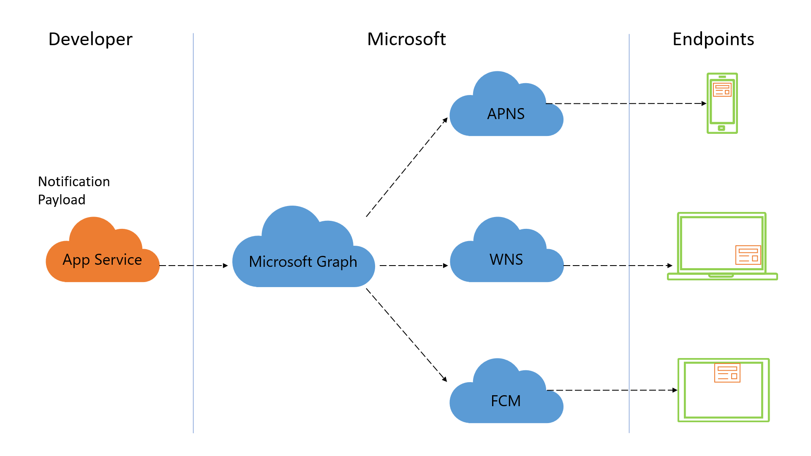

# Enabling human-centric notification experiences using Microsoft Graph notifications

Notifications are one of the most effective ways to reengage with your application users. A great notification experience can help open a near real-time communication channel between you and your users, and that in turn can increase app engagement at the right time, make users more productive, and alert them to important events or required actions.

> [!VIDEO https://www.youtube-nocookie.com/embed/cmpPFhrS8ZA]

Today, users can access your applications and services via a wide variety of platforms and form factors. This mix of devices requires that you understand and support multiplatform notification systems, map users to endpoints, and maintain notification state across devices. 

Most other notification systems eliminate the need to understand and target platform-specific push notification systems, but are still  designed to target each device. The Microsoft Graph notifications platform provides a human-centric approach that gives you the ability to target your users across any and all device endpoints.

## Why integrate with Microsoft Graph notifications?

The Microsoft Graph notifications platform provides a user-centric notification offering that brings five key benefits to your applications.

### Effortlessly target your user for notification delivery across different endpoints

You can use the notifications API to target a personal Microsoft account or a work or school Azure Active Directory (Azure AD) account to deliver notifications. The platform distributes this notification to all user endpoints running your application or service, including Windows UWP, iOS, Android, and web endpoints. This capability helps maximize outreach by ensuring appropriate notifications can reach your target, wherever they are.

### Easily manage notifications across endpoints

Using the new and improved [notifications client SDK](https://aka.ms/GNSDK) within your client application, you can update the state of a notification and sync that state across all endpoints. For example, when a user acts on a notification on one device, you can update the state of this notification (such as marking it as read or dismissed), and the same state change will be distributed to all other endpoints. The Microsoft Graph notifications API tracks the state of your user’s notifications in a centralized way, making it easy for you to ensure that your notifications are handled once, and dismissed everywhere, thereby minimizing redundancy and ensuring a great customer experience.

### Retrieve notification state and history

You can use the notifications API to retrieve notification history based on an expiration time you define (up to 30 days). Notifications that are marked as read or dismissed are still retrievable from the history, enabling in-app views of notification history as well as enabling you to build on insights and intelligence.

### Guaranteed delivery for high-priority notifications

On platforms like iOS, under certain power conditions, raw data notifications might be delayed in delivery due to batching, or not reach the target endpoint at all. For high-priority notifications being delivered to users on iOS, the Microsoft Graph notifications platform allows you to specify a raw-to-visual toast notification "fallback" option that automatically sends a visual toast notification to the target iOS device, thereby ensuring your user gets notified near real-time.   

### Privacy and compliance

Our push-to-pull model ensures that notifications never leave trusted boundaries. Platform-specific push services are used to send a shoulder-tap to your user's device and from there, the client SDK securely fetches the corresponding payload from the Microsoft Graph notifications service. We meet most enterprise compliance requirements, including ISO 27001, ISO 27018, EUMC, HIPAA, FERPA, SOC 1, SOC 2, and of course GDPR.

## How do I get started?

To get started, see the [integration overview](notifications-integration-e2e-overview.md) section to learn how you can integrate user-centric notifications within your application.

## API reference
Looking for the API reference for this service?

- [Use the notifications REST API in Microsoft Graph](/graph/api/resources/notifications-api-overview?view=graph-rest-beta)
