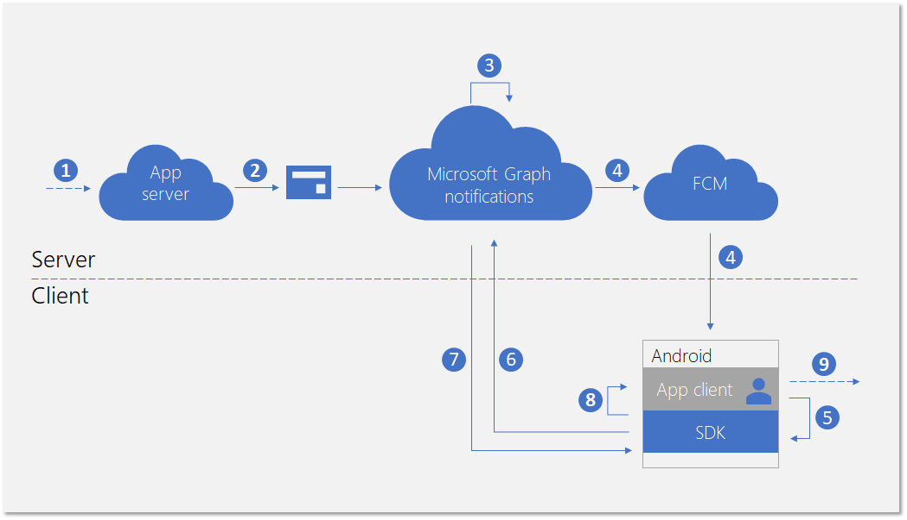
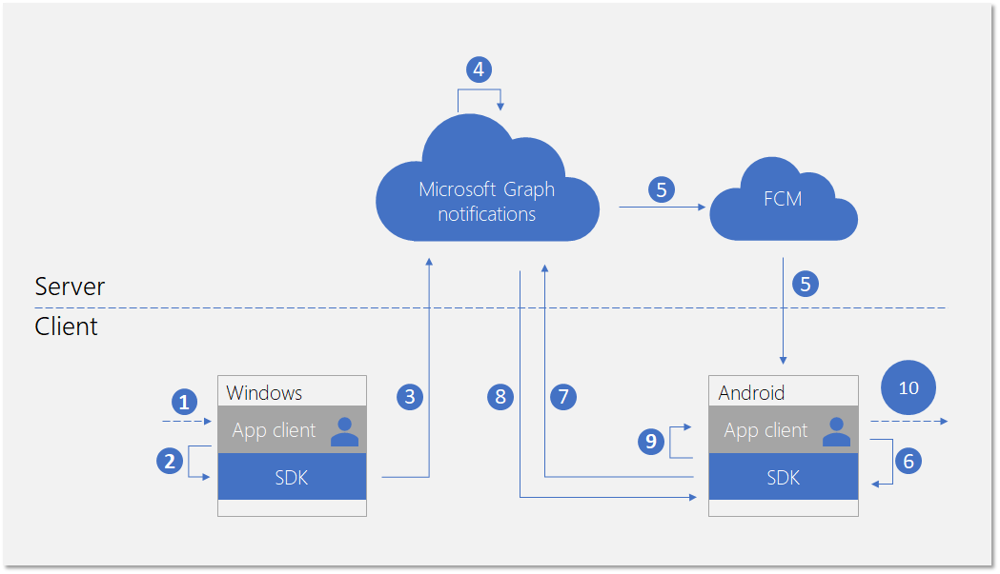

# Integrate your Android app with the client-side SDK for user notifications (deprecated)

> [!IMPORTANT]
> The Microsoft Graph notifications API is deprecated and stopped returning data in January 2022. For an alternative notification experience, see [Microsoft Azure Notification Hubs](/azure/notification-hubs). For more information, see the blog post [Retiring Microsoft Graph notifications API (beta)](https://devblogs.microsoft.com/microsoft365dev/retiring-microsoft-graph-notifications/).

After you [register your app](notifications-integration-app-registration.md) in the Azure Portal and onboard your [cross-device experiences](notifications-integration-cross-device-experiences-onboarding.md) in the Partner Dev Center, the next step is to integrate your client app with the client-side SDK for Android apps.  

With the client-side SDK, your app can perform the necessary registration steps to start receiving notifications published from your app server targeted at the user who is currently signed in. The SDK then manages the notifications on the client side, including receiving new incoming notifications, managing the state of notifications to achieve scenarios like universal dismiss, and retrieving full notification history. 

## New incoming notification flow

For receiving new incoming notifications, the data flow is shown in the following diagram.



he process involves a few components:

* App server - The back end of your application
* App client - The front end of your application (a UWP app, an Android app, or an iOS app)
* Microsoft Graph notifications - The service component that enables user notifications to be published, stored, and synced across different instances of app clients across devices and platforms
* FCM - Firebase Cloud Messaging, the push notification service provided by Android as a part of Google Play Services. Microsoft Graph notifications use this service to signal the Android app clients about user notification data changes.  

The diagram shows the following steps: 

1. Application logic. This step captures what triggers the notification to be published to the user. This is app-specific logic, and can be an event or data update about something else in Microsoft Graph, such as a new calendar event or task assignment, or else your app service wants to notify the user about.
2. The app server publishes a notification to the targeted user via the Microsoft Graph notifications API. For more details, see [server side integration](notifications-integrating-app-server.md).
3. On receiving the web request containing the new notification, Microsoft Graph notifications persists the content of the notification securely in the cloud for this app and this user.
4. For each app client instance subscribing to receive notifications for this user, Microsoft Graph notifications sends a signal to notify the app client, via the native push service provided by the operating system. In this case, the application is an Android app, and it uses [FCM data message](https://firebase.google.com/docs/cloud-messaging/concept-options) to send the signal. 
5. After the application is signaled by the incoming push notification, it asks the SDK to fetch for the changes in the user notification store. 
6. The SDK establishes a secure and compliant connection with the user notifications store in Microsoft Graph.
7. The SDK gets the data changes - in this case, the new notification contents. 
8. The SDK fires event callbacks to notify the app after the changes are successfully retrieved. 
9. Application logic. This step captures what your app chooses to do inside the event callback. Usually, this results in local app data changes and local UI updates. In this case,  the app usually constructs a toast notification popup to notify the user about the notification contents.

## Notification update flow

One of the main benefits for using Microsoft Graph notifications is that it persists notifications in the cloud securely and turns them into a stateful resource type. Therefore, it can help your application to manage and sync the correct state of the notifications across different devices for the same signed in user in a cross-device scenario. When a notification is marked as dismissed, or marked as read on one device, the other devices can be notified in real-time. "Handled once, dismissed everywhere" can become a true promise as part of the notification experience for your users. 

The following diagram shows the data flow for changing the state of a notification or deleting the notification on one device, and receiving/handling the state change or the deletion on another device.



Notice that the second part of the flow is similar to the flow for handling new incoming notifications. This is by design - the  programming pattern of the SDK is designed so that the application client can handle all types of user notification data changes (new incoming notifications, notification state changes, notification deleted) in a similar way.  

The diagram shows the following steps:

1. Application logic. Something triggers the notification to be changed or deleted. In general, any event can trigger a notification to change. 
2. App calling into the client SDK to update or delete a notification. Currently, we expose two properties regarding state changes - **userActionState** and **readState** - but your application can define these states and when they need to be updated. For example, when a user dismisses the notification popup, you can update the **userActionState** to be Dismissed. When a user clicks the notification popup and launches the app to consume corresponding app content, you can update the **userActionState** to be Activated and update the **readState** to be Read. 
3. After the corresponding API is called to update or delete a notification, the SDK will call into the user notification store in the cloud in order to fan-out this change to the other app client instances with the same signed in user. 
4. On receiving the update/delete request from a client, Microsoft Graph notifications will update the notification store, and identify the other app client instances that subscribed to this change.
5. For each app client subscription, Microsoft Graph notifications sends a signal to notify the app client, via the native push service provided by the operating system. In this case, this is an Android app, and it uses [FCM data message](https://firebase.google.com/docs/cloud-messaging/concept-options) to send the signal. 
6. After the application is signaled by the incoming push notification, it asks the SDK to fetch for the changes in the user notification store. 
7. The SDK establishes a secure and compliant connection with the user notifications store in Microsoft Graph.
8. The SDK gets the data changes - in this case, the changes are notification state updates or notification deletions. 
9. The SDK fires event callbacks to notify the app after the changes are successfully retrieved. 
10. Application logic. This step captures what your app chooses to do inside the event callback. Usually, this results in local app data changes and local UI updates. In this case, because there are notification updates, the app should update the UI locally to reflect the state change. For example, if a notification is marked as activated, you can remove the corresponding notification message inside Android's notification tray to achieve "handled once, dismissed everywhere". 

For more information about Microsoft Graph notifications, see [Microsoft Graph Notifications overview](notifications-concept-overview.md). For more information about the steps required to integrate with Microsoft Graph notifications from end to end, see Microsoft Graph notifications [integration overview](notifications-integration-e2e-overview.md).

## Development environment and requirements

To use Microsoft Graph notifications, you will need an Android app development IDE and an Android device with one of the supported architectures (**armeabi-v7a**, **arm64-v8a**, **x86**, or **x86_64**) or an emulator. The system must be running Android 4.4.2 or later.

## Adding the SDK to your project

Insert the following repository references into the *build.gradle* file at the root of your project.

```Java
allprojects {
    repositories {
    jcenter()
    maven { url 'https://maven.google.com' }
    maven { url 'https://projectrome.bintray.com/maven/' }
    }
}
```

Then, insert the following dependency into the _build.gradle_ file that is in your project folder.

```Java
dependencies { 
    ...
    implementation 'com.microsoft.connecteddevices:connecteddevices-sdk:+'
}
```

If you want to use ProGuard in your app, add the ProGuard Rules for these new APIs. Create a file called *proguard-rules.txt* in the *App* folder of your project, and paste in the contents of `ProGuard_Rules_for_Android_Rome_SDK.txt`.
In your project's *AndroidManifest.xml* file, add the following permissions inside the `manifest` element (if they are not already present). This gives your app permission to connect to the Internet and to enable Bluetooth discovery on your device.
Note that the Bluetooth-related permissions are only necessary for using Bluetooth discovery; they are not needed for the other features in the Connected Devices Platform. Additionally, `ACCESS_COARSE_LOCATION` is only required on Android SDKs 21 and later. On Android SDKs 23 and later, you must also prompt the user to grant location access at runtime.

```xml
<uses-permission android:name="android.permission.INTERNET" />
<uses-permission android:name="android.permission.BLUETOOTH" />
<uses-permission android:name="android.permission.BLUETOOTH_ADMIN" />
<uses-permission android:name="android.permission.ACCESS_COARSE_LOCATION" />
<uses-permission android:name="android.permission.ACCESS_NETWORK_STATE" />
```
Next, go to the activity classes where you would like the Connected Devices functionality to be located. Import the following namespaces.

```java
import com.microsoft.connecteddevices;
import com.microsoft.connecteddevices.userdata;
import com.microsoft.connecteddevices.userdata.usernotifications;
```

## Initializing the Connected Device Platforms

The client-side SDK is built on top of an infrastructure called Connected Device Platform. Before any feature can be used, the platform must be initialized within your app. The initialization steps should occur in your main class **OnCreate** method, because they are required before the notification scenarios can take place.

You must construct and initialize the platform by instantiating the [**ConnectedDevicesPlatform**](/java/api/com.microsoft.connecteddevices.connecteddevicesplatform?view=rome-android-latest&preserve-view=true) class. Before doing that, make sure to hook up event handlers, because after the platform is started, the events might begin to fire. 

```java
ConnectedDevicesPlatform platform = new ConnectedDevicesPlatform(context);

platform.getAccountManager().accessTokenRequested().subscribe((accountManager, args) -> onAccessTokenRequested(accountManager, args));
platform.getAccountManager().accessTokenInvalidated().subscribe((accountManager, args) -> onAccessTokenInvalidated(accountManager, args));
platform.getNotificationRegistrationManager().notificationRegistrationStateChanged().subscribe((notificationRegistrationManager, args) -> onNotificationRegistrationStateChanged(notificationRegistrationManager, args));

platform.start();
```

### Handling account access token

All the web calls the SDK makes, including retrieving the content of a new incoming notification, updating notification states, and more, are reading from or writing to the user's data, and therefore always require a valid access token. The SDK requires you to handle the following events - invoked when an access token is requested or invalidated - to make sure that after the platform is initialized, your access token for the user is handled correctly. 

#### accessTokenRequested 

For a full implementation, see the [Android sample app](https://github.com/Microsoft/project-rome/blob/release/1.3.0/Android/samples/graphnotificationssample/app/src/main/java/com/microsoft/connecteddevices/graphnotifications/ConnectedDevicesManager.java). 

```Java
private void onAccessTokenRequested(ConnectedDevicesAccountManager sender, ConnectedDevicesAccessTokenRequestedEventArgs args) {
    ConnectedDevicesAccessTokenRequest request = args.getRequest();
    List<String> scopes = request.getScopes();

    // We always need to complete the request, even if a matching account is not found
    if (account == null) {
        request.completeWithErrorMessage("The app could not find a matching ConnectedDevicesAccount to get a token");
        return;
    }

    // Complete the request with a token
    account.getAccessTokenAsync(scopes)
        .thenAcceptAsync((String token) -> {
            request.completeWithAccessToken(token);
        }).exceptionally(throwable -> {
            request.completeWithErrorMessage("The Account could not return a token with those scopes");
            return null;
    });
}
```

#### accessTokenInvalidated

For a full implementation, see the  [Android sample app](https://github.com/Microsoft/project-rome/blob/release/1.3.0/Android/samples/graphnotificationssample/app/src/main/java/com/microsoft/connecteddevices/graphnotifications/ConnectedDevicesManager.java). 

```Java
private void onAccessTokenInvalidated(ConnectedDevicesAccountManager sender, ConnectedDevicesAccessTokenInvalidatedEventArgs args, List<Account> accounts) {
    Log.i(TAG, "Token invalidated for account: " + args.getAccount().getId());
}
```

### Handling push registration expiration 

Microsoft Graph notifications uses FCM, the native push platform on Android, to signal the client application on user notifications data changes. This happens when new incoming notifications are published from your app server, or when any notification's state is updated on a different device with the same signed in user in a cross-device scenario. 

Therefore, a valid FCM token that allows data notification messages to come through successfully is required. The following event callback handles FCM push token expirations. 

#### notificationRegistrationStateChanged

For a full implementation, see the  [Android sample app](https://github.com/Microsoft/project-rome/blob/release/1.3.0/Android/samples/graphnotificationssample/app/src/main/java/com/microsoft/connecteddevices/graphnotifications/ConnectedDevicesManager.java). 

## Signing in your user

Microsoft Graph notifications, like many other resource types in Microsoft Graph, are centralized around users. In order for your app to subscribe to and start receiving notifications for the signed in user, you first need to obtain a valid OAuth token to be used in the registration process. You can use your preferred method of generating and managing the OAuth tokens. The sample app used ADAL. 

If you're using a Microsoft account, you will need to include the following permissions in your sign-in request: `wl.offline_access"`, `ccs.ReadWrite`, `wns.connect`, `asimovrome.telemetry`, and `https://activity.windows.com/UserActivity.ReadWrite.CreatedByApp`. 

If you're using an Azure AD account, you'll need to request the following audience: `https://cdpcs.access.microsoft.com`.

## Adding the user account to the platform 

You need to register the signed in user account with the SDK, which involves adding the account and registering a push channel in order to receive the initial push notifications through FCM. 

```Java
public AsyncOperation<Boolean> prepareAccountAsync(final Context context) {
    // Accounts can be in 3 different scenarios:
    // 1: cached account in good standing (initialized in the SDK and our token cache).
    // 2: account missing from the SDK but present in our cache: Add and initialize account.
    // 3: account missing from our cache but present in the SDK. Log the account out async

    // Subcomponents (e.g. UserDataFeed) can only be initialized when an account is in both the app cache
    // and the SDK cache.
    // For scenario 1, initialize our subcomponents.
    // For scenario 2, subcomponents will be initialized after InitializeAccountAsync registers the account with the SDK.
    // For scenario 3, InitializeAccountAsync will unregister the account and subcomponents will never be initialized.
    switch (mState) {
        // Scenario 1
        case IN_APP_CACHE_AND_SDK_CACHE:
            mUserNotificationsManager = new UserNotificationsManager(context, mAccount, mPlatform);
            return registerAccountWithSdkAsync();
        // Scenario 2
        case IN_APP_CACHE_ONLY: {
            // Add the this account to the ConnectedDevicesPlatform.AccountManager
            return mPlatform.getAccountManager().addAccountAsync(mAccount).thenComposeAsync((ConnectedDevicesAddAccountResult result) -> {
                // We failed to add the account, so exit with a failure to prepare bool
                if (result.getStatus() != ConnectedDevicesAccountAddedStatus.SUCCESS) {
                    result.getStatus());
                    return AsyncOperation.completedFuture(false);
                }

                // Set the registration state of this account as in both app and sdk cache
                mState = AccountRegistrationState.IN_APP_CACHE_AND_SDK_CACHE;
                mUserNotificationsManager = new UserNotificationsManager(context, mAccount, mPlatform);
                return registerAccountWithSdkAsync();
            });
        }
        // Scenario 3
        case IN_SDK_CACHE_ONLY:
            // Remove the account from the SDK since the app has no knowledge of it
            mPlatform.getAccountManager().removeAccountAsync(mAccount);
            // This account could not be prepared
            return AsyncOperation.completedFuture(false);
        default:
            // This account could not be prepared
            Log.e(TAG, "Failed to prepare account " + mAccount.getId() + " due to unknown state!");
            return AsyncOperation.completedFuture(false);
    }
}
```

```Java
public AsyncOperation<Boolean> registerAccountWithSdkAsync() {
    if (mState != AccountRegistrationState.IN_APP_CACHE_AND_SDK_CACHE) {
        AsyncOperation<Boolean> toReturn = new AsyncOperation<>();
        toReturn.completeExceptionally(new IllegalStateException("Cannot register this account due to bad state: " + mAccount.getId()));
        return toReturn;
    }

    // Grab the shared GCM/FCM notification token from this app's BroadcastReceiver
    return RomeNotificationReceiver.getNotificationRegistrationAsync().thenComposeAsync((ConnectedDevicesNotificationRegistration notificationRegistration) -> {
        // Perform the registration using the NotificationRegistration
        return mPlatform.getNotificationRegistrationManager().registerAsync(mAccount, notificationRegistration)
            .thenComposeAsync((result) -> {
                if (result.getStatus() == ConnectedDevicesNotificationRegistrationStatus.SUCCESS) {
                    Log.i(TAG, "Successfully registered account " + mAccount.getId() + " for cloud notifications");
                } else {
                    // It would be a good idea for apps to take a look at the different statuses here and perhaps attempt some sort of remediation.
                    // For example, token request failed could mean that the user needs to sign in again. An app could prompt the user for this action 
                    // and retry the operation afterwards.
                    Log.e(TAG, "Failed to register account " + mAccount.getId() + " for cloud notifications!");
                    return AsyncOperation.completedFuture(false);
                }

                return mUserNotificationsManager.registerForAccountAsync();
            });
    });
}
```

## Subscribing to receive user's notifications 

You need to instantiate a **UserDataFeed** object for your application for this logged in user. Your application is identified by the cross-platform app ID you provided during the [Cross-Device Experiences onboarding](notifications-integration-cross-device-experiences-onboarding.md).

```Java
public UserNotificationsManager(@NonNull Context context, @NonNull ConnectedDevicesAccount account, @NonNull ConnectedDevicesPlatform platform)
{
    Context context = new Context;
    UserDataFeed feed = UserDataFeed.getForAccount(account, platform, Secrets.APP_HOST_NAME);
    UserNotificationChannel channel = new UserNotificationChannel(feed);
    UserNotificationReader reader = channel.createReader();
    reader.dataChanged().subscribe((reader, aVoid) -> readFromCache(reader));
    }
}
```

## Receiving and managing user notifications

The flow diagram earlier in this topic shows that the programming patterns to handle a new incoming notifications from an app server and a notification update or deletion initiated from another app client instance are similar. The following are the steps for handling these data changes. 

### Handling incoming push notification signal

All types of user notification data changes generate a signal that gets delivered to the app clients as a push notification. For Android apps, the signal is delivered as a FCM push data message. On receiving the data message signal, the app should call **TryParse** to trigger the SDK to fetch from the Microsoft Graph notifications service for the actual data changes.

```Java
public void onMessageReceived(RemoteMessage message) {
    Map data = message.getData();
    ConnectedDevicesNotification notification = ConnectedDevicesNotification.tryParse(data);

    if (notification != null) {
        try {
            ConnectedDevicesPlatform platform = ConnectedDevicesManager.getConnectedDevicesManager(getApplicationContext()).getPlatform();

            // NOTE: it may be useful to attach completion to this async in order to know when the notification is done being processed.
            // This would be a good time to stop a background service or otherwise cleanup.
            platform.processNotificationAsync(notification);
        } catch (Exception e) {
            Log.e(TAG, "Failed to process FCM notification" + e.getMessage());
        }
    }
}
```

### Handling user notification data changes

After the SDK successfully completes fetching the data changes, an event callback is invoked and the app client is expected to handle notification creation, update, or deletion.

```Java
private void readFromCache(final UserNotificationReader reader)
{
    reader.readBatchAsync(Long.MAX_VALUE).thenAccept(notifications -> {
        synchronized (this) {
            for (final UserNotification notification : notifications) {
                if (notification.getStatus() == UserNotificationStatus.ACTIVE) {
                    removeIf(mNewNotifications, item -> notification.getId().equals(item.getId()));

                    if (notification.getUserActionState() == UserNotificationUserActionState.NO_INTERACTION) {
                        mNewNotifications.add(notification);
                        if (notification.getReadState() != UserNotificationReadState.READ) {
                            clearNotification(mContext.getApplicationContext(), notification.getId());
                            addNotification(mContext.getApplicationContext(), notification.getContent(), notification.getId());
                        }
                    } else {
                        clearNotification(mContext.getApplicationContext(), notification.getId());
                    }

                    removeIf(mHistoricalNotifications, item -> notification.getId().equals(item.getId()));
                    mHistoricalNotifications.add(0, notification);
                } else {
                    removeIf(mNewNotifications, item -> notification.getId().equals(item.getId()));
                    removeIf(mHistoricalNotifications, item -> notification.getId().equals(item.getId()));
                    clearNotification(mContext.getApplicationContext(), notification.getId());
                }
            }
        }

    });
}
```

### Update state of a notification

If a notification state change is initiated from this app client instance (for example, if the toast notification popup on this device is activated by the user), the app needs to call the SDK to update the notification's state in order to have this state change synced across all devices used by the same user. 

```Java
notification.setUserActionState(UserNotificationUserActionState.ACTIVATED);
notification.saveAsync().whenCompleteAsync((userNotificationUpdateResult, throwable) -> {
    if (throwable == null && userNotificationUpdateResult != null && userNotificationUpdateResult.getSucceeded()) {
        Log.d(TAG, "Successfully activated the notification");
    }
});
```

### Delete a notification

If a notification deletion is initiated from this app client instance (for example, if the task corresponding to this notification is marked as complete and is removed from your app's database), the app needs to call the SDK to delete the notification in order to have this delete operation synced across all devices used by the same user. 

A notification is removed from the user notification store only if it is expired or explicitly deleted. A user notification is not deleted when you update the **UserActionState** to be Dismissed, because the semantic definition of **UserActionState** is defined by the application itself.

```Java
channel.deleteUserNotificationAsync(notification.getId()).whenCompleteAsync((userNotificationUpdateResult, throwable) -> {
    if (throwable == null && userNotificationUpdateResult != null && userNotificationUpdateResult.getSucceeded()) {
        Log.d(TAG, "Successfully deleted the notification");
    }
});
```

## See also

- [API reference](/windows/project-rome/notifications/api-reference-for-android) for the full set of APIs related to notification features in the SDK. 
- [Client-side sample](https://github.com/Microsoft/project-rome/tree/master/Android/samples/graphnotificationssample) for Android apps.
- [App server sample](notifications-integrating-app-server.md) for publishing notifications.
