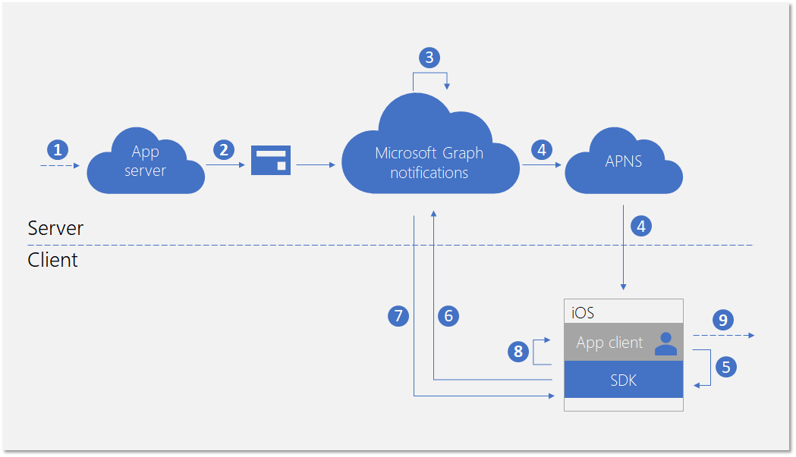
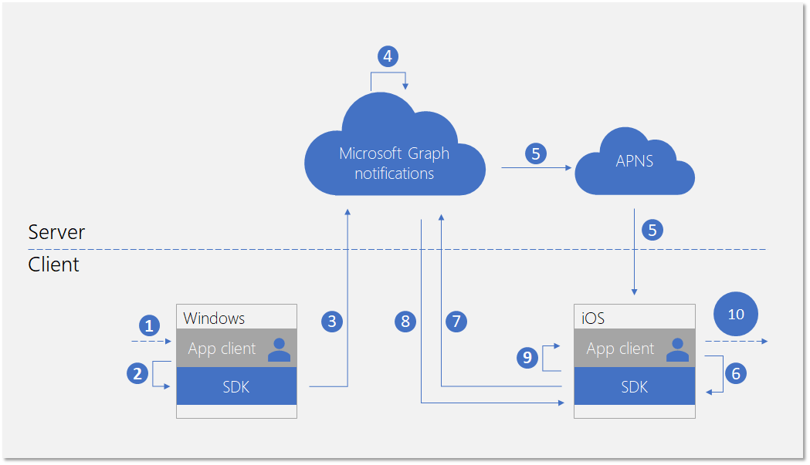

# Integrate your iOS app with the client-side SDK for user notifications

After you [register your app](notifications-integration-app-registration.md) in the Azure Portal and onboard your [cross-device experiences](notifications-integration-cross-device-experiences-onboarding.md) in the Partner Dev Center, the next step is to integrate your client app with the client-side SDK for iOS apps.  

With the client-side SDK, your app can perform the necessary registration steps to start receiving notifications published from your app server targeted at the user who is currently signed in. The SDK then manages the notifications on the client side, including receiving new incoming notifications, managing the state of notifications to achieve scenarios like universal dismiss, and retrieving full notification history. 

## New incoming notification flow

For receiving new incoming notifications, the data flow is shown in the following diagram.



The process involves a few components:

* App server - The back end of your application
* App client - The front end of your application (a UWP app, an Android app, or an iOS app)
* Microsoft Graph notifications - The service component that enables user notifications to be published, stored, and synced across different instances of app clients across devices and platforms
* APNs - The Apple Push Notification Service provided by Apple for iOS apps. Microsoft Graph notifications use this service to signal the iOS app clients about user notification data changes.  

The diagram shows the following steps: 

1. Application logic. This step captures what triggers the notification to be published to the user. This is app-specific logic, and can be an event or data update about something else in Microsoft Graph, such as a new calendar event or task assignment, or else your app service wants to notify the user about.
2. The app server publishes a notification to the targeted user via the Microsoft Graph notifications API. For more details, see [server side integration](notifications-integrating-app-server.md).
3. On receiving the web request containing the new notification, Microsoft Graph notifications persists the content of the notification securely in the cloud for this app and this user.
4. For each app client instance subscribing to receive notifications for this user, Microsoft Graph notifications sends a signal to notify the app client, via the native push service provided by the operating system. In this case, the application is an iOS app, and it uses [APNs background update notification] to send the signal. 
5. After the application is signaled by the incoming push notification, it asks the SDK to fetch for the changes in the user notification store. 
6. The SDK establishes a secure and compliant connection with the user notifications store in Microsoft Graph.
7. The SDK gets the data changes - in this case, the new notification contents. 
8. The SDK fires event callbacks to notify the app after the changes are successfully retrieved. 
9. Application logic. This step captures what your app chooses to do inside the event callback. Usually, this results in local app data changes and local UI updates. In this case,  the app usually constructs an iOS alert to notify the user about the notification contents.

## Notification update flow

One of the main benefits for using Microsoft Graph notifications is that it persists notifications in the cloud securely and turns them into a stateful resource type. Therefore, it can help your application to manage and sync the correct state of the notifications across different devices for the same signed in user in a cross-device scenario. When a notification is marked as dismissed, or marked as read on one device, the other devices can be notified in real-time. "Handled once, dismissed everywhere" can become a true promise as part of the notification experience for your users. 

The following diagram shows the data flow for changing the state of a notification or deleting the notification on one device, and receiving/handling the state change or the deletion on another device.



Notice that the second part of the flow is similar to the flow for handling new incoming notifications. This is by design - the  programming pattern of the SDK is designed so that the application client can handle all types of user notification data changes (new incoming notifications, notification state changes, notification deleted) in a similar way.  

The diagram shows the following steps:

1. Application logic. Something triggers the notification to be changed or deleted. In general, any event can trigger a notification to change. 
2. App calling into the client SDK to update or delete a notification. Currently, we expose two properties regarding state changes - **userActionState** and **readState** - but your application can define these states and when they need to be updated. For example, when a user dismisses the notification popup, you can update the **userActionState** to be Dismissed. When a user clicks the notification popup and launches the app to consume corresponding app content, you can update the **userActionState** to be Activated and update the **readState** to be Read. 
3. After the corresponding API is called to update or delete a notification, the SDK will call into the user notification store in the cloud in order to fan-out this change to the other app client instances with the same signed in user. 
4. On receiving the update/delete request from a client, Microsoft Graph notifications will update the notification store, and identify the other app client instances that subscribed to this change.
5. For each app client subscription, Microsoft Graph notifications sends a signal to notify the app client, via the native push service provided by the operating system. In this case, this is an iOS, and it uses [APNs background update notification](https://developer.apple.com/library/archive/documentation/NetworkingInternet/Conceptual/RemoteNotificationsPG/CreatingtheNotificationPayload.html#//apple_ref/doc/uid/TP40008194-CH10-SW8) to send the signal. 
6. After the application is signaled by the incoming push notification, it asks the SDK to fetch for the changes in the user notification store. 
7. The SDK establishes a secure and compliant connection with the user notifications store in Microsoft Graph.
8. The SDK gets the data changes - in this case, the changes are notification state updates or notification deletions. 
9. The SDK fires event callbacks to notify the app after the changes are successfully retrieved. 
10. Application logic. This step captures what your app chooses to do inside the event callback. Usually, this results in local app data changes and local UI updates. In this case, because there are notification updates, the app should update the UI locally to reflect the state change. For example, if a notification is marked as activated, you can remove the corresponding alert UI inside the iOS notification center to achieve "handled once, dismissed everywhere". 

For more information about Microsoft Graph notifications, see [Microsoft Graph Notifications overview](notifications-concept-overview.md). For more information about the steps required to integrate with Microsoft Graph notifications from end to end, see Microsoft Graph notifications [integration overview](notifications-integration-e2e-overview.md).

## Adding the SDK to your project

The simplest way to add the Connected Devices Platform to your iOS app is by using the [CocoaPods](https://cocoapods.org/) dependency manager. Go to your iOS project's *Podfile* and insert the following entry:

```ObjectiveC
platform :ios, "10.0"
workspace 'iOSSample'

target 'iOSSample' do
  # Uncomment the next line if you're using Swift or would like to use dynamic frameworks
  # use_frameworks!

	pod 'ProjectRomeSdk'

  # Pods for iOSSample
```

> [!NOTE]
> In order to consume CocoaPod, you must use the _.xcworkspace_ file in your project.

## Initializing the Connected Device Platforms

The client-side SDK is built on top of an infrastructure called Connected Device Platform. Before any feature can be used, the platform must be initialized within your app. The initialization steps should occur in your **AppDelegate** method, because they are required before the notification scenarios can take place.

You must construct and initialize the platform by instantiating the [**MCDConnectedDevicesPlatform**](/windows/project-rome/objectivec-api/connecteddevices/mcdconnecteddevicesplatform) class. efore doing that, make sure to hook up event handlers, as shown, because after platform is started, the events might begin to fire.  

```ObjectiveC
MCDConnectedDevicesPlatform* platform = [MCDConnectedDevicesPlatform new];
        
[platform.accountManager.accessTokenRequested subscribe:^(MCDConnectedDevicesAccountManager* _Nonnull manager, MCDConnectedDevicesAccessTokenRequestedEventArgs* _Nonnull args) {
    // implement the callback;
}];
        
[self.platform.accountManager.accessTokenInvalidated
    subscribe:^(MCDConnectedDevicesAccountManager* _Nonnull manager __unused,
        MCDConnectedDevicesAccessTokenInvalidatedEventArgs* _Nonnull request) {
    // implement the callback;
}];
        
[self.platform.notificationRegistrationManager.notificationRegistrationStateChanged subscribe:^(MCDConnectedDevicesNotificationRegistrationManager* _Nonnull manager __unused, MCDConnectedDevicesNotificationRegistrationStateChangedEventArgs* _Nonnull args) {
    // implement the callback
}];
        
[platform start];
```

### Handling account access token

All the web calls the SDK makes, including retrieving the content of a new incoming notification, updating notification states, and more, are reading from or writing to the user's data, and therefore always require a valid access token. The SDK requires you to handle the following events - invoked when an access token is requested or invalidated - to make sure that after the platform is initialized, your access token for the user is handled correctly. 

#### accessTokenRequested

For a full implementation, see the [iOS sample app](https://github.com/Microsoft/project-rome/blob/master/iOS/samples/GraphNotifications/GraphNotificationsSample/ConnectedDevicesPlatformManager.m). 

#### accessTokenInvalidated

For a full implementation, see the [iOS sample app](https://github.com/Microsoft/project-rome/blob/master/iOS/samples/GraphNotifications/GraphNotificationsSample/ConnectedDevicesPlatformManager.m). 

```ObjectiveC
[platform.accountManager.accessTokenInvalidated
    subscribe:^(MCDConnectedDevicesAccountManager* _Nonnull manager __unused,
        MCDConnectedDevicesAccessTokenInvalidatedEventArgs* _Nonnull request) {
}];
```

### Handling push registration expiration 

Microsoft Graph notifications use APNs, the native push platform on iOS, to signal the client application on user notifications data changes. This happens when new incoming notifications are published from your app server, or when any notification's state is updated on a different device with the same signed in user in a cross-device scenario. 

For this reason, a valid APNs token that allows background update notifications to come through successfully is required. The following event callback handles APNs push token expirations. 

#### notificationRegistrationStateChanged

For a full implementation, see the [iOS sample app](https://github.com/Microsoft/project-rome/blob/master/iOS/samples/GraphNotifications/GraphNotificationsSample/ConnectedDevicesPlatformManager.m). 

## Signing in your user

Microsoft Graph notifications, like many other resource types inside Microsoft Graph, are centralized around users. In order for your app to subscribe to and start receiving notifications for the signed in user, you first need to obtain a valid OAuth token to be used in the registration process. You can use your preferred method of generating and managing the OAuth tokens. The sample app uses ADAL. 

If you're using a Microsoft account, you will need to include the following permissions in your sign-in request: `wl.offline_access"`, `ccs.ReadWrite`, `wns.connect`, `asimovrome.telemetry`, and `https://activity.windows.com/UserActivity.ReadWrite.CreatedByApp`. 

If you're using an Azure AD account, you'll need to request the following audience: `https://cdpcs.access.microsoft.com`.

## Adding the user account to the platform 

You need to register the signed in user account with the SDK. This involves adding the account and registering a push channel to receive the initial push notifications through APNs. For details, see the [prepareAccountAsync](https://github.com/Microsoft/project-rome/blob/master/iOS/samples/GraphNotifications/GraphNotificationsSample/ConnectedDevicesPlatformManager.m) method in the sample.

```ObjectiveC
MCDConnectedDevicesPlatform* platform = [MCDConnectedDevicesPlatform new];
MCDConnectedDevicesAccount* mcdAccount = [MCDConnectedDevicesAccount new];

[platform.accountManager addAccountAsync:mcdAccount callback:adapter]; 
```

## Subscribing to receive user's notifications 

You need to instantiate a **UserDataFeed** object for your application for this signed in user. Your application is identified by the cross-platform app ID you provided during the [Cross-Device Experiences onboarding](notifications-integration-cross-device-experiences-onboarding.md) process.

```ObjectiveC
// Initialize the feed and subscribe for notifications
MCDUserDataFeed* feed = [MCDUserDataFeed getForAccount:account
                        platform:platform
                        activitySourceHost:APP_HOST_NAME];

NSArray<MCDUserDataFeedSyncScope*>* syncScopes = @[ [MCDUserNotificationChannel syncScope] ];
[feed subscribeToSyncScopesAsync:syncScopes
        callback:^(BOOL success __unused, NSError* _Nullable error __unused) {
    // Start syncing down notifications
    [feed startSync];
}];
```

## Receiving and managing user notifications

The flow diagram earlier in this topic shows that the programming patterns to handle a new incoming notifications from an app server and a notification update or deletion initiated from another app client instance are similar. The following are the steps for handling these data changes. 

### Handling incoming push notification signal

All types of user notification data changes generate a signal that gets delivered to the app clients as a push notification. In the case of an iOS app, the signal is delivered as an APNs background update notification. On receiving the data message signal, the app should call **TryParse** to trigger the SDK to fetch from the Microsoft Graph notifications service for the actual data changes.

```ObjectiveC
// App running in background and received a push notification, launched by user tapping the alert view
MCDConnectedDevicesNotification* notification = [MCDConnectedDevicesNotification tryParse:notificationInfo];
if (notification != nil) {
    [_platformManager.platform processNotificationAsync:notification
            completion:^(NSError* error __unused) {
        // NOTE: it may be useful to attach completion to this async in order to know when the
        // notification is done being processed.
        // This would be a good time to stop a background service or otherwise cleanup.
    }];
} else {
    NSLog(@"Remote notification is not for ConnectedDevicesPlatform, skip processing");
}
```

### Handling user notification data changes

After the SDK successfully fetches the data changes, an event callback is invoked and the app client is expected to handle notification creation, update, or deletion.

```ObjectiveC
[reader readBatchAsyncWithMaxSize:100 completion:^(NSArray<MCDUserNotification *> * _Nullable notifications,
                                                    NSError * _Nullable error) {
    if (error) {
    } else {
        for (MCDUserNotification* notification in self.notifications) {
		// Handle notification change based on change type;
		}
        }
    }
}];
```

### Update state of a notification

If a notification state change is initiated from this app client instance (for example, if the toast notification popup on this device is activated by the user), the app needs to call the SDK to update the notification's state in order to have this state change synced across all devices used by the same user. 

```ObjectiveC
- (void)dismissNotification:(MCDUserNotification*)notification {
    if (notification.userActionState == MCDUserNotificationUserActionStateNoInteraction) {
        [self dismissNotificationFromTrayWithId:notification.notificationId];
        notification.userActionState = MCDUserNotificationUserActionStateDismissed;
        [notification saveAsync:^(__unused MCDUserNotificationUpdateResult * _Nullable result, __unused NSError * _Nullable error) {
		// handle result;
         }];
    }
}
```

### Delete a notifications

If a notification deletion is initiated from this app client instance (for example, if the task corresponding to this notification is marked as complete and is removed from your app's database), the app needs to call the SDK to delete the notification in order to have this delete operation synced across all devices used by the same user. 

A notification is removed from the user notification store only if it is expired or explicitly deleted. A user notification is not deleted when you update the **UserActionState** to be Dismissed, because the semantic definition of **UserActionState** is defined by the application itself.

```Obj-C
- (void)deleteNotification:(MCDUserNotification*)notification {
    [_channel deleteUserNotificationAsync:notification.notificationId
     completion:^(__unused MCDUserNotificationUpdateResult* _Nullable result, NSError* _Nullable error) {
        // handle result;
     }];
}
```

## See also

- [API reference](/windows/project-rome/notifications/api-reference-for-ios/) for the full set of APIs related to notification features in the SDK. 
- [Client-side sample](https://github.com/Microsoft/project-rome/tree/master/iOS/samples/GraphNotifications) for Android apps.
- [App server sample](notifications-integrating-app-server.md) for publishing notifications.
