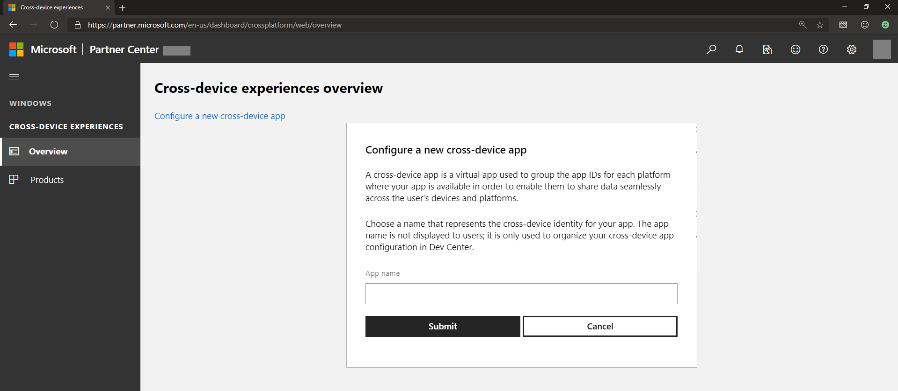
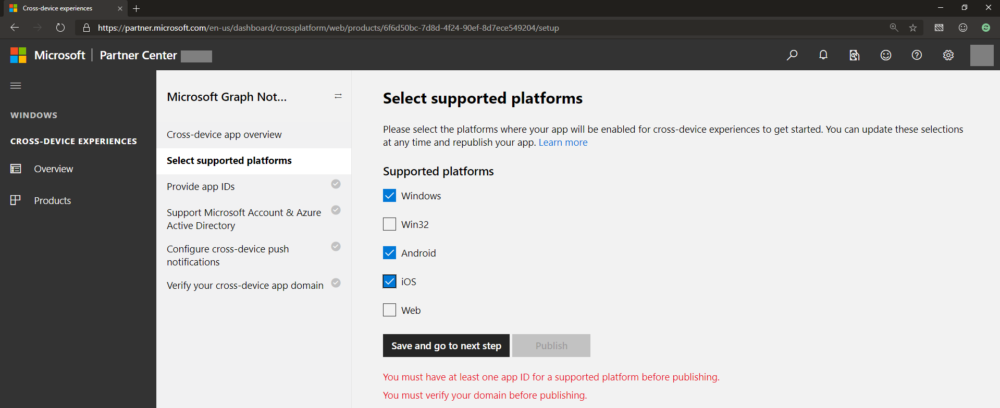
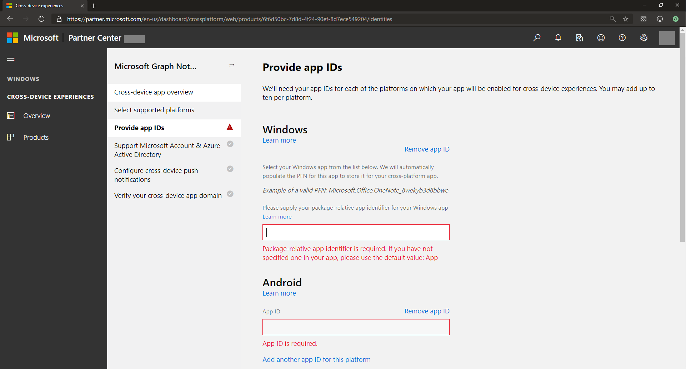
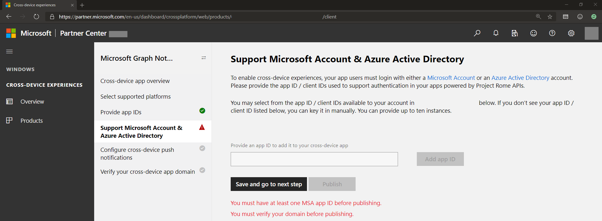
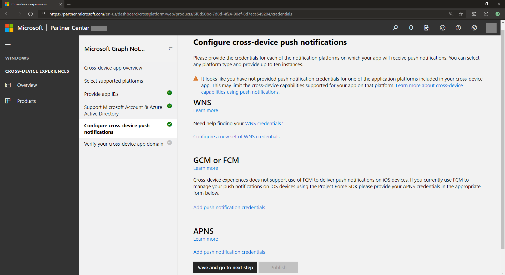
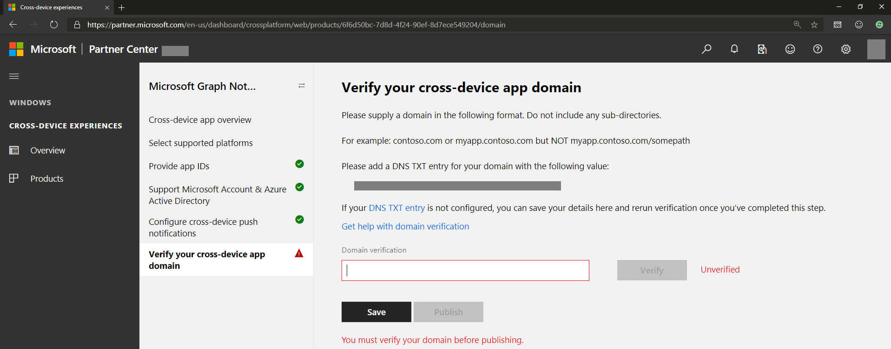

# Onboarding to cross-device experiences for Microsoft Graph notifications

>[!NOTE]
>If you're only targeting web endpoints, you can go directly to setting up your [app service](notifications-integrating-app-server.md) to send notifications.

In addition to [app registration on Azure Portal](notifications-integration-app-registration.md), your application needs to register cross-device information such as cross-platform application ID and cross-platform push credentials in order to authorize Microsoft Graph to send notifications via native push notification services that correspond to each operating system: Windows, iOS, and Android. This is done through the [Partner Center dashboard (formerly Windows Dev Center dashboard)](https://partner.microsoft.com/dashboard/). 

> [!NOTE]
> You'll need a Windows developer account to complete the steps in this article, even if you don’t plan to build a Windows UWP application. If you don’t already have a Windows developer account, see [Opening a developer account](/windows/uwp/publish/opening-a-developer-account). Alternatively, if you prefer not to enroll as a Windows developer, you can reach out to us via email at [gnsengage@microsoft.com](sendto: gnsengage@microsoft.com). If you create a Windows developer account and are building a school or work application as part of an enterprise, you can associate your developer account with the appropriate Azure AD account that is used for managing your enterprise submissions. For details, see [Associate Azure Active Directory with your Partner Center account](/windows/uwp/publish/associate-azure-ad-with-partner-center).

To get started, sign in to the [Partner Center dashboard](https://partner.microsoft.com/dashboard) using your Windows developer account:

1.  On the left menu, go to **Cross-Device Experiences**, select **Configuring a new cross-device app**, and provide your app name, as shown in the following screenshot.

2.  Select all supported platforms where your app will have a presence and be enabled to receive notifications. You can select from supported platforms that include Windows, Android, and iOS, as shown. 

3.  Provide app IDs for each of the platforms where your app has a presence, as shown.

 

> [!NOTE] 
> You can add different IDs (up to ten) per platform – this is in case you have multiple versions of the same app, or even different apps, that want to be able to receive the same notification sent by your app server and targeted to the same user.

4.  Provide or select the app ID from Microsoft account and/or Azure AD app registration. This client ID corresponds to the Microsoft account or Azure AD app registration that you obtained when you register in the Azure Portal.

5.  Microsoft Graph notifications use each of the native notification platforms on all major platforms to send notifications to the app client endpoints, namely, WNS (for Windows UWP), FCM (for Android), and APNS (for iOS). Provide your credentials for these notification platforms to enable Microsoft Graph notifications to deliver notifications for your app server when you publish user-targeted notifications, as shown.

 

> [!NOTE]
> For Windows UWP apps, enabling WNS push notification is a prerequisite to using Microsoft Graph notifications. For details, see [WNS overview](/windows/uwp/design/shell/tiles-and-notifications/windows-push-notification-services--wns--overview). After you onboard, you can provide push credentials via Partner Center to the Connected Device Platform.

6.  Verify your cross-device app domain, which serves as a verification process to prove that your application has ownership of this domain. This acts like a cross-device app identity for the application or applications you registered, as shown.
    
    

That’s it! You've now registered your applications to receive notifications. Next, learn how to set up your [app service](notifications-integrating-app-server.md) and start sending notifications.
