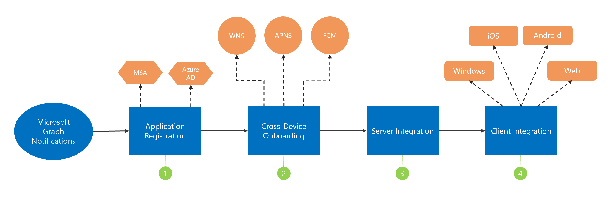

# Integrate with Microsoft Graph notifications

You can integrate your apps with Microsoft Graph notifications with a few simple steps, as shown in the following diagram.

1.  [Register](notifications-integration-app-registration.md) your application in the Microsoft Azure portal.

2. [Onboard](notifications-integration-cross-device-experiences-onboarding.md) to Partner Center/Windows Dev Center for cross-platform application identity and push notification credentials for Windows, iOS, and Android.

3.  [Set up your app server](notifications-integrating-app-server.md) to send notifications via Microsoft Graph.

4.  [Integrate](notifications-integrating-with-windows.md) the new [notifications client SDK](https://aka.ms/GNSDK) into your Windows, iOS, Android, or web clients to receive and manage notifications.

> [!NOTE]
> We recommend using the new and improved, lightweight [notification SDK](https://aka.ms/GNSDK) instead of the cross-device [Project Rome SDK](https://github.com/microsoft/project-rome).
