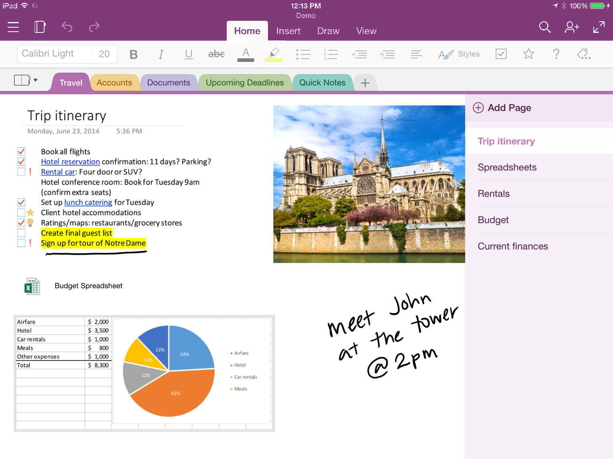
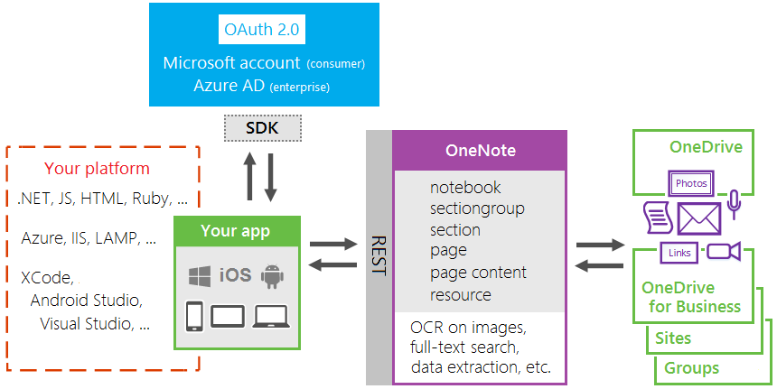

# Integrate with OneNote

OneNote is a popular note-taking tool that's available online and on many mobile and tablet platforms. By integrating your apps with OneNote, it's easier than ever to create empowering apps on your favorite platforms and reach millions of users worldwide. 



Leverage OneNote's notebook, section, and page hierarchy and easy-to-use API to help your users plan and organize ideas and information.

## Platform overview

The OneNote service runs on the Microsoft cloud and provides a RESTful interface for programmatic access to OneNote content. The OneNote API is lightweight and simple--it's built on JSON, HTML, and OData, so you can use it with any language or platform that supports HTTP requests. 

Here's a simple view of the OneNote API development stack. 



First, your user must be authenticated and grant access to your app. Then you get an access token that you use to interact with OneNote content. 
 In addition to CRUD support for OneNote resources, the API also provides capabilities such as optical character recognition (OCR), full-text search, and business card extractions.

>You can use [SDKs](#sdks-for-onenote-development) to simplify the auth process. 

**Using the OneNote API**

To use the OneNote API, you send HTTP requests to specific endpoints off OneNote's service root URL:

```http
https://www.onenote.com/api/{version}/{location}/notes/...
```


You can use the OneNote API to do things like create, view, and manage pages in personal, site, and group notebooks. To give you an idea of how the API works, here's a simple POST request that creates a page in the current user's default notebook. 

```http
POST https://www.onenote.com/api/v1.0/me/notes/pages

Authorization: Bearer {token}
Content-Type: text/html; charset=utf-8
Accept: application/json
 ...

<!DOCTYPE html>
<html>
    <head>
    <title>My new OneNote page</title>
    <meta name="created" content="2015-09-9T12:45:00.000-8:00"/>
    </head>
    <body>
        <p>This is a simple HTML page.</p>
    </body>
</html>
```     

If successful, the request returns the following response--in this case an OData representation of the new page in JSON format.

```http
HTTP/1.1 201 Created
Location: https://www.onenote.com/api/v1.0/me/notes/pages/0-37e6dad...
X-CorrelationId: 8943c159-ee49-4c71-8cd0-ebf0861d07a6
Date: Sun, 09 Aug 2015 21:36:40 GMT
Content-Type: application/json; odata.metadata=minimal; odata.streaming=true;

...

{
  "@odata.context": "https://www.onenote.com/api/v1.0/$metadata#me/notes/pages/$entity",
  "title": "My new OneNote page",
  "createdByAppId": "WLID-0000000048219837",
  "links": {
    "oneNoteClientUrl": {
      "href": "onenote:https://d.docs.live.net/73dbaf9b..."
    },
    "oneNoteWebUrl": {
      "href": "https://onedrive.live.com/redir.aspx?cid=73dbaf9b..."
    }
  },
  "contentUrl": "https://www.onenote.com/api/v1.0/me/notes/pages/0-37e6dad.../content",
  "lastModifiedTime": "2015-09-09T12:45:00Z",
  "id": "0-37e6dad8c6eb489294656ad878431666!209-73DBAF9B7E5C4B4C!153",
  "self": "https://www.onenote.com/api/v1.0/me/notes/pages/0-37e6dad...",
  "createdTime": "2015-09-09T12:45:00Z"
}
```
See [Create pages](../api-reference/v1.0/section_post_pages.md) for a closer look at *POST pages* requests. 

## Why create OneNote apps?
Integrate OneNote to create apps that people will love. You can use the OneNote API to create and manage notes, lists, pictures, files, and more in OneNote notebooks.

**Collect and organize notes and ideas**  
 Use OneNote as a canvas where users can add and arrange their content. The OneNote API makes it easy to write apps so students can take notes and do research, families share plans and ideas, shoppers share pictures--all the things that interest people most. 
  Your app can grab the information people want, send it to OneNote, and then help them organize it.

**Capture information in many formats**  
 Capture HTML, embed images (sourced locally or at a public URL), video, audio, email messages, and other common file types. OneNote can even render webpages and PDF files as snapshots. 
  The OneNote API supports a set of standard HTML and CSS for OneNote page layout, so you can use tables, inline images, and basic formatting to get the look you want. 

**Use the OneNote ecosystem to enhance your core scenarios**  
 Tap into other powerful OneNote API features. The API runs OCR on images, supports full-text search, auto-syncs clients, processes images, and extracts business card captures and online product and recipe listings. Use OneNote as your digital memory store in the cloud for notes and lightweight media, or as a data feed for domain-specific data. 
 
**Reach millions of OneNote users on all major platforms**  
 Use OneNote to increase your app usage. Pre-installed on new Windows devices, available for popular platforms, on the web as OneNote Online, and part of [Office 365](https://msdn.microsoft.com/en-us/office/office365/howto/platform-development-overview)--100+ million people worldwide actively use OneNote. When you publish apps that leverage the 
  feature-rich OneNote environment, the cross-platform market potential is simply too big to ignore.

## Get started with the OneNote API
Use samples and tutorials to start coding fast, try out our interactive consoles, or dive deeper with our documentation.

### OneNote samples and tutorials

These samples and tutorials show the basics of using the OneNote API on different platforms. (See all our [samples on GitHub](https://github.com/onenotedev).)

<table width="100%" role="presentation" border="1px solid black">
  <tbody>
    <tr>
      <td> 
        iOS <br />
        &nbsp;&nbsp;&nbsp;- <a href="https://github.com/OneNoteDev/iOS-REST-API-Explorer">iOS-REST-API-Explorer (MSA only)</a>  <br />
        &nbsp;&nbsp;&nbsp;- <a href="../howto/onenote-tutorial.md#ios">Tutorial (BROKEN)</a></td>
      </td>
      <td> 
        Windows <br />
        &nbsp;&nbsp;&nbsp;- <a href="http://go.microsoft.com/fwlink/?LinkID=524572">OneNoteAPISampleWinUniversal</a>  <br />
      </td>
    </tr>
    <tr>
      <td> 
        Android <br />
        &nbsp;&nbsp;&nbsp;- <a href="https://github.com/OneNoteDev/Android-REST-API-Explorer">Android-REST-API-Explorer</a>  <br />
        &nbsp;&nbsp;&nbsp;- <a href="https://github.com/OneNoteDev/OneNoteAPISamplePHP">OneNoteAPISamplePHP</a></td>
      </td>
      <td> 
        PHP <br />
        &nbsp;&nbsp;&nbsp;- <a href="http://go.microsoft.com/fwlink/?LinkID=524572">OneNoteAPISampleWinUniversal</a>  <br />
      </td>
    </tr>
    <tr>
      <td> 
        Node.js <br />
        &nbsp;&nbsp;&nbsp;- <a href="https://github.com/OneNoteDev/OneNoteAPISampleNodejs">OneNoteAPISampleNodejs</a>  <br />
      </td>
      <td> 
        Ruby <br />
        &nbsp;&nbsp;&nbsp;- <a href="https://github.com/OneNoteDev/OneNoteAPISampleRuby">OneNoteAPISampleRuby</a>  <br />
      </td>
    </tr>
    <tr>
      <td> 
        ASP.NET MVC <br />
        &nbsp;&nbsp;&nbsp;- <a href="../howto/onenote-tutorial.md#aspne">Tutorial (BROKEN)</a>  <br />
      </td>
    </tr>
  </tbody>
</table>

*MSA = Microsoft Account authentication, AAD = Azure Active Directory authentication</p>

## Interactive consoles
 
Use one of our interactive consoles to try out the OneNote API with your own OneNote notebooks.

ALL INTERACTIVE REST APIS REPLACED WITH GRAPH EXPLORER.

**[Interactive REST reference](http://dev.onenote.com/docs)**


<p id="indent">(1) Choose an endpoint, (2) click the method tile, and then (3) choose **Switch to Console** and authenticate with your Microsoft account credentials. Change the example query string options as needed, and choose **Call Resource**.</p>

<br />
**[OneNote on Apigee](https://apigee.com/onenote/embed/console/onenote/)**


<p id="indent">(1) Choose **OAuth 2 Implicit Grant** from the drop-down menu and authenticate with your Microsoft account credentials, and then (2) choose an endpoint. Enter values on the Query, Template, and Header tabs as needed, and (3) choose **Send**.</p>
 

## How-to and conceptual articles

When you're ready to dig deeper, browse our how-to and conceptual articles to learn more about what you can do with OneNote.

* [Authentication and permissions](https://msdn.microsoft.com/en-us/office/office365/howto/onenote-auth)
* [Branding guidelines](https://msdn.microsoft.com/en-us/office/office365/howto/onenote-branding)
* [Supported REST operations](https://msdn.microsoft.com/en-us/office/office365/howto/onenote-supported-ops)
* [Get OneNote content and structure](https://msdn.microsoft.com/en-us/office/office365/howto/onenote-get-content)
[Open the OneNote clients](onenote_open_onenote_client.md)
* [Copy notebooks, sections, and pages](https://msdn.microsoft.com/en-us/office/office365/howto/onenote-copy)
* [Create pages](../api-reference/v1.0/api/section_post_pages.md)
[Update page content](../api-reference/v1.0/api/page_update.md)
* [Add images, videos, and files](https://msdn.microsoft.com/en-us/office/office365/howto/onenote-images-files.md)
* [Create absolute positioned elements](https://msdn.microsoft.com/en-us/office/office365/howto/onenote-abs-pos.md)
* [Extract data](https://msdn.microsoft.com/en-us/office/office365/howto/onenote-extract-data.md)
* [Use note tags](https://msdn.microsoft.com/en-us/office/office365/howto/onenote-note-tags.md)
* [Manage permissions on OneNote entities](https://msdn.microsoft.com/en-us/office/office365/howto/onenote-manage-perms.md)
* [Work with class notebooks](https://msdn.microsoft.com/en-us/office/office365/howto/onenote-classnotebook.md)
* [Work with staff notebooks](https://msdn.microsoft.com/en-us/office/office365/howto/onenote-staffnotebook.md)
* [Understanding the HTML](onenote_understand_the_html.md)
* [Error and warning codes](onenote_error_codes.md)
* [Use the save dialog](https://msdn.microsoft.com/en-us/office/office365/howto/onenote-save-dialog.md)
* [Subscribe for webhooks](https://msdn.microsoft.com/en-us/office/office365/howto/onenote-sync.md)

## SDKs for OneNote development

OneNote apps can use the OneDrive API SDK to get the access tokens that are required for all requests to the OneNote API. The SDK makes authentication easier for you. You just provide your identity information and integrate a few calls, and the SDK handles everything from sign in and consent to getting, storing, and refreshing tokens. Then, you can make REST calls to the OneNote API. Our [iOS tutorial](../../howto/onenote-tutorial.md#ios) shows how you can use the SDK in a OneNote app.

All versions of the SDK support Microsoft account authentication (for consumer notebooks), and some also support Azure Active Directory (for enterprise notebooks). See the [OneDrive documentation](https://dev.onedrive.com/sdks.htm) for the current list of supported platforms.

>The OneDrive API SDK replaces the Live SDK. The Live SDK is deprecated but will continue to support existing OneNote applications that use it. For new development, use the OneDrive API SDK.

At some point, we may provide libraries that both handle authentication and support native calls to the OneNote API, but for now you can use the OneDrive API SDK.

Alternatively, enterprise apps can use the [Active Directory Authentication Library](https://azure.microsoft.com/documentation/articles/active-directory-authentication-libraries/) (ADAL) to access Office 365 and SharePoint-hosted notebooks. You might consider using ADAL directly if there's no SDK available for your platform or if you want more control over the auth process. Our [ASP.NET MVC tutorial](../../howto/onenote-tutorial.md#aspnet) shows how you can use ADAL in a OneNote app.
e OneNote API. Don't use the OneDrive API.
**Important!** To interact with OneNote content and resources, you should always use the OneNote API. Don't use the OneDrive API.

## Connect with us
Stay tuned as we expand and improve. We always want to hear your questions and comments, help you figure things out, and keep you up-to-date. Here's how you can connect with us:

- Read the [OneNote Developer Blog](http://go.microsoft.com/fwlink/?LinkID=390183) for news and helpful tips.
- Get expert answers on [Stack Overflow](http://go.microsoft.com/fwlink/?LinkID=390182).
- Follow us on Twitter: [@onenotedev](http://twitter.com/onenotedev). 
- Send us your ideas and comments on [UserVoice](http://go.microsoft.com/fwlink/?LinkID=396377).

## What's changed

The following entries highlight changes made to the OneNote API and documentation during the past year:

<p id="outdent">February 2017</p>
<p id="indent">Added the [OneNote authentication and Azure AD application permissions](../howto/onenote-auth-appperms.md) topic.</p>
<p id="outdent">July 2016</p>
<p id="indent">Added the [Work with staff notebooks](../howto/onenote-staffnotebook.md) topic.</p>
<p id="indent">Documented support for [embedded videos](../howto/onenote-images-files.md#videos).</p>
<p id="outdent">May 2016</p>
<p id="indent">Added [page preview](../howto/onenote-get-content.md#get-page-preview) support. Use the `../pages/{id}/preview` endpoint to get text and image preview content for a page. Read the [Page preview API](https://blogs.msdn.microsoft.com/onenotedev/2016/05/23/page-preview-api/) blog post to learn more.</p>
<p id="indent">Documented support for the `../users/{id}/notes/` location, which enables access to OneNote content that the specified user (in the URL) has shared with the current user. Enterprise notebooks only.</p>
<p id="indent">Added [permission management APIs](../howto/onenote-manage-perms.md) that allow you to set access permissions on a notebook, section group, or section. Enterprise notebooks only.</p>
<p id="indent">Added new class notebook operations: [Insert sections from other notebooks](../howto/onenote-classnotebook.md#insert-sections), [add a *Teacher Only* section group](../howto/onenote-classnotebook.md#update), [delete class notebooks](../howto/onenote-classnotebook.md#delete), [create class notebooks in a specified language](../howto/onenote-classnotebook.md#create), [send an email notification for a new class notebook](../howto/onenote-classnotebook.md#create). Enterprise notebooks only.</p>
<p id="indent">Added support for the &lt;pre&gt; element in page HTML content. Now, content captured from sites like MSDN and StackOverflow renders with proper code formatting.</p>
<p id="outdent">March 2016</p>
<p id="indent">Released `GET /pages/{id}/content?preAuthenticated=true` to production. When the `preAuthenticated=true` query string option is used to retrieve page content, the [output HTML](../howto/onenote-input-output-html.md#image-output-examples) includes public URLs to the image resources on the page. These pre-authenticated URLs are valid for one hour. See [One time Authentication for Public Resource](https://blogs.msdn.microsoft.com/onenotedev/2016/03/22/693/).</p>
<p id="indent">Released `PATCH /sections/{id}` to production. This lets you rename a section by sending an *application/json* content type in the message body, like this: `{ "name": "New section name" }`</p>
<p id="outdent">February 2016</p>
<p id="indent">Added the [Subscribe for webhooks](../howto/onenote-sync.md) and [Work with class notebooks](../howto/onenote-classnotebook.md) topics. Webhooks is currently supported only for consumer notebooks on OneDrive.</p>
<p id="outdent">January 2016</p>
<p id="indent">Turned on throttling. Learn more about [OneNote API throttling and best practices to avoid it](http://blogs.msdn.com/b/onenotedev/archive/2016/01/13/onenote-api-throttling-and-best-practices.aspx).</p>
<p id="indent">Added the [Supported REST operations](../howto/onenote-supported-ops.md) and [Copy notebooks, sections, and pages](../howto/onenote-copy.md) topics. Copy functionality is currently available only for Office 365 notebooks.</p>
<p id="outdent">November 2015</p>
<p id="indent">Support for Office 365 notebooks moved from preview to production. Includes support for notebooks on SharePoint sites and Office 365 groups, and the **Notes.Read.All** and **Notes.ReadWrite.All** permissions that are required to access these organization-level notebooks.</p>
<p id="indent">Released `POST /sectiongroups/{id}/sections`, `POST /notebooks/{id}/sectiongroups`, and `POST /sectiongroups/{id}/sectiongroups` to production.</p>
<p id="indent">Released **CopyNotebook**, **CopyToNotebook**, **CopyToSectionGroup**, **CopyToSection** to production for Office 365 notebooks.</p>
<p id="indent">Added the **parentSection** and **parentNotebook** navigation properties to pages. The default `GET pages` query expands **parentSection** and selects the section's **name**, **id**, and **self** properties.</p>
<p id="indent">Added the **level** and **order** properties to pages. To retrieve these properties, include the **pagelevel** parameter in a query for the pages collection in a section or for a specific page. Example: `GET ../sections/{id}/pages?pagelevel=true` or `GET ../pages/{id}?pagelevel=true`</p>
<p id="indent">The maximum number of characters in a notebook name changed from 50 to 128.</p>
<p id="indent">Moved the how-to and conceptual documentation. The new documentation covers both consumer and enterprise OneNote APIs.</p>
<p id="outdent">September 2015</p>
<p id="indent">The maximum number of pages returned in a `GET pages` request using the **top** query string option changed from 500 to 100.</p>
<p id="outdent">July 2015</p>
<p id="indent">Released two OneNote REST API explorer sample apps:<br />- [iOS REST API Explorer](https://github.com/OneNoteDev/iOS-REST-API-Explorer)<br />- [Android REST API Explorer](https://github.com/OneNoteDev/Android-REST-API-Explorer)</p>
<p id="indent">Released `DELETE pages` to production.</p>
<p id="indent">Updated the root service URL in the how-to topics to use the new, recommended `/me/notes/` route: `https://www.onenote.com/api/v1.0/me/notes/`</p>
<p id="outdent">June 2015</p>
<p id="indent">Published the [Use note tags](../howto/onenote-note-tags.md) topic.</p>

## Additional resources

- [OneNote Dev Center](http://dev.onenote.com/) 
