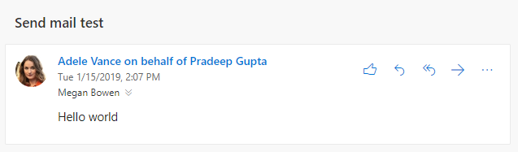

# Send Outlook messages from another user

Exchange Online provides [mailbox permissions](/Exchange/recipients/mailbox-permissions) that allow a user to send mail that appears to be sent from another user, distribution list, group, resource, or shared mailbox. Microsoft Graph supports this feature as well, but the end result varies depending on the exact permissions granted in Exchange Online and which API you use to send the mail.

## Permissions

Two types of permissions apply to sending messages from another user: [Microsoft Graph permissions](permissions-reference.md), and mailbox permissions.

### Microsoft Graph permissions

In order to send messages from another user, applications that use user tokens use the **Mail.Send.Shared** permission.

> [!NOTE]
> Applications that use application tokens instead of user tokens and have the **Mail.Send** permission consented by an administrator can send mail as any user in the organization by sending the mail normally through the user's mailbox.

### Mailbox permissions

Two permissions affect the end result of sending a message from another user: **Send on Behalf** and **Send As**. The user that is signed in to your application with the **Mail.Send.Shared** permission MUST have at least one of these permissions granted to the mailbox, group, or distribution list that the mail is from.

#### Send on Behalf

With this permission, the recipient of the email has an indication in their email client that the message was sent by the user of your application on behalf of another user.



This is exposed in Microsoft Graph as the `sender` (user that actually sent the message) and `from` (user/group/etc. that the message appears to be from) properties.

```json
{
  "id": "AAMkAGE1...",
  "subject": "Send mail test",
  "sender": {
    "emailAddress": {
      "name": "Adele Vance",
      "address": "AdeleV@contoso.com"
    }
  },
  "from": {
    "emailAddress": {
      "name": "Pradeep Gupta",
      "address": "PradeepG@contoso.com"
    }
  }
}
```

A user can grant this permission for their own mailbox to another user by [using Outlook](https://support.office.com/article/Allow-someone-else-to-manage-your-mail-and-calendar-41C40C04-3BD1-4D22-963A-28EAFEC25926). Administrators can grant this permission for any mailbox, group, or distribution list in the [Microsoft 365 admin center](/office365/admin/add-users/give-mailbox-permissions-to-another-user?view=o365-worldwide).

#### Send As

With this permission, there is no indication that the message was sent as a different user. The `sender` and `from` properties have the same value.

Users cannot grant this permission to their mailboxes. Admins can grant this permission in the Microsoft 365 admin center.

## Sending with Microsoft Graph

You can send messages from another user by either [sending directly](/graph/api/user-sendmail?view=graph-rest-1.0) or by [creating a draft](/graph/api/user-post-messages?view=graph-rest-1.0) and then [sending it](/graph/api/message-send?view=graph-rest-1.0).

In order to send from another user, set the `from` property on the [message](/graph/api/resources/message?view=graph-rest-1.0) sent to the email address of the user to send from. You don't need to set the `sender` property - Microsoft Graph will set it appropriately, based on the mailbox permissions granted to the user who has signed in.

For example, to send mail from the `sales@contoso.com` group, configure the message as follows.

```json
{
  "subject": "January sales report",
  "toRecipients": [
    {
      "emailAddress": {
        "address": "MeganB@contoso.com"
      }
    }
  ],
  "from": {
    "emailAddress": {
      "address": "sales@contoso.com"
    }
  }
}
```

## Sent Items behavior

After the message is sent, it can be saved to the sending user's Sent Items folder, the from user's Sent Items folder, or both. It can also not be saved at all.

> [!NOTE]
> If the message is sent from an address that does not have a mailbox (a distribution list, for example), there is no Sent Items for the from user.

- If your application sends by using the `/me` endpoint (or `/users/{user-id}` where the `user-id` corresponds to the signed in user), by default, the message will be saved in the sending user's Sent Items folder.
- If your application sends by using the `/users/{user-id}` where the `user-id` corresponds to the from user, by default, the message will be saved in the from user's Sent Items folder.
    > [!IMPORTANT]
    > In order to send this way, the sending user must have the **Full Access** mailbox permission in addition to either the **Send on Behalf** or **Send As** permission.

The default behavior can be changed by other outside factors:

- Administrators can update the from user's mailbox to [always save a copy of messages sent from a delegate](/exchange/recipients-in-exchange-online/manage-user-mailboxes/automatically-save-sent-items-in-delegator-s-mailbox) to their Sent Items.
- By setting the `saveToSentItems` property to `false` in a [send mail](/graph/api/user-sendmail?view=graph-rest-1.0) request, you can prevent the item from being saved to the Sent Items folder. However, if an administrator has configured the "always save a copy" setting, the message will still be saved to the from user's Sent Items.

## Examples

### Example 1: Successful send through /me endpoint

In this example, Adele Vance has been granted **Send on Behalf** permission to Allan Deyoung's mailbox.

#### Request

```http
POST /me/sendmail
Content-Type: application/json

{
  "message": {
    "subject": "Expense reports",
    "body": {
      "contentType": "text",
      "content": "Have you submitted your expense reports yet?"
    },
    "toRecipients": [
      {
        "emailAddress": {
          "address": "MeganB@contoso.com"
        }
      }
    ],
    "from": {
      "emailAddress": {
        "address": "AllanD@contoso.com"
      }
    }
  }
}
```

#### Response

```http
HTTP/1.1 202 Accepted
```

### Example 2: Unsuccessful attempt to send without permissions

In this example, Adele Vance attempts to send an email from Patti Fernandez, but has not been granted either the **Send on Behalf** or **Send As** permission. The response contains a `ErrorSendAsDenied` error.

<!-- markdownlint-disable MD024 -->

#### Request

```http
POST /me/sendmail
Content-Type: application/json

{
  "message": {
    "subject": "Support ticket",
    "body": {
      "contentType": "text",
      "content": "I noticed you opened a support ticket yesterday..."
    },
    "toRecipients": [
      {
        "emailAddress": {
          "address": "MeganB@contoso.com"
        }
      }
    ],
    "from": {
      "emailAddress": {
        "address": "PattiF@contoso.com"
      }
    }
  }
}
```

#### Response

```http
HTTP/1.1 403 Forbidden
Content-Type: application/json

{
  "error": {
    "code": "ErrorSendAsDenied",
    "message": "The user account which was used to submit this request does not have the right to send mail on behalf of the specified sending account. Cannot submit message.",
    "innerError": {
      "request-id": "24e7991e-01ae-4cc2-8e06-532a96fd8948",
      "date": "2019-01-16T18:53:25"
    }
  }
}
```

## Next steps

Find out more about:

- [Why integrate with Outlook mail](outlook-mail-concept-overview.md)
- [Using the mail API](/graph/api/resources/mail-api-overview?view=graph-rest-1.0) and mail API [use cases](/graph/api/resources/mail-api-overview?view=graph-rest-1.0#common-use-cases) in Microsoft Graph v1.0.

<!--
{
  "type": "#page.annotation",
  "suppressions": [
    "Error: /concepts/outlook-send-mail-from-other-user.md:\r\n      FileNotFound: '[/exchange/recipients-in-exchange-online/manage-user-mailboxes/automatically-save-sent-items-in-delegator-s-mailbox](always save a copy of messages sent from a delegate)'.",
    "Error: /concepts/outlook-send-mail-from-other-user.md:\r\n      InvalidUrlFormat '[/office365/admin/add-users/give-mailbox-permissions-to-another-user?view=o365-worldwide](Office 365 admin center)'.",
    "Error: /concepts/outlook-send-mail-from-other-user.md:\r\n      FileNotFound: '[/Exchange/recipients/mailbox-permissions](mailbox permissions)'. "
  ]
}
-->
