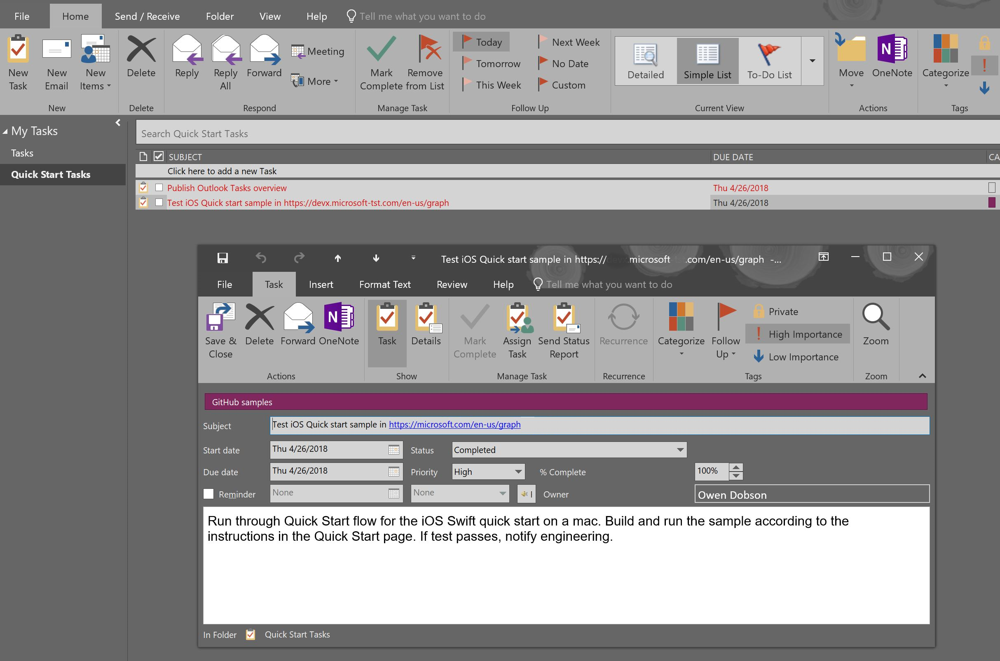

# Outlook To-do tasks API overview (preview)

Outlook tasks is a simple task manager feature of the Outlook web and desktop clients. Outlook tasks lets customers track their tasks in the same client that they use to manage email and calendars. The integration with Outlook provides popular Outlook features such as forwarding and attaching Outlook items, files, and reference links. Tasks are organized by task folder and task folders can be organized in task groups. Tasks are integrated with OneNote to let a customer keep an extensive and rich set of task-specific content in one place. All of these task features are available on the tasks tab of the Outlook client.

## Why integrate with Outlook To-do tasks?

By integrating your apps with Outlook tasks, you can create empowering experiences across multiple platforms that reach millions of users worldwide. You can use Microsoft Graph to access tasks, task attachments, task folders, and task groups to create solutions that help your users track their daily tasks and even automate the creation, update, and completion of tasks. With well-designed task automation, you can give users all the benefits of task tracking while ensuring that your organization's workflow is automatically tracked in user tasks.

Popular Outlook To-do task integration scenarios include the scenarios described in the following sections.

### Automate the creation of tasks

If your line-of-business application generates the workflow that directs users in their work, you can extend the application to create a task for each stage of the workflow and assign the task to a user along with task details, start dates, expected work effort, priority, associated customers, and recurrence. The new task appears in the assigned user's task list. 

Outlook client. Task pane with open task 

### Automate task updates

If your application creates a task for a user, it can also automate the update of a task as work progresses. The user can update the task within the Outlook client or your application can automate the update of the task - as long as the assigned user works in your application in the context of the task. Hours worked on the task, the status, and the completion date can be updated. Outlook tasks API in Microsoft Graph gives access to the details of the task so your app can even add additional notes to the task as appropriate. 

### Extend task properties

Microsoft Graph is designed to account for the unique task management requirements of any organization. For example, your organization might require a structured set of task details in all new tasks. Use the [openTypeExtension](../api-reference/beta/resources/opentypeextension.md) to access this flexibility for the most common customizations. If your organization needs to extend tasks in a way that is not supported by **openTypeExtension**, you can use a [singleValueLegacyExtendedProperty](../api-reference/beta/resources/singlevaluelegacyextendedproperty.md) or a [multiValueExtendedPropety](../api-reference/beta/resources/multivaluelegacyextendedproperty.md).

Learn more about [adding custom data to resources using extensions](extensibility_overview.md) and how extensions are implemented as [Outlook extended properties](../api-reference/beta/resources/extended-properties-overview.md).

### Automate task organization

As your organization starts new projects or takes on new clients, use Microsoft Graph to create [task folders](../api-reference/beta/resources/outlooktaskfolder.md) and [task groups](../api-reference/beta/resources/outlooktaskgroup.md) to organize tasks by project or customer... or any other logical entity that your organization works with. After you've created a task group and folder, you can use Microsoft Graph to create tasks in the new folder.

### Report on task progress across your organization

Use the Outlook tasks API to capture information about the current state of all Outlook tasks that your application has permission to read. You can create reports in any report generation application that can be extended to connect to Microsoft Graph. Use the [outlookTask](../api-reference/beta/resources/outlooktask.md) resource to get progress information about each task.

When your app creates a task with the Microsoft Graph API, it is available to the assigned user through the **Outlook** client tasks tab. The [Office 365 portal](https://www.office.com/) apps, including [Outlook](https://outlook.office365.com), [tasks](https://outlook.office365.com/owa/?realm=microsoft.com&modurl=3&exsvurl=1&ll-cc=1033&path=/tasks), and [To-Do](https://to-do.microsoft.com), give the user access to tasks. These apps give users different views of task data and expose different functionality. For example, if a user wants to forward a task to another user, she must open the task in **Outlook**. If a user wants to add substeps to a task, he must open the task in the **To-Do** app. 

## Tasks in Outlook To-do tasks, Tasks, and To-Do apps

When your app creates a task with the Microsoft Graph API, it is available to the assigned user through the **Outlook** client tasks tab. The [Microsoft Office 365 Portal](https://www.office.com/) apps that give a user access to tasks created in Outlook include
 [Outlook](https://outlook.office365.com), [tasks](https://outlook.office365.com/owa/?realm=microsoft.com&modurl=3&exsvurl=1&ll-cc=1033&path=/tasks), and [To-Do](https://to-do.microsoft.com). Outlook, Tasks, and To-do access the same tasks but provide different features.

## Outlook To-do task features

The integration with Outlook provides such task features as:

- Forwarding or assigning tasks
- Sending task status reports
- Categorizing tasks
- Setting follow up flags and importance
- Attaching Outlook items, files, or reference links
- OneNote integration 

All of these task features are available on the tasks tab of the Outlook client.

If you want to forward tasks in your app, use Microsoft Graph to [create a mail message](../api-reference/beta/api/user_post_messages.md), [add the task to be forwarded as an attachment](../api-reference/beta/api/message_post_attachments.md), and then [send the mail message](../api-reference/beta/api/user_sendmail.md).

You can also integrate tasks with OneNote by using the OneNote API in Microsoft Graph. Use Microsoft Graph to create a OneNote page and store a link to it in [extended task properties](#extend-task-properties). To edit the task notes in the new OneNote page, [open the OneNote client](open_onenote_client.md) to that page. You can also automate updating linked OneNote notes with Microsoft Graph. [Explore the OneNote APIs](integrate_with_onenote.md#explore-the-onenote-apis) to learn more about this valuable integration.

## Task organization
Tasks are organized by task folder and task folders can be organized in task groups. Tasks are integrated with Microsoft OneNote so a customer can create an extensive and rich set of task-specific notes using the same app they use for all of their other note taking.

## Next steps

- Use the [outlookTask](../api-reference/beta/resources/outlooktask.md) resource.
- Work with [Outlook task folders](../api-reference/beta/resources/outlooktaskfolder.md).
- [Create Outlook tasks](../api-reference/beta/api/outlooktaskfolder_post_tasks.md).
- [Update an Outlook task](../api-reference/beta/api/outlooktask_update.md).

