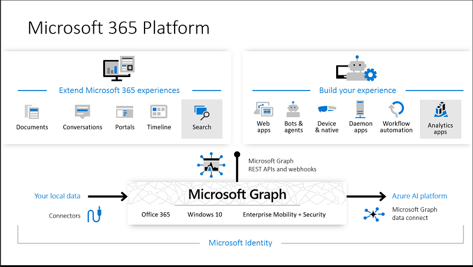

# Overview of Microsoft Graph

Microsoft Graph is the gateway to data and intelligence in Microsoft 365. Microsoft Graph provides a unified programmability model that you can use to take advantage of the tremendous amount of data in Office 365, Windows 10, and Enterprise Mobility + Security. 

You can use the Microsoft Graph API to build apps for organizations and consumers that interact with the data of millions of users. With Microsoft Graph, you can connect to a wealth of resources, relationships, and intelligence, all through a single endpoint: `https://graph.microsoft.com`.

> [!VIDEO https://www.youtube-nocookie.com/embed/PI9NO5rayiY]

## Powering the Microsoft 365 platform

Together with [Microsoft Graph data connect](#access-microsoft-graph-at-scale) and Microsoft Graph connectors (private preview), Microsoft Graph powers the Microsoft 365 platform. The ability to access Microsoft Graph data and other datasets to derive insights and analytics lets you extend Microsoft 365 experiences, or build unique intelligent applications.

> [!NOTE]
> Microsoft Graph connectors is in private preview. Participation in the preview is by invitation only. See more information in [Build 2019: Microsoft Graph powers the Microsoft 365 platform](https://aka.ms/microsoftgraphbuild2019).

## What's in Microsoft Graph?
Microsoft Graph exposes REST APIs and client libraries to access data on the following Microsoft 365 services:

- Azure Active Directory
- Education
- Enterprise Mobility and Security services: Advanced Threat Analytics, Advanced Threat Protection, Identity Manager, and Intune 
- Office 365 services: Delve, Dynamics 365 Business Central, Excel, Microsoft Bookings, Microsoft Teams, OneDrive, OneNote, Outlook/Exchange, Planner, and SharePoint
- Reports: Identity and access, Office 365 usage
- Windows 10 services: activities, devices, notifications

To find out more, see 
[Major services and features in Microsoft Graph](overview-major-services.md).

## What can you do with Microsoft Graph? 

You can use Microsoft Graph to build experiences around the user's unique context to help them be more productive. Imagine an app that...

- Looks at your next meeting and helps you prepare for it by providing profile information for attendees, including their job titles and who they work with, as well as information about the latest documents and projects they're working on.
- Scans your calendar, and suggests the best times for the next team meeting.
- Fetches the latest sales projection chart from an Excel file in your OneDrive and lets you update the forecast in real time, all from your phone.
- Subscribes to changes in your calendar, sends you an alert when you’re spending too much time in meetings, and provides recommendations for the ones you can miss or delegate based on how relevant the attendees are to you.
- Helps you sort out personal and work information on your phone; for example, by categorizing pictures that should go to your personal OneDrive and business receipts that should go to your OneDrive for Business.

Using Microsoft Graph API, you can connect to resources across Microsoft 365 services using relationships. For example, a user can be connected to a group through a [memberOf](/graph/api/user-list-memberof?view=graph-rest-1.0) relationship, and to another user through a [manager relationship](/graph/api/user-list-manager?view=graph-rest-1.0). Your app can traverse these relationships to access these connected resources and perform actions on them through the API.

You can also get valuable insights and intelligence about the data from Microsoft Graph. For example, you can get the popular files [trending around](/graph/api/resources/insights-trending?view=graph-rest-beta) a particular user, or [get the most relevant people](/graph/api/user-list-people?view=graph-rest-beta) around a user.

Discover the possibilities in the relationships within Microsoft Graph.

>**Note:** When you use the Microsoft Graph API, you agree to the [Microsoft Graph Terms of Use](https://developer.microsoft.com/graph/docs/misc/terms-of-use) and the [Microsoft Privacy Statement](https://go.microsoft.com/fwlink/?LinkId=521839).

### Popular requests

Check out some of these common scenarios for working with the Microsoft Graph API. The links take you to the [Graph Explorer](https://developer.microsoft.com/graph/graph-explorer).

| **Operation**	| **URL** |
|:--------------------------|:----------------------------------------|
|   GET my profile |	[`https://graph.microsoft.com/v1.0/me`](https://developer.microsoft.com/graph/graph-explorer/?request=me&version=v1.0) |
|   GET my files | [`https://graph.microsoft.com/v1.0/me/drive/root/children`](https://developer.microsoft.com/graph/graph-explorer/?request=me%2Fdrive%2Froot%2Fchildren&version=v1.0) |
|   GET my photo | [`https://graph.microsoft.com/v1.0/me/photo/$value`](https://developer.microsoft.com/graph/graph-explorer/?request=me%2Fphoto%2F%24value&version=v1.0) |
|   GET my mail |	[`https://graph.microsoft.com/v1.0/me/messages`](https://developer.microsoft.com/graph/graph-explorer/?request=me%2Fmessages&version=v1.0) |
|   GET my high importance email | [`https://graph.microsoft.com/v1.0/me/messages?$filter=importance%20eq%20'high'`](https://developer.microsoft.com/graph/graph-explorer/?request=me%2Fmessages%3F%24filter%3Dimportance%2520eq%2520'high'&version=v1.0) |
|   GET my calendar events |	[`https://graph.microsoft.com/v1.0/me/events`](https://developer.microsoft.com/graph/graph-explorer/?request=me%2Fevents&version=v1.0) |
|   GET my manager	| [`https://graph.microsoft.com/v1.0/me/manager`](https://developer.microsoft.com/graph/graph-explorer/?request=me%2Fmanager&version=v1.0) |
|   GET last user to modify file foo.txt |	[`https://graph.microsoft.com/v1.0/me/drive/root/children/foo.txt/lastModifiedByUser`](https://developer.microsoft.com/graph/graph-explorer/?request=me%2Fdrive%2Froot%2Fchildren%2Ffoo.txt%2FlastModifiedByUser&version=v1.0) |
|   GET Office365 groups I’m member of|	[`https://graph.microsoft.com/v1.0/me/memberOf/$/microsoft.graph.group?$filter=groupTypes/any(a:a%20eq%20'unified')`](https://developer.microsoft.com/graph/graph-explorer/?request=me%2FmemberOf%2F%24%2Fmicrosoft.graph.group%3F%24filter%3DgroupTypes%2Fany(a%3Aa%2520eq%2520'unified')&version=v1.0) |
|   GET users in my organization	 | [`https://graph.microsoft.com/v1.0/users`](https://developer.microsoft.com/graph/graph-explorer/?request=users&version=v1.0) |
|   GET groups in my organization |	[`https://graph.microsoft.com/v1.0/groups`](https://developer.microsoft.com/graph/graph-explorer/?request=groups&version=v1.0) |
|   GET people related to me	| [`https://graph.microsoft.com/v1.0/me/people`](https://developer.microsoft.com/graph/graph-explorer/?request=me%2Fpeople&version=beta)  |
|   GET items trending around me |	[`https://graph.microsoft.com/beta/me/insights/trending`](https://developer.microsoft.com/graph/graph-explorer/?request=me%2Finsights%2Ftrending&version=beta) |
|   GET my notes |	[`https://graph.microsoft.com/v1.0/me/onenote/notebooks`](https://developer.microsoft.com/graph/graph-explorer/?request=me%2Fonenote%2Fnotebooks&version=beta) |

## Access Microsoft Graph at scale

Microsoft Graph data connect provides a set of tools to access data on Microsoft Graph at scale, while allowing administrators granular consent and full control over their Microsoft Graph data. Data connect streamlines the delivery of this data to Microsoft Azure. 
Using Azure tools, you can build intelligent apps that:

- Find you the closest expert on a topic to you in your organization 
- Automate knowledge base creation
- Analyze meeting requests to provide insights into conference room utilization
- Detect fraud with productivity and communication data

## When should I use Microsoft Graph data connect?

Microsoft Graph data connect provides a new way for you to interact with the data that's available through Microsoft Graph APIs. Data connect provides a unique set of tools that streamline the building of intelligent applications, all within the Microsoft cloud.

|**Feature**| **Microsoft Graph API** | **Microsoft Graph Data Connect** |
|:----------|:------------------------|:--------------------------------------|
| **Access scope** | Single user or entire tenant | Many users or groups |
| **Access pattern** | Real time | Recurrent schedule |
| **Data operations** | Operates on data master | Operates on a cache of the data |
| **Data protection** | Data is protected while in Microsoft 365 | Data protection is extended to the cache of data in your Azure subscription |
| **User consent** | Self Resource types | None |
| **Admin consent** | Entire organization Resource types | Select groups of users Resource types and properties Excludes users |
| **Access tools** | RESTful web queries | Azure Data Factory |

For more information about Microsoft Graph data connect, see [Microsoft Graph data connect](data-connect-overview.md). To get started, see [Overview of Microsoft Graph data connect](data-connect-concept-overview.md). 

## Next steps

- Check out some [featured scenarios](https://developer.microsoft.com/graph/examples).
- Try a sample request in the [Graph Explorer](https://developer.microsoft.com/graph/graph-explorer).
- Use the [quick start](https://developer.microsoft.com/graph/quick-start) to set up a ready-to-run sample app.
- Look under **Learn** in the table of contents to read about services and features that you can use in your scenarios. 
- Find out how to [get an auth token](./auth/) in your app.
- Start [using the API](use-the-api.md).

