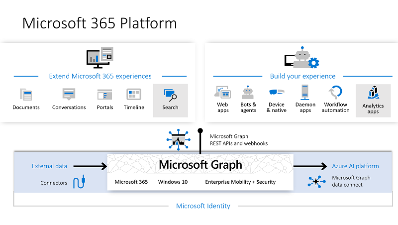

# Overview of Microsoft Graph

Microsoft Graph is the gateway to data and intelligence in Microsoft 365. It provides a unified programmability model that you can use to access the tremendous amount of data in Microsoft 365, Windows, and Enterprise Mobility + Security. Use the wealth of data in Microsoft Graph to build apps for organizations and consumers that interact with millions of users.

## Data and services powering the Microsoft 365 platform

In the Microsoft 365 platform, three main components facilitate the access and flow of data:

- The **Microsoft Graph API** offers a single endpoint, `https://graph.microsoft.com`, to provide access to rich, people-centric data and insights in the Microsoft cloud, including Microsoft 365, Windows, and Enterprise Mobility + Security. You can use REST APIs or SDKs to access the endpoint and build apps that support Microsoft 365 scenarios, spanning across productivity, collaboration, education, people and workplace intelligence, and more. Microsoft Graph also includes a powerful set of services that manage user and device identity, access, compliance, and security and help protect organizations from data leakage or loss.
- **[Microsoft Graph connectors](#bring-data-from-an-external-content-source-to-microsoft-graph)** work in the incoming direction, delivering data external to the Microsoft cloud into Microsoft Graph services and applications to enhance Microsoft 365 experiences such as Microsoft Search. Connectors exist for many commonly used data sources such as Box, Google Drive, Jira, and Salesforce.
- **[Microsoft Graph Data Connect](#access-microsoft-graph-data-at-scale)** provides a set of tools to streamline secure and scalable delivery of Microsoft Graph data to popular Azure data stores. The cached data serves as data sources for Azure development tools that you can use to build intelligent applications.

Together, the Microsoft Graph API, connectors, and Data Connect power the Microsoft 365 platform. With the ability to access Microsoft Graph data and other datasets, you can derive insights and analytics, extend Microsoft 365 experiences, and build unique, intelligent applications.

## What's in Microsoft Graph?

Microsoft Graph exposes REST APIs and client libraries to access data on the following Microsoft cloud services:

- **Microsoft 365 core services:** Bookings, Calendar, Delve, Excel, Microsoft 365 compliance eDiscovery, Microsoft Search, OneDrive, OneNote, Outlook/Exchange, People (Outlook contacts), Planner, SharePoint, Teams, To Do, Viva Insights
- **Enterprise Mobility + Security services:** Advanced Threat Analytics, Advanced Threat Protection, Azure Active Directory, Identity Manager, and Intune
- **Windows services:** activities, devices, notifications, Universal Print
- **Dynamics 365 Business Central services**

To find out more, see [Major services and features in Microsoft Graph](overview-major-services.md).

## What can you do with Microsoft Graph?

> [!VIDEO https://www.youtube-nocookie.com/embed/PI9NO5rayiY]

Use Microsoft Graph to build experiences around the user's unique context to help them be more productive. Imagine an app that...

- Looks at your next meeting and helps you prepare for it by providing profile information for attendees, including their job titles and managers, as well as information about the latest documents they're working on, and people they're collaborating with.
- Scans your calendar, and suggests the best times for the next team meeting.
- Fetches the latest sales projection chart from an Excel file in your OneDrive and lets you update the forecast in real time, all from your phone.
- Subscribes to changes in your calendar, sends you an alert when you're spending too much time in meetings, and provides recommendations for the ones you can miss or delegate based on how relevant the attendees are to you.
- Helps you sort out personal and work information on your phone; for example, by categorizing pictures that should go to your personal OneDrive and business receipts that should go to your OneDrive for Business.
- Analyzes at-scale Microsoft 365 data so that decision makers can unlock valuable insights into time allocation and collaboration patterns that improve business productivity.
- Brings custom business data into Microsoft Graph, indexing it to make it searchable along with data from Microsoft 365 services.

Pick the first scenario about researching meeting attendees as an example. With the Microsoft Graph API, you can:

1. Get the email addresses of the [meeting event](/graph/api/resources/event) attendees.
2. Look them up individually as a [user](/graph/api/resources/user) in Azure Active Directory to [get their profile information](/graph/api/user-get).

You can then navigate to other resources using relationships:

- Connect to their manager through a [manager relationship](/graph/api/user-list-manager).
- Get valuable insights and intelligence including the popular files [trending around](/graph/api/resources/insights-trending) the user.
- [Get the most relevant people](/graph/api/user-list-people?view=graph-rest-beta&preserve-view=true) around the user.
- Extend the scenario to get to the user's groups through a [memberOf](/graph/api/user-list-memberof) relationship.
- [Reach other members in each group](/graph/api/group-list-members).
- Tap into other scenarios enabled by [groups](office365-groups-concept-overview.md), such as [education](education-concept-overview.md) and [teamwork](teams-concept-overview.md).

Microsoft Graph continues to open up the Microsoft 365 platform for developers, and always only with the appropriate permissions.

> [!NOTE]
> When you use the Microsoft Graph API, you agree to the [Microsoft APIs Terms of Use](/legal/microsoft-apis/terms-of-use?context=/graph/context) and the [Microsoft Privacy Statement](https://go.microsoft.com/fwlink/?LinkId=521839).

### Popular API requests

Check out some of these common scenarios for working with the Microsoft Graph API. The links take you to the [Graph Explorer](https://developer.microsoft.com/graph/graph-explorer).

| **Operation** | **URL** |
|:--------------------------|:----------------------------------------|
|   GET my profile | [`https://graph.microsoft.com/v1.0/me`](https://developer.microsoft.com/graph/graph-explorer/?request=me&version=v1.0) |
|   GET my files | [`https://graph.microsoft.com/v1.0/me/drive/root/children`](https://developer.microsoft.com/graph/graph-explorer/?request=me%2Fdrive%2Froot%2Fchildren&version=v1.0) |
|   GET my photo | [`https://graph.microsoft.com/v1.0/me/photo/$value`](https://developer.microsoft.com/graph/graph-explorer/?request=me%2Fphoto%2F%24value&version=v1.0) |
|   GET my mail | [`https://graph.microsoft.com/v1.0/me/messages`](https://developer.microsoft.com/graph/graph-explorer/?request=me%2Fmessages&version=v1.0) |
|   GET my high importance email | [`https://graph.microsoft.com/v1.0/me/messages?$filter=importance%20eq%20'high'`](https://developer.microsoft.com/graph/graph-explorer/?request=me%2Fmessages%3F%24filter%3Dimportance%2520eq%2520'high'&version=v1.0) |
|   GET my calendar events | [`https://graph.microsoft.com/v1.0/me/events`](https://developer.microsoft.com/graph/graph-explorer/?request=me%2Fevents&version=v1.0) |
|   GET my manager | [`https://graph.microsoft.com/v1.0/me/manager`](https://developer.microsoft.com/graph/graph-explorer/?request=me%2Fmanager&version=v1.0) |
|   GET last user to modify file foo.txt | [`https://graph.microsoft.com/v1.0/me/drive/root/children/foo.txt/lastModifiedByUser`](https://developer.microsoft.com/graph/graph-explorer/?request=me%2Fdrive%2Froot%2Fchildren%2Ffoo.txt%2FlastModifiedByUser&version=v1.0) |
|   GET Microsoft 365 groups I'm a member of| [`https://graph.microsoft.com/v1.0/me/memberOf/$/microsoft.graph.group?$filter=groupTypes/any(a:a%20eq%20'unified')`](https://developer.microsoft.com/graph/graph-explorer/?request=me%2FmemberOf%2F%24%2Fmicrosoft.graph.group%3F%24filter%3DgroupTypes%2Fany(a%3Aa%2520eq%2520'unified')&version=v1.0) |
|   GET users in my organization  | [`https://graph.microsoft.com/v1.0/users`](https://developer.microsoft.com/graph/graph-explorer/?request=users&version=v1.0) |
|   GET groups in my organization | [`https://graph.microsoft.com/v1.0/groups`](https://developer.microsoft.com/graph/graph-explorer/?request=groups&version=v1.0) |
|   GET people related to me | [`https://graph.microsoft.com/v1.0/me/people`](https://developer.microsoft.com/graph/graph-explorer/?request=me%2Fpeople&version=beta)  |
|   GET items trending around me | [`https://graph.microsoft.com/beta/me/insights/trending`](https://developer.microsoft.com/graph/graph-explorer/?request=me%2Finsights%2Ftrending&version=v1.0) |
|   GET my notes | [`https://graph.microsoft.com/v1.0/me/onenote/notebooks`](https://developer.microsoft.com/graph/graph-explorer/?request=me%2Fonenote%2Fnotebooks&version=beta) |

## Bring data from an external content source to Microsoft Graph

Use [Microsoft Graph connectors](connecting-external-content-connectors-overview.md) to bring data that is external to the Microsoft cloud into Microsoft Graph. Examples of such data can be an organization's human resources database or product catalog, hosted on-premises or in the public or private clouds.

Microsoft Graph connectors create connections to external data sources, index the data, and store it as external custom items and files. Once indexed, those items can show up in Microsoft Search and for apps that use the [Microsoft Search API](search-concept-overview.md).

## Access Microsoft Graph data at scale

Use [Microsoft Graph Data Connect](data-connect-concept-overview.md) to access data on Microsoft Graph at scale, while allowing administrators granular consent and full control over their Microsoft Graph data. Data Connect streamlines the delivery of this data to Microsoft Azure.

Using Azure tools, you can then build intelligent apps that:

- Find you the closest expert on a topic to you in your organization.
- Automate knowledge base creation.
- Analyze meeting requests to provide insights into conference room utilization.
- Detect fraud with productivity and communication data.

## When should I use Microsoft Graph API or Data Connect?

Microsoft Graph Data Connect provides a new way for you to interact with the data that's available through Microsoft Graph APIs. Data Connect provides a unique set of tools that streamline the building of intelligent applications, all within the Microsoft cloud.

|**Feature**| **Microsoft Graph API** | **Microsoft Graph Data Connect** |
|:----------|:------------------------|:--------------------------------------|
| **Access scope** | Single user or entire tenant | Many users or groups |
| **Access pattern** | Real time | Recurrent schedule |
| **Data operations** | Operates on data master | Operates on a cache of the data |
| **Data protection** | Data is protected while in Microsoft 365 | Data protection is extended to the cache of data in your Azure subscription |
| **User consent** | Self Resource types | None |
| **Admin consent** | Entire organization Resource types | Select groups of users Resource types and properties Excludes users |
| **Access tools** | RESTful web queries | Azure Data Factory |

## Next steps

- Check out some [partner solutions](https://developer.microsoft.com/graph/partners).
- Try a sample request in the [Graph Explorer](https://developer.microsoft.com/graph/graph-explorer).
- Use the [quick start](https://developer.microsoft.com/graph/quick-start) to set up a ready-to-run sample app.
- Look under **Learn** in the table of contents to read about services and features that you can use in your scenarios.
- Learn about [metered APIs and services in Microsoft Graph](metered-api-overview.md).
- Find out how to [get an auth token](auth/auth-concepts.md) in your app.
- Start [using the API](use-the-api.md).
