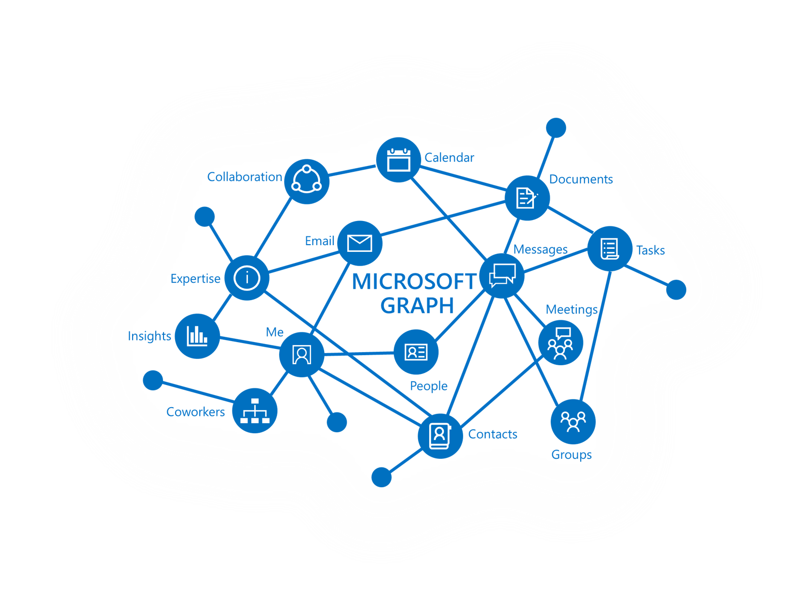

# Overview of Microsoft Graph

Microsoft Graph is the gateway to data and intelligence in Microsoft 365. Its unified programmability model enables developers to take advantage of the tremendous amount of data in Office 365, Enterprise Mobility + Security, and Windows 10. 

You can use the Microsoft Graph API to build apps and interact with the data of millions of users.  You can build apps for organizations and consumers, and connect to a wealth of resources, relationships, and intelligence, all through a single endpoint: `https://graph.microsoft.com`.

## What's in the graph?
Microsoft Graph exposes APIs for:
- Azure Active Directory
- Office 365 services: SharePoint, OneDrive, Outlook/Exchange, Microsoft Teams, OneNote, Planner, and Excel
- Enterprise Security and Mobility services: Identity Manager, Intune, Advanced Thread Analytics and Advanced Thread Protection.
- Windows 10 services: activities and devices
- Education.

Find more about 
[Major services and features in Microsoft Graph](../concepts/overview-major-services.md).

Microsoft Graph connects all the resources across these services using relationships. For example, a user can be connected to a group through a [memberOf](../api-reference/v1.0/api/user_list_memberof.md) relationship, and to another user through a [manager relationship](../api-reference/v1.0/api/user_list_manager.md). Your app can traverse these relationships to access these connected resources and perform actions on them through the API.

You can also get valuable insights and intelligence about the data from Microsoft Graph. For example, you can get the popular files [trending around](../api-reference/beta/resources/insights_trending.md) a particular user, or [get the most relevant people](../api-reference/beta/api/user_list_people.md) around a user.

Discover the possibilities in the relationships within Microsoft Graph.

## What can you do with Microsoft Graph? 

You can use Microsoft Graph to build experiences around the user's unique context to help them be more productive. Imagine an app that...

- Looks at your next meeting and helps you prepare for it by providing profile information for attendees, including their job titles and who they work with, as well as information on the latest documents and projects they're working on.
- Scans your calendar, and suggests the best times for the next team meeting.
- Fetches the latest sales projection chart from an Excel file in your OneDrive and lets you update the forecast in real time, all from your phone.
- Subscribes to changes in your calendar, sends you an alert when you’re spending too much time in meetings, and provides recommendations for the ones you could miss or delegate based on how relevant the attendees are to you.
- Helps you sort out personal and work information on your phone; for example, by categorizing pictures that should go to your personal OneDrive and business receipts that should go to your OneDrive for Business.

You can do all this and more with the Microsoft Graph API.

>**Note:** When you use the Microsoft Graph API, you agree to the [Microsoft Graph Terms of Use](../misc/terms-of-use.md) and the [Microsoft Privacy Statement](https://go.microsoft.com/fwlink/?LinkId=521839).

## Next steps

- Check out some [featured scenarios](../concepts/featured_scenarios.md).
- Try a sample request in the [Graph Explorer](https://developer.microsoft.com/graph/graph-explorer).
- Use the [quick start](https://developer.microsoft.com/graph/quick-start) to set up a ready-to-run sample app.
- Look under **Learn** in the table of contents to read about services and features that you can leverage in your scenarios. 
- Find out how to [get an auth token](../concepts/auth_overview.md) in your app.
- Start [using the API](../concepts/use_the_api.md).

## Feedback?

Your feedback is important to us. Connect with us on [Stack Overflow](http://stackoverflow.com/questions/tagged/office365+or+microsoftgraph). Tag your questions with {MicrosoftGraph}.

