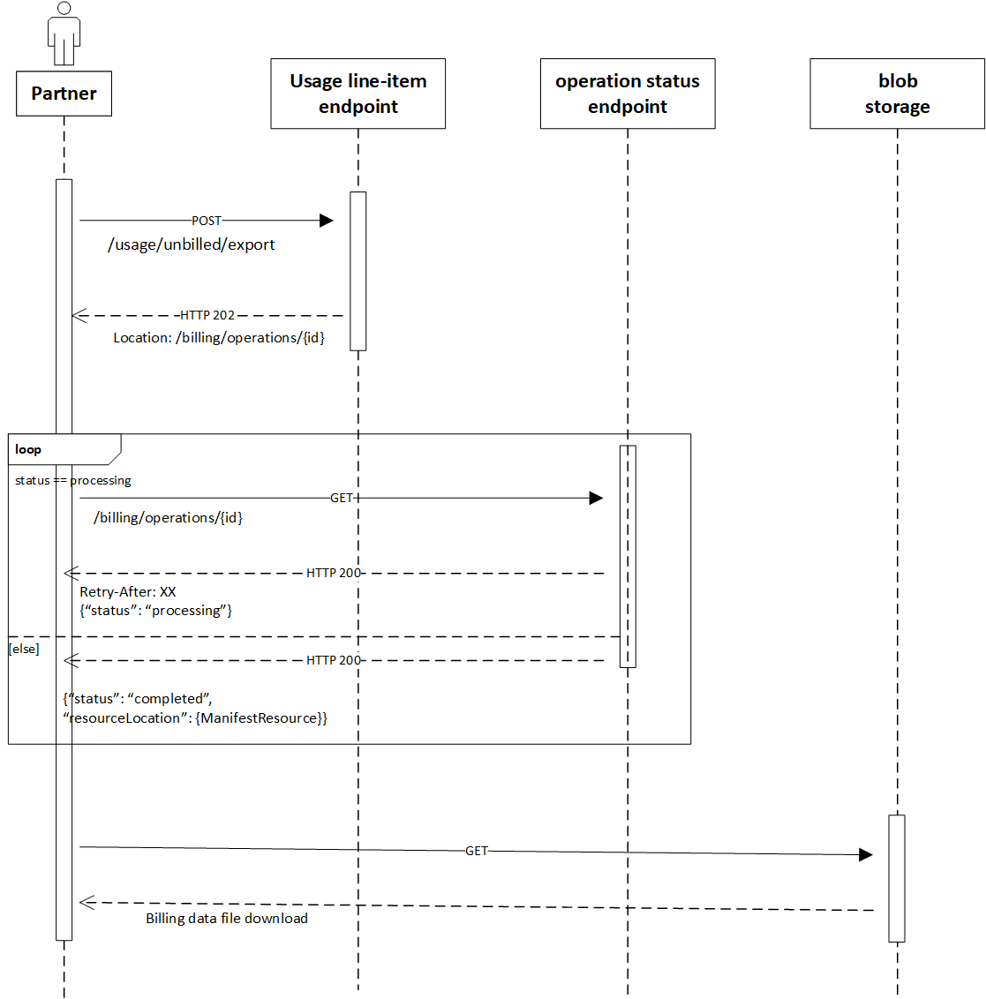

# Use the partner billing API in Microsoft Graph to access billing data

[!INCLUDE [alerts-callout-csp-partner-only](../includes/alerts-callout-csp-partner-only.md)]

The partner billing API in Microsoft Graph allow Microsoft direct partners in the Cloud Solution Provider programs to export their high-volume billed and unbilled data asynchronously. This removes the need to maintain an open connection for hours and loop through millions of transactions iteratively. Asynchronous APIs enable fast, efficient retrieval of billing and reconciliation data in manageable chunks for quicker reconciliation.

## Why use the partner billing API?

The partner billing API uses [valet key](/azure/architecture/patterns/valet-key) and [asynchronous request-reply](/azure/architecture/patterns/async-request-reply) patterns to optimize the efficiency and deliver results asynchronously. API responses contain a token that provides access to reconciliation data, including either all attributes or a selected subset.

The partner billing API provides the following advantages:

- Faster download and processing speed
- Optimized response payload size and retrieval time when the basic set of attributes from the reconciliation data is selected
- Delivered the response as a single Azure blob, without the need for iterative data retrieval with 2000 transactions per call
- Improved access speed by splitting the blobs into manageable chunks
- No changes are required to the existing data models

## Sequence diagram

The following diagram shows the steps needed to download reconciliation data.

To access the usage data asynchronously, use the following steps with the API endpoints.

### 1. Usage line-item endpoint

- Retrieve the [billed](/graph/api/partners-billing-billedusage-export) or [unbilled](/graph/api/partners-billing-unbilledusage-export) usage line items.
- Receive a `202 Accepted` response code and a URL in the response body to check the status of the operation.

### 2. Operation status endpoint

Use the [Get operation](/graph/api/partners-billing-operation-get) endpoint to poll the URL repeatedly until the [manifest](/graph/api/resources/partners-billing-manifest) is returned.

## API reference

Looking for the API reference for this service?

- [Partner billing API in Microsoft Graph v1.0](/graph/api/resources/partners-billing-api-overview?view=graph-rest-1.0&preserve-view=true)
- [Partner billing API in Microsoft Graph beta](/graph/api/resources/partners-billing-api-overview?view=graph-rest-beta&preserve-view=true)

## Next steps

- To learn more about the partner billing API, see [Use the Microsoft Graph API to export partner billing data](/graph/api/resources/partners-billing-api-overview).
- Try the partner billing API in [Graph Explorer](https://developer.microsoft.com/graph/graph-explorer).
