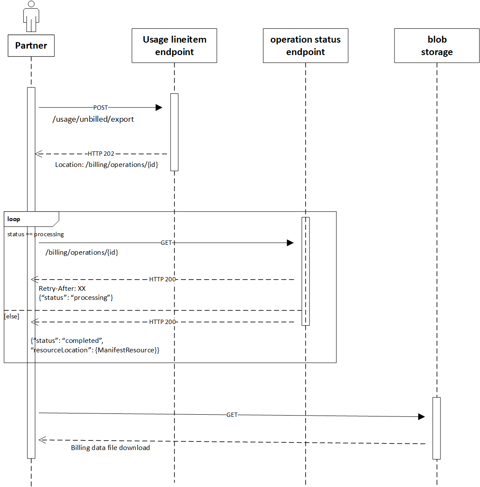

# Use asynchronous billing API in MS Graph to access your usage reconciliation data

 

We’re introducing asynchronous APIs to allow for faster reconciliation data retrieval. The asynchronous API is a novel method for quickly accessing billing and reconciliation data in manageable chunks. It eliminates the need to maintain an open connection for hours and loop through millions of transactions iteratively.

 

# Why use the asynchronous API?

We’ve used [valet key](https://learn.microsoft.com/en-us/azure/architecture/patterns/valet-key) and [asynchronous request-reply](https://learn.microsoft.com/en-us/azure/architecture/patterns/async-request-reply) patterns to optimize the efficiency of our reconciliation APIs and deliver results asynchronously. API responses will contain a token that grants access to the reconciliation data, which can include all the attributes or a subset of them.

The asynchronous API provides the following advantages:

·    Faster download and processing speed.

·    Optimized response payload size and retrieval time when the basic set of attributes from the reconciliation data is selected.

·    Delivered the response as a single Azure blob, without the need for iterative data retrieval with 2000 transactions per call.

·    Improved access speed by splitting the blobs into manageable chunks.

·    No changes are required to the existing data models. 

## Sequence diagram
The following diagram depicts the steps needed to download reconciliation data.

To access the usage data asynchronously, follow these steps using the API endpoints:

**1. Usage line-item endpoint** 

•    Retrieve the billed or unbilled usage line items. 

•    Receive a 202 HTTP status code and a URL in response.

**2. Operation status endpoint** 

•    Poll the URL repeatedly until the manifest is returned. 

 