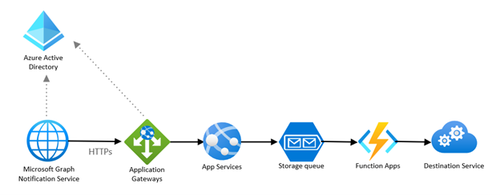

# Receive notifications about changes in your data

A **business scenario** offers enterprise collaboration enhancements for mobile apps to receive a read-only feed of shared messages from Microsoft Teams in near-real time.

This business scenario describes a non-interactive use case that relies on data changes triggered by external events. It has the following **significant architectural requirements**:

- A data integration type.
- An outbound data flow from Microsoft 365 boundaries to the app.
- A low data volume per human interaction, but a potentially high data volume if there are many users.
- A near-real-time data latency to generate up-to-date feed.
  
The best integration option for this app is to use Graph rich change notifications, which can deliver not only event notifications but also the entire content of a shared message, and implement webhooks to call by Graph. The client app provides a client secret, an encryption key, and expose an HTTP endpoint where the Graph Notification service will post changes. The client app should be able to accept and promptly respond to synchronous Graph requests, so it should be able to scale for a burst of events triggered by other clients generating messages. This type of app interaction is often called PUSH mode.

A simple **reference architecture** for a webhook is:

## Components

The architecture uses the following components:

- Azure App Service, which lets you build and host web apps, mobile back ends, and RESTful APIs in your preferred programming language, without managing infrastructure. It offers autoscaling and high availability, supports both Windows and Linux, and enables automated deployments from GitHub, Azure DevOps, or any Git repo.
- Azure Active Directory, which is required to manage authentication for the Microsoft Graph APIs and supports Delegated and Application permissions to enable OAuth flow.
- Function App, which is a serverless component that allows you to scale out for bursts of new notifications and has a business logic to process notifications and send them to a destination service.
- Simple Storage Queue, which helps you shed the load from the app service by persisting notifications before asynchronous processing by an instance of a Function App.
- Azure Application Gateway, which provides web security and routing capabilities.
Microsoft Graph Notification Services, which manages notification subscriptions and delivers change notifications to clients.
 

## Considerations

**Availability**: Microsoft Graph calls the client webhook whenever a new message is published in a shared channel or a chat. Therefore, the webhook must have high availability throughout the day or even 24x7.

**Latency**: The webhook must acknowledge Microsoft Graph notification requests within 3 seconds. If Microsoft Graph does not receive a 2xx class code within this time, it resends the change notification multiple times, for up to 4 hours.

**Scalability**: The client webhook must be able to scale for bursts of notifications at any time of the day. It can do this by adding more instances to the App Service and instantiating more Function App instances to update the destination service promptly.

**Solution Complexity**: The webhook solution also requires custom code to maintain subscriptions, encryption keys and process the data. This solution is considered highly complex because of the number of components involved and the scalability and availability requirements.

## See also

- [Change notifications](./../webhooks.md)
- [Training: Use change notifications and track changes with Microsoft Graph](/training/modules/msgraph-changenotifications-trackchanges)
- [Real-time presence with Microsoft 365](https://learn.microsoft.com/en-us/azure/architecture/solution-ideas/articles/presence-microsoft-365-power-platform)
  