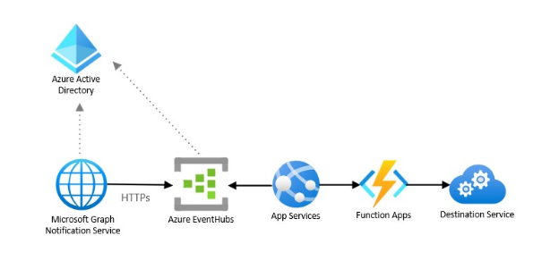

# Observe events via Event Hubs

A **business scenario** requires a security analysis of collaboration content to prevent unsafe or inappropriate sharing, transfer, or use of sensitive data, such as in Data Loss Prevention (DLP) scenarios.

This business scenario describes a non-interactive use case that requires a data feed of changes triggered by users interacting with various messaging systems. It doesn’t rely on Microsoft 365 functional behavior and needs only data, and has the following **architecturally significant requirements**:

- A data integration type.
- An outbound data flow from Microsoft 365 boundaries to the app.
- A high data volume for a medium to large enterprises.
- Near-real-time data latency to minimize data loss.
  
The best integration option for this app is to use the Pub/Sub integration pattern enabled by Graph rich change notifications, which can deliver not only event notifications but also the entire content of a shared message, delivered to Azure Event Hubs. This pattern allows the app to receive change notifications asynchronously and does not tightly couple the Microsoft Graph to the receiver applications. This type of app interaction is often called "PULL" mode.

A simple **reference architecture** for a webhook is:

## Components

The architecture uses the following components:

- Azure Event Hubs, which allows you to ingest a high volume of small messages, less than 1 Mb, in a second with low latency, and store them for consecutive processing.
- Azure App Service, which lets you build and host web apps, mobile back ends, and RESTful APIs in your preferred programming language, without managing infrastructure. It offers autoscaling and high availability, supports both Windows and Linux, and enables automated deployments from GitHub, Azure DevOps, or any Git repo.
- Azure Active Directory, which is required to manage authentication for the Microsoft Graph APIs and supports Delegated and Application permissions to enable OAuth flow.
- Function App, which is a serverless component that allows you to scale out for bursts of new notifications and has a business logic to process notifications and send them to a destination service. 
- Microsoft Graph Notification Services, which manages notification subscriptions and delivers change notifications to clients.

## Considerations

**Availability**: Azure Event Hubs provides high availability across multiple availability zones.

**Latency**: Azure Event Hubs can process millions of events per second with low latency.

**Scalability**: The Azure Event Hubs provides event storage and retention up-to 90 days depending on the service tier, thus allowing the custom app to consume and process events at its own pace.

**Solution Complexity**: This solution requires custom code to maintain subscriptions, encryption keys and process the data. Because, this solution doesn’t require elasticity and the ability to react to an unexpected burst of events it's considered less complex than integration using webhooks in PUSH mode. We consider this solution to be of medium complexity.
