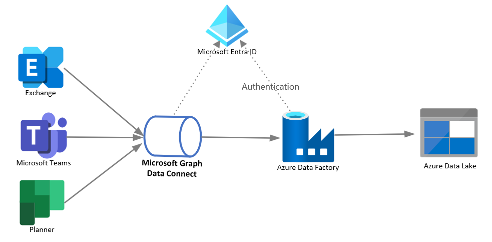

# Analyze Microsoft Graph data in your data storage

This article describes a common Microsoft Graph integration pattern for a business scenario that requires a complex analysis of enterprise collaboration data to improve business processes and productivity.

This scenario relies on a large amount of extracted Microsoft 365 data and has the following requirements:

- A data integration type.
- An outbound data flow from Microsoft 365 boundaries to the app.
- A high volume of data spanning multiple months.
- A relatively high data latency; the initial data extract might include messages that are up to a year old.
  
The best option for this scenario is to use Microsoft Graph Data Connect. The client needs to set up high-capacity data storage such as Azure Data Lake or Azure Synapse, enable an Azure subscription, and configure an Azure Data Factory or Azure Synapse pipeline.

The following diagram shows the architecture for this solution.

## Solution components

The solution architecture includes the following components:

- Microsoft Graph Data Connect, which enables the extraction of Microsoft 365 data at scale with granular data consent, and supports all Azure-native service capabilities such as encryption, geo-fencing, auditing, and policy enforcement.
- Azure Data Factory (ADF), which allows easy construction of ETL (extract, transform, and load) and ELT (extract, load, and transform) processes code-free in an intuitive environment, or writing your code.
- Azure Data Lake, which lets you persist large amounts of structured and unstructured data in different formats.
- Microsoft Entra ID, which is required to manage authentication for Microsoft Graph APIs and supports delegated and application permissions to enable OAuth flow.

## Considerations

The following considerations support the use of this integration pattern:

- **Availability**: The client ADF can extract data in bulk on their schedule or on an ad-hoc basis.

- **Latency**: Data latency in this scenario can vary depending on the extraction of historical data or the delivery of more recent data to Microsoft Graph Data Connect storage by asynchronous processes performed as scheduled tasks. The performance of the ADF large data extract is faster than granular HTTP APIs because ADF uses batching and file transfer.

- **Scalability**: This architecture allows you to develop pipelines that maximize data movement throughput for your environment. These pipelines can fully utilize the following resources:

  - Network bandwidth between the source and destination data stores.
  - Source or destination data store input/output operations per second (IOPS) and bandwidth.

- **Solution complexity**: This data egress solution is of low complexity from an integration perspective because it doesn't require custom code, has few components, and is tolerant of data latency.

## Related content

- [Overview of Microsoft Graph Data Connect](/graph/data-connect-concept-overview)
- [Training: Build your first Microsoft Graph Data Connect application](/graph/data-connect-quickstart)

