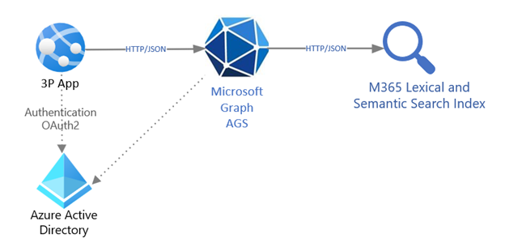

# Augment the Microsoft Search experience with custom data

The **business scenario** requires adding custom enterprise data to the Microsoft Search and Microsoft Copilot experiences built in Microsoft product canvas. The custom data is ingested into unstructured Microsoft 365 storage and added to various Search indexes.

This business scenario describes a non-interactive scenario, and it has the following **architecturally significant requirements**:

- A data integration type, because it only provides custom data and doesn't use Microsoft 365 functionality in customer apps.
- An inbound data flow between the app and the Microsoft 365 boundaries.
- A high data volume for indexing.
- Data batching and scheduling for upload and ingestion therefore assuming increased data latency

The only suitable option for this application is to use **Microsoft Graph Connectors**.

A simple **reference architecture** for the app is:

## Components

The architecture uses the following components:

- Azure App Service, which lets you build and host web apps, scheduled jobs, and RESTful APIs in your preferred programming language, without managing infrastructure. It offers auto-scaling and high availability, supports both Windows and Linux, and enables automated deployments from GitHub, Azure DevOps, or any Git repo.
- Azure Active Directory, which is required to manage authentication for the Microsoft Graph and supports Delegated and Application permissions to enable OAuth flow.
- Microsoft Graph AGS, which is a single gateway, <https://graph.microsoft.com>, to access Microsoft Graph RESTful HTTP APIs including connectors.
- Custom app, which implements custom logic and API orchestration.

## Considerations

**Availability**: The client app periodically sends data via Graph APIs. The non-interactive client app will make requests and upload the data at a frequency controlled by the client environment and limited by Connectors throttling.

**Latency**: The client app uses the synchronous Connectors APIs and expects a response, but there may be some latency depending on the network conditions and the load on the Graph service.

**Scalability**: The client app is limited by 30 connections with no more than 50,000,000 items per tenant, so scalability is limited. In addition, if the data volume is large, synchronous processing may become a challenge and a roadblock.

**Solution complexity**: This solution can leverage connectors built by independent software vendors (ISVs), but if it directly accesses Microsoft Graph SDK or Microsoft Graph APIs, it needs custom code to serialize custom data into the format required by connectors. This gives it much flexibility but also increases the complexity for developers. Therefore, this solution can range from low to medium in complexity.

## See also

- [Microsoft Graph connectors overview](./../connecting-external-content-connectors-overview.md)
- [Training: build your first Microsoft Graph Data Connect application](/training/modules/data-connect-quickstart)
