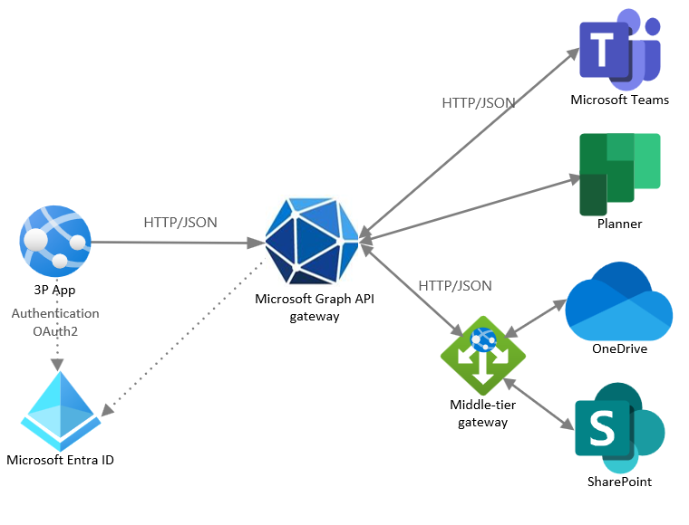

# Build interactive apps by using Microsoft Graph APIs

This article describes a common Microsoft Graph integration pattern for a business scenario that requires a UI that can create, update, and manage channel messages in real time. This scenario depends on Microsoft 365 services such as sending and receiving messages from different teams.

This scenario has the following architecture requirements:

- An application integration type, because it relies on complex Microsoft 365 functionality.
- A bidirectional data flow between the app and Microsoft 365.
- A low volume of data compared to automated systems based on single human interations. Depending on the number of users, however, the data volume might be high.
- A real-time data operation on the app, with some asynchronous server-side operations, such as delivering email to a remote client.

The best choice for this application is to use Microsoft Graph RESTful HTTP APIs. The client app responds to user actions and can make requests and process the data at a speed that's controlled by the client environment.

The following diagram shows the architecture for this solution.

## Solution components

The solution architecture includes the following components:

- Azure App Service, which lets you build and host web apps, mobile backends, and RESTful APIs in your preferred programming language, without managing infrastructure. It offers auto-scaling and high availability, supports both Windows and Linux, and enables automated deployments from GitHub, Azure DevOps, or any Git repo.
- Microsoft Entra ID is required to manage authentication for Microsoft Graph APIs and supports delegated and application permissions to enable OAuth flow.
- SQL Database is used to store application data and state; this component is optional.
- Microsoft Graph RESTful APIs, accessed via a single endpoint: `https://graph.microsoft.com`.
- An app that implements custom logic.

## Considerations

The following considerations support the use of this integration pattern:

- **Availability**: The client app periodically polls Microsoft Graph APIs for data. The client app can make requests and process the data at a speed controlled by the client environment.

- **Latency**: The client app queries Microsoft Graph APIs for data in real time; however, there may be some latency depending on the network conditions and the load on the Microsoft Graph service.

- **Scalability**: The client app can scale horizontally by adding more instances to the App Service plan. Microsoft Graph APIs can handle a large number of requests, but they also have throttling limits and policies to prevent abuse. The client app should implement retry logic and exponential back-off to handle throttling errors gracefully.

- **Solution complexity**: Although this solution might use the Microsoft Graph SDK, it still requires custom code to poll and process the data. If the data volume is large, sequential processing might not be sufficient, and parallel processing might be necessary. For this reason, this solution has a medium level of complexity.

## Related content

- [Best practices in cloud applications](/azure/architecture/best-practices/index-best-practices)

