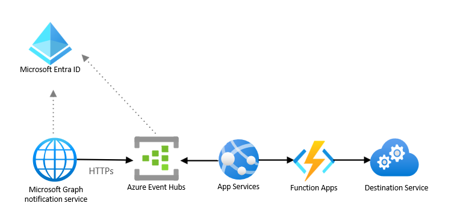

# Retrieve events at your speed by using Microsoft Graph

This article describes a common Microsoft Graph integration pattern for a business scenario that requires a security analysis of collaboration content to prevent unsafe or inappropriate sharing, transfer, or use of sensitive data, such as in Data Loss Prevention (DLP) scenarios.

This business scenario is a non-interactive use case that requires a data feed of changes triggered by users interacting with various messaging systems. It doesn't rely on Microsoft 365 functional behavior, and has the following architecture requirements:

- A data integration type.
- An outbound data flow from Microsoft 365 boundaries to the app.
- A high data volume for medium to large enterprises.
- Near real-time data latency to minimize data loss.
  
The best integration option for this scenario is to use the Pub/Sub integration pattern enabled by Microsoft Graph change notifications, which can deliver event notifications as well as the contents of a shared message, delivered to Azure Event Hubs. This pattern allows the app to receive change notifications asynchronously and does not tightly couple Microsoft Graph to the receiver applications. This type of app interaction is often called pull mode.

The following diagram shows the architecture for this solution.

## Solution components

The solution architecture includes the following components:

- Azure Event Hubs, which allows you to ingest a high volume of small messages, less than 1 MB, in a second with low latency, and store them for consecutive processing.
- Azure App Service, which lets you build and host web apps, mobile backends, and RESTful APIs in your preferred programming language, without managing infrastructure. It offers auto-scaling and high availability, supports both Windows and Linux, and enables automated deployments from GitHub, Azure DevOps, or any Git repo.
- Microsoft Entra ID, which is required to manage authentication for Microsoft Graph APIs and supports delegated and application permissions to enable OAuth flow.
- Function app, which is a serverless component that allows you to scale out for bursts of new notifications and has a business logic to process notifications and send them to a destination service. 
- Microsoft Graph notification services, which manage notification subscriptions and deliver change notifications to clients.

## Considerations

The following considerations support the use of this integration pattern:

- **Availability**: Azure Event Hubs provide high availability across multiple availability zones.

- **Latency**: Azure Event Hubs can process millions of events per second with low latency.

- **Scalability**: Azure Event Hubs provide event storage and retention for up to 90 days depending on the service tier, thus allowing the custom app to consume and process events at its own pace.

- **Solution complexity**: This solution requires custom code to maintain subscriptions, and encryption keys to process the data. Because this solution doesn't require elasticity and the ability to react to an unexpected volume of events, it's less complex than integration with webhooks in push mode. This solution has medium complexity.

## Related content

- [Change notifications](./../change-notifications-overview.md)
- [Real-time presence with Microsoft 365](/azure/architecture/solution-ideas/articles/presence-microsoft-365-power-platform)
  
