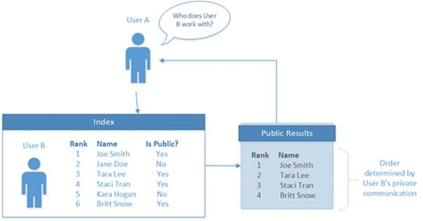

# Use the People API in Microsoft Graph to get information about the people most relevant to you

Microsoft Graph applications can use the People API to retrieve the people who are most relevant to a user. Relevance is determined by the user’s communication and collaboration patterns and business relationships. People can be local contacts or from an organization’s directory, and people from recent communications. Along with generating this insight, the People API also provides fuzzy matching search support and the ability to retrieve the list of users relevant to another user in the signed-in user's organization.
The People API is particularly useful for people picking scenarios, such as composing an email or creating a meeting. For example, you can use the People API in email compose scenarios.

## Authorization

To call the People API in Microsoft Graph, your app will need the appropriate permissions:

* People.Read - Use to make general People API calls; for example, `https://graph.microsoft.com/v1.0/me/people/`. People.Read requires end user consent.
* People.Read.All - Required to retrieve the people most relevant to a specified user in the signed-in user’s organization (`https://graph.microsoft.com/v1.0/users/{id}/people`) calls. People.Read.All requires admin consent.

## Browse people

The requests in this section get the people most relevant to the signed-in user (`/me`), or to a specific user in the signed-in user’s organization. These requests require the People.Read or People.Read.All permission respectively. By default, each response returns 10 records, but you can change this by using the *$top* query parameter.

### Get a collection of relevant people

The following request gets the people most relevant to the signed-in user (`/me`), based on communication and collaboration patterns and business relationships.

```http
GET https://graph.microsoft.com/v1.0/me/people/
```

The following example shows the response. By default, each response returns 10 records. You can change this by using the *$top* query parameter. This example uses *$top* to limit the response to three records.

```http
HTTP/1.1 200 OK
Content-type: application/json

{
  "value": [
    {
      "id": "8CE6E1DE-CB84-4BF5-971D-D3ECF452E2B5",
      "displayName": "Lorrie Frye",
      "givenName": "Lorrie",
      "surname": "Frye",
      "birthday": "",
      "personNotes": "",
      "isFavorite": false,
      "jobTitle": "Paralegal",
      "companyName": null,
      "yomiCompany": "",
      "department": "Legal",
      "officeLocation": "20/1109",
      "profession": "",
      "userPrincipalName": "LorrieF@contoso.onmicrosoft.com",
      "imAddress": "sip:LorrieF@contoso.onmicrosoft.com",
      "scoredEmailAddresses": [
        {
          "address": "LorrieF@contoso.onmicrosoft.com",
          "relevanceScore": 8
        }
      ],
      "phones": [
        {
          "type": "Business",
          "number": "+1 980 555 0101"
        }
      ],
      "postalAddresses": [],
      "websites": [],
      "personType": {
        "class": "Person",
        "subclass": "OrganizationUser"
      }
    },
    {
      "id": "5767393D-42BA-4E5C-BEE4-52BB25639CF4",
      "displayName": "Maynard Denman",
      "givenName": "Maynard",
      "surname": "Denman",
      "birthday": "",
      "personNotes": "",
      "isFavorite": false,
      "jobTitle": "Web Marketing Manager",
      "companyName": null,
      "yomiCompany": "",
      "department": "Sales & Marketing",
      "officeLocation": "20/1101",
      "profession": "",
      "userPrincipalName": "MaynardD@contoso.onmicrosoft.com",
      "imAddress": "sip:MaynardD@contoso.onmicrosoft.com",
      "scoredEmailAddresses": [
        {
          "address": "MaynardD@contoso.onmicrosoft.com",
          "relevanceScore": 8
        }
      ],
      "phones": [
        {
          "type": "Business",
          "number": "+1 918 555 0101"
        }
      ],
      "postalAddresses": [],
      "websites": [],
      "personType": {
        "class": "Person",
        "subclass": "OrganizationUser"
      }
    },
    {
      "id": "914B5191-11FA-4C0B-A354-0FA8C8EFD585",
      "displayName": "Darrel Halsey",
      "givenName": "Darrel",
      "surname": "Halsey",
      "birthday": "",
      "personNotes": "",
      "isFavorite": false,
      "jobTitle": "Attorney",
      "companyName": null,
      "yomiCompany": "",
      "department": "Legal",
      "officeLocation": "14/1102",
      "profession": "",
      "userPrincipalName": "DarrelH@contoso.onmicrosoft.com",
      "imAddress": "sip:DarrelH@contoso.onmicrosoft.com",
      "scoredEmailAddresses": [
        {
          "address": "DarrelH@contoso.onmicrosoft.com",
          "relevanceScore": 8
        }
      ],
      "phones": [
        {
          "type": "Business",
          "number": "+1 205 555 0103"
        }
      ],
      "postalAddresses": [],
      "websites": [],
      "personType": {
        "class": "Person",
        "subclass": "OrganizationUser"
      }
    }
  ]
}
```

### Request a subsequent page of people

If the first response does not contain the complete list of relevant people, you can make a second request using *$top* and *$skip* to request additional pages of information. If the previous request has additional information, the following request gets the next page of people from the server.

```http
GET https://graph.microsoft.com/v1.0/me/people/?$top=3&$skip=10
```

The following example shows the response. By default, each response returns 10 records. You can change this by using the *$top* query parameter. This example uses *$top* to limit the response to three records.

```http
HTTP/1.1 200 OK
Content-type: application/json

{
  "value": [
    {
      "id": "1F28616D-BDFE-4080-8F06-03366A851688",
      "displayName": "Felix Coppola",
      "givenName": "Felix",
      "surname": "Coppola",
      "birthday": "",
      "personNotes": "",
      "isFavorite": false,
      "jobTitle": "CVP Legal",
      "companyName": null,
      "yomiCompany": "",
      "department": "Legal",
      "officeLocation": "19/2109",
      "profession": "",
      "userPrincipalName": "FelixC@contoso.onmicrosoft.com",
      "imAddress": "sip:FelixC@contoso.onmicrosoft.com",
      "scoredEmailAddresses": [
        {
          "address": "FelixC@contoso.onmicrosoft.com",
          "relevanceScore": 8
        }
      ],
      "phones": [
        {
          "type": "Business",
          "number": "+1 309 555 0104"
        }
      ],
      "postalAddresses": [],
      "websites": [],
      "personType": {
        "class": "Person",
        "subclass": "OrganizationUser"
      }
    },
    {
      "id": "8A3FC021-6DBB-44AC-8884-B7B500CC260A",
      "displayName": "Lenora Rowland",
      "givenName": "Lenora",
      "surname": "Rowland",
      "birthday": "",
      "personNotes": "",
      "isFavorite": false,
      "jobTitle": "Marketing Assistant",
      "companyName": null,
      "yomiCompany": "",
      "department": "Sales & Marketing",
      "officeLocation": "18/1106",
      "profession": "",
      "userPrincipalName": "LenoraR@contoso.onmicrosoft.com",
      "imAddress": "sip:LenoraR@contoso.onmicrosoft.com",
      "scoredEmailAddresses": [
        {
          "address": "LenoraR@contoso.onmicrosoft.com",
          "relevanceScore": 8
        }
      ],
      "phones": [
        {
          "type": "Business",
          "number": "+1 954 555 0118"
        }
      ],
      "postalAddresses": [],
      "websites": [],
      "personType": {
        "class": "Person",
        "subclass": "OrganizationUser"
      }
    },
    {
      "id": "032C9919-4DF9-4715-8C46-4D0FAE7B3EB2",
      "displayName": "Manuel Collette",
      "givenName": "Manuel",
      "surname": "Collette",
      "birthday": "",
      "personNotes": "",
      "isFavorite": false,
      "jobTitle": "Accountant II",
      "companyName": null,
      "yomiCompany": "",
      "department": "Finance",
      "officeLocation": "98/2202",
      "profession": "",
      "userPrincipalName": "ManuelC@contoso.onmicrosoft.com",
      "imAddress": "sip:ManuelC@contoso.onmicrosoft.com",
      "scoredEmailAddresses": [
        {
          "address": "ManuelC@contoso.onmicrosoft.com",
          "relevanceScore": 8
        }
      ],
      "phones": [
        {
          "type": "Business",
          "number": "+20 255501070"
        }
      ],
      "postalAddresses": [],
      "websites": [],
      "personType": {
        "class": "Person",
        "subclass": "OrganizationUser"
      }
    }
  ]
}
```

### Sort the response

By default, the people in the response are sorted by their relevance to your query. You can change the order of the people in the response by using the *$orderby* parameter. This query selects the people most relevant to you, sorts them by their **displayName**, and then returns the first 10 people on the sorted list.

```http
GET https://graph.microsoft.com/v1.0/me/people/?$orderby=displayName
```

The following example shows the response. By default, each response returns 10 records. You can change this by using the *$top* parameter. The following example uses *$top* to limit the response to three records.

```http
HTTP/1.1 200 OK
Content-type: application/json

{
  "value": [
    {
      "id": "818E29A1-E6BB-4EDA-AB20-8230B4B1E290",
      "displayName": "Adriana Ramos",
      "givenName": "Adriana",
      "surname": "Ramos",
      "birthday": "",
      "personNotes": "",
      "isFavorite": false,
      "jobTitle": "Product Marketing Manager",
      "companyName": null,
      "yomiCompany": "",
      "department": "Sales & Marketing",
      "officeLocation": "18/2111",
      "profession": "",
      "userPrincipalName": "AdrianaR@contoso.onmicrosoft.com",
      "imAddress": "sip:AdrianaR@contoso.onmicrosoft.com",
      "scoredEmailAddresses": [
        {
          "address": "AdrianaR@contoso.onmicrosoft.com",
          "relevanceScore": 8
        }
      ],
      "phones": [
        {
          "type": "Business",
          "number": "+1 425 555 0109"
        }
      ],
      "postalAddresses": [],
      "websites": [],
      "personType": {
        "class": "Person",
        "subclass": "OrganizationUser"
      }
    },
    {
      "id": "62633BAA-1CB9-4FA2-9B8F-55AB1840B69D",
      "displayName": "Alyce Cooley",
      "givenName": "Alyce",
      "surname": "Cooley",
      "birthday": "",
      "personNotes": "",
      "isFavorite": false,
      "jobTitle": "Marketing Assistant",
      "companyName": null,
      "yomiCompany": "",
      "department": "Sales & Marketing",
      "officeLocation": "131/1104",
      "profession": "",
      "userPrincipalName": "AlyceC@contoso.onmicrosoft.com",
      "imAddress": "sip:AlyceC@contoso.onmicrosoft.com",
      "scoredEmailAddresses": [
        {
          "address": "AlyceC@contoso.onmicrosoft.com",
          "relevanceScore": 8
        }
      ],
      "phones": [
        {
          "type": "Business",
          "number": "+1 858 555 0110"
        }
      ],
      "postalAddresses": [],
      "websites": [],
      "personType": {
        "class": "Person",
        "subclass": "OrganizationUser"
      }
    },
    {
      "id": "6BB54D2C-EF20-48DA-ADD9-AE757DD30C4E",
      "displayName": "Alyssa Clarke",
      "givenName": "Alyssa",
      "surname": "Clarke",
      "birthday": "",
      "personNotes": "",
      "isFavorite": false,
      "jobTitle": "Corporate Security Officer",
      "companyName": null,
      "yomiCompany": "",
      "department": "Operations",
      "officeLocation": "24/1106",
      "profession": "",
      "userPrincipalName": "AlyssaC@contoso.onmicrosoft.com",
      "imAddress": "sip:AlyssaC@contoso.onmicrosoft.com",
      "scoredEmailAddresses": [
        {
          "address": "AlyssaC@contoso.onmicrosoft.com",
          "relevanceScore": 8
        }
      ],
      "phones": [
        {
          "type": "Business",
          "number": "+1 262 555 0106"
        }
      ],
      "postalAddresses": [],
      "websites": [],
      "personType": {
        "class": "Person",
        "subclass": "OrganizationUser"
      }
    }
  ]
}
```

### Change the number of people and fields returned

You can change the number of people returned in the response by setting the *$top* parameter.

The following example requests the 1,000 people most relevant to `/me`. The request also limits the amount of data sent back from the server by requesting only the **displayName** of the person.

```http
GET https://graph.microsoft.com/v1.0/me/people/?$top=1000&$Select=displayName
```

The following example shows the response.

```http
HTTP/1.1 200 OK
Content-type: application/json

{
  "value": [
    {
      "id": "8CE6E1DE-CB84-4BF5-971D-D3ECF452E2B5",
      "displayName": "Lorrie Frye"
    },
    {
      "id": "5767393D-42BA-4E5C-BEE4-52BB25639CF4",
      "displayName": "Maynard Denman"
    },
    {
      "id": "914B5191-11FA-4C0B-A354-0FA8C8EFD585",
      "displayName": "Darrel Halsey"
    },
    {
      "id": "E3C5B235-DE15-4566-B7B1-7A8E32426540",
      "displayName": "Roscoe Seidel"
    },
    {
      "id": "6BB54D2C-EF20-48DA-ADD9-AE757DD30C4E",
      "displayName": "Alyssa Clarke"
    },
    {
      "id": "818E29A1-E6BB-4EDA-AB20-8230B4B1E290",
      "displayName": "Adriana Ramos"
    },
    {
      "id": "62633BAA-1CB9-4FA2-9B8F-55AB1840B69D",
      "displayName": "Alyce Cooley"
    },
    {
      "id": "6BB9CC1F-418D-4DDF-AB0C-6A1C4ABCDBF4",
      "displayName": "Wayne Leeper"
    },
    {
      "id": "E7D40AC5-0078-4575-B1F3-F738124C4BC9",
      "displayName": "Jan Travis"
    },
    {
      "id": "6F99D1CC-4FCC-49E4-9160-E8AB01BF3E83",
      "displayName": "Charlotte Delacruz"
    },
    {
      "id": "1F28616D-BDFE-4080-8F06-03366A851688",
      "displayName": "Felix Coppola"
    },
    {
      "id": "8A3FC021-6DBB-44AC-8884-B7B500CC260A",
      "displayName": "Lenora Rowland"
    },
    {
      "id": "032C9919-4DF9-4715-8C46-4D0FAE7B3EB2",
      "displayName": "Manuel Collette"
    }
  ]
}
```
### Types of results included
By default, Microsoft Graph serves mailbox-only results, which are your saved contacts or people you are most likely to interact with. To retrieve organization-wide directory results, specify an HTTP header, as shown.

```http
"X-PeopleQuery-QuerySources: Mailbox,Directory”
```
### Select the fields to return

You can limit the amount of data returned from the server by using the *$select* parameter to choose one or more fields. The `@odata.id` field is always returned.

The following example limits the response to the **displayName** and **scoredEmailAddresses** of the 10 most relevant people.

```http
GET https://graph.microsoft.com/v1.0/me/people/?$select=displayName,scoredEmailAddresses
```

The following example shows the response. By default, each response returns 10 records. You can change this using the *$top* parameter. This example uses *$top* to limit the response to three records.

```http
HTTP/1.1 200 OK
Content-type: application/json

{
  "value": [
    {
      "id": "8CE6E1DE-CB84-4BF5-971D-D3ECF452E2B5",
      "displayName": "Lorrie Frye",
      "scoredEmailAddresses": [
        {
          "address": "LorrieF@contoso.onmicrosoft.com",
          "relevanceScore": 8
        }
      ]
    },
    {
      "id": "5767393D-42BA-4E5C-BEE4-52BB25639CF4",
      "displayName": "Maynard Denman",
      "scoredEmailAddresses": [
        {
          "address": "MaynardD@contoso.onmicrosoft.com",
          "relevanceScore": 8
        }
      ]
    },
    {
      "id": "914B5191-11FA-4C0B-A354-0FA8C8EFD585",
      "displayName": "Darrel Halsey",
      "scoredEmailAddresses": [
        {
          "address": "DarrelH@contoso.onmicrosoft.com",
          "relevanceScore": 8
        }
      ]
    }
  ]
}
```

### Use a filter to limit the response

You can use the *$filter* parameter to limit the response to only those people whose record contains the specified criteria.

The following query limits the response to **person** instances with the **personType** property being assigned **person** as **class** and **organizationUser** as **subclass**.

```http
GET https://graph.microsoft.com/v1.0/me/people/?$filter=personType/class eq 'Person' and personType/subclass eq 'OrganizationUser'
```

The following example shows the response. By default, each response returns 10 records. You can change this using the *$top* parameter. This example uses *$top* to limit the response to three records.

```http
HTTP/1.1 200 OK
Content-type: application/json

{
  "value": [
    {
      "id": "8CE6E1DE-CB84-4BF5-971D-D3ECF452E2B5",
      "displayName": "Lorrie Frye",
      "givenName": "Lorrie",
      "surname": "Frye",
      "birthday": "",
      "personNotes": "",
      "isFavorite": false,
      "jobTitle": "Paralegal",
      "companyName": null,
      "yomiCompany": "",
      "department": "Legal",
      "officeLocation": "20/1109",
      "profession": "",
      "userPrincipalName": "LorrieF@contoso.onmicrosoft.com",
      "imAddress": "sip:LorrieF@contoso.onmicrosoft.com",
      "scoredEmailAddresses": [
        {
          "address": "LorrieF@contoso.onmicrosoft.com",
          "relevanceScore": 8
        }
      ],
      "phones": [
        {
          "type": "Business",
          "number": "+1 980 555 0101"
        }
      ],
      "postalAddresses": [],
      "websites": [],
      "personType": {
        "class": "Person",
        "subclass": "OrganizationUser"
      }
    },
    {
      "id": "5767393D-42BA-4E5C-BEE4-52BB25639CF4",
      "displayName": "Maynard Denman",
      "givenName": "Maynard",
      "surname": "Denman",
      "birthday": "",
      "personNotes": "",
      "isFavorite": false,
      "jobTitle": "Web Marketing Manager",
      "companyName": null,
      "yomiCompany": "",
      "department": "Sales & Marketing",
      "officeLocation": "20/1101",
      "profession": "",
      "userPrincipalName": "MaynardD@contoso.onmicrosoft.com",
      "imAddress": "sip:MaynardD@contoso.onmicrosoft.com",
      "scoredEmailAddresses": [
        {
          "address": "MaynardD@contoso.onmicrosoft.com",
          "relevanceScore": 8
        }
      ],
      "phones": [
        {
          "type": "Business",
          "number": "+1 918 555 0101"
        }
      ],
      "postalAddresses": [],
      "websites": [],
      "personType": {
        "class": "Person",
        "subclass": "OrganizationUser"
      }
    },
    {
      "id": "914B5191-11FA-4C0B-A354-0FA8C8EFD585",
      "displayName": "Darrel Halsey",
      "givenName": "Darrel",
      "surname": "Halsey",
      "birthday": "",
      "personNotes": "",
      "isFavorite": false,
      "jobTitle": "Attorney",
      "companyName": null,
      "yomiCompany": "",
      "department": "Legal",
      "officeLocation": "14/1102",
      "profession": "",
      "userPrincipalName": "DarrelH@contoso.onmicrosoft.com",
      "imAddress": "sip:DarrelH@contoso.onmicrosoft.com",
      "scoredEmailAddresses": [
        {
          "address": "DarrelH@contoso.onmicrosoft.com",
          "relevanceScore": 8
        }
      ],
      "phones": [
        {
          "type": "Business",
          "number": "+1 205 555 0103"
        }
      ],
      "postalAddresses": [],
      "websites": [],
      "personType": {
        "class": "Person",
        "subclass": "OrganizationUser"
      }
    }
  ]
}
```

### Select the fields to return in a filtered response

You can combine the *$select* and *$filter* parameters to create a custom list of people relevant to the user and get only the fields that your application needs.

The following example gets the **displayName** and **scoredEmailAddresses** of people whose display name equals the specified name. In this example, only people whose display name equals "Lorrie Frye" are returned.

```http
GET https://graph.microsoft.com/v1.0/me/people/?$select=displayName,scoredEmailAddresses&$filter=displayName eq 'Lorrie Frye'
```

The following example shows the response.

```http
HTTP/1.1 200 OK
Content-type: application/json

{
  "value": [
    {
      "id": "8CE6E1DE-CB84-4BF5-971D-D3ECF452E2B5",
      "displayName": "Lorrie Frye",
      "scoredEmailAddresses": [
        {
          "address": "LorrieF@contoso.onmicrosoft.com",
          "relevanceScore": 8
        }
      ]
    }
  ]
}
```

### Browse another user’s relevant people

The following request gets the people most relevant to another person in the signed-in user's organization, as described in the [implementation of the working-with feature](#implementation-of-the-working-with-feature). This request requires the People.Read.All permission. All the query parameters described in the above sections apply as well.

In this example, Roscoe Seidel's relevant people are displayed.

```http
GET https://graph.microsoft.com/v1.0/users('roscoes@contoso.com')/people/
```

The following example shows the response. By default, each response returns 10 records. You can change this using the *$top* parameter. The example below uses *$top* to limit the response to three records.

```http
HTTP/1.1 200 OK
Content-type: application/json

{
  "value": [
    {
      "id": "56155636-703F-47F2-B657-C83F01F49BBC",
      "displayName": "Clifton Clemente",
      "givenName": "Clifton",
      "surname": "Clemente",
      "birthday": "",
      "personNotes": "",
      "isFavorite": false,
      "jobTitle": "Director",
      "companyName": null,
      "yomiCompany": "",
      "department": "Legal",
      "officeLocation": "19/2106",
      "profession": "",
      "userPrincipalName": "CliftonC@contoso.onmicrosoft.com",
      "imAddress": "sip:CliftonC@contoso.onmicrosoft.com",
      "scoredEmailAddresses": [
        {
          "address": "CliftonC@contoso.onmicrosoft.com",
          "relevanceScore": 20
        }
      ],
      "phones": [
        {
          "type": "Business",
          "number": "+1 309 555 0101"
        }
      ],
      "postalAddresses": [],
      "websites": [],
      "personType": {
        "class": "Person",
        "subclass": "OrganizationUser"
      }
    },
    {
      "id": "6BF27D5A-AB4F-4C43-BED0-7DAD9EB0C1C4",
      "displayName": "Sheree Mitchell",
      "givenName": "Sheree",
      "surname": "Mitchell",
      "birthday": "",
      "personNotes": "",
      "isFavorite": false,
      "jobTitle": "Product Manager",
      "companyName": null,
      "yomiCompany": "",
      "department": "Sales & Marketing",
      "officeLocation": "20/2107",
      "profession": "",
      "userPrincipalName": "ShereeM@contoso.onmicrosoft.com",
      "imAddress": "sip:ShereeM@contoso.onmicrosoft.com",
      "scoredEmailAddresses": [
        {
          "address": "ShereeM@contoso.onmicrosoft.com",
          "relevanceScore": 10
        }
      ],
      "phones": [
        {
          "type": "Business",
          "number": "+1 918 555 0107"
        }
      ],
      "postalAddresses": [],
      "websites": [],
      "personType": {
        "class": "Person",
        "subclass": "OrganizationUser"
      }
    },
    {
      "id": "B3E5302D-EAF0-4E8B-8C6C-A2AE64B4B163",
      "displayName": "Vincent Matney",
      "givenName": "Vincent",
      "surname": "Matney",
      "birthday": "",
      "personNotes": "",
      "isFavorite": false,
      "jobTitle": "CVP Engineering",
      "companyName": null,
      "yomiCompany": "",
      "department": "Engineering",
      "officeLocation": "23/2102",
      "profession": "",
      "userPrincipalName": "VincentM@contoso.onmicrosoft.com",
      "imAddress": "sip:VincentM@contoso.onmicrosoft.com",
      "scoredEmailAddresses": [
        {
          "address": "VincentM@contoso.onmicrosoft.com",
          "relevanceScore": 10
        }
      ],
      "phones": [
        {
          "type": "Business",
          "number": "+1 502 555 0102"
        }
      ],
      "postalAddresses": [],
      "websites": [],
      "personType": {
        "class": "Person",
        "subclass": "OrganizationUser"
      }
    }
  ]
}
```

## Search people

The requests in this section allow you to search for people relevant to the signed-in user (`/me`) and other users in the signed-in user’s organization. These requests require the People.Read permission, with the exception of searching other users’ relevant people, which requires People.Read.All. By default, each response returns 10 records, but you can change this by using the *$top* parameter.

### Use search to select people

Use the *$search* parameter to select people who meet a particular set of criteria.

The following search query returns people relevant to `/me` whose **displayName** or **emailAddress** has a word that begins with the letter "j".

```http
GET https://graph.microsoft.com/v1.0/me/people/?$search=j
```

The following example shows the response. By default, each response returns 10 records. You can change this using the *$top* parameter. This example uses *$top* to limit the response to three records.

```http
HTTP/1.1 200 OK
Content-type: application/json

{
  "value": [
    {
      "id": "E3C5B235-DE15-4566-B7B1-7A8E32426540",
      "displayName": "Jan Travis",
      "givenName": "Jan",
      "surname": "Travis",
      "birthday": "",
      "personNotes": "",
      "isFavorite": false,
      "jobTitle": "VP Sales",
      "companyName": null,
      "yomiCompany": "",
      "department": "Sales & Marketing",
      "officeLocation": "19/3123",
      "profession": "",
      "userPrincipalName": "JanT@contoso.onmicrosoft.com",
      "imAddress": "sip:JanT@contoso.onmicrosoft.com",
      "scoredEmailAddresses": [
        {
          "address": "JanT@contoso.onmicrosoft.com",
          "relevanceScore": -12.297347783416837
        }
      ],
      "phones": [
        {
          "type": "Business",
          "number": "+1 732 555 0102"
        }
      ],
      "postalAddresses": [],
      "websites": [],
      "personType": {
        "class": "Person",
        "subclass": "OrganizationUser"
      }
    },
    {
      "id": "C43BF05E-5B6B-4DCF-B2FC-0837B09E0FA9",
      "displayName": "Jacob Cazares (TAILSPIN)",
      "givenName": null,
      "surname": null,
      "birthday": "",
      "personNotes": "",
      "isFavorite": false,
      "jobTitle": null,
      "companyName": null,
      "yomiCompany": "",
      "department": null,
      "officeLocation": null,
      "profession": "",
      "userPrincipalName": "",
      "imAddress": null,
      "scoredEmailAddresses": [
        {
          "address": "JacobC@tailspintoys.com",
          "relevanceScore": -12.298154282019846
        }
      ],
      "phones": [],
      "postalAddresses": [],
      "websites": [],
      "personType": {
        "class": "Person",
        "subclass": "PersonalContact"
      }
    },
    {
      "id": "6BB9CC1F-418D-4DDF-AB0C-6A1C4ABCDBF4",
      "displayName": "Jewell Montgomery",
      "givenName": "Jewell",
      "surname": "Montgomery",
      "birthday": "",
      "personNotes": "",
      "isFavorite": false,
      "jobTitle": null,
      "companyName": null,
      "yomiCompany": "",
      "department": null,
      "officeLocation": null,
      "profession": "",
      "userPrincipalName": "JewellM@contoso.onmicrosoft.com",
      "imAddress": null,
      "scoredEmailAddresses": [
        {
          "address": "JewellM@contoso.onmicrosoft.com",
          "relevanceScore": -12.531408487977451
        }
      ],
      "phones": [],
      "postalAddresses": [],
      "websites": [],
      "personType": {
        "class": "Person",
        "subclass": "OrganizationUser"
      }
    }
  ]
}
```

### Perform a fuzzy search

Searches implement a fuzzy matching algorithm. They will return results based on an exact match and also on inferences about the intent of the search. For example, imagine a user with a display name of "Tyler Lee" and an email address of tylerle@example.com who is in the **people** collection of the signed-in user. All of the following searches will return this user Tyler as one of the results.

```http
GET https://graph.microsoft.com/v1.0/me/people?$search="tyler"                //matches both Tyler's name and email
GET https://graph.microsoft.com/v1.0/me/people?$search="tylerle"              //matches Tyler's email
GET https://graph.microsoft.com/v1.0/me/people?$search="tylerle@example.com"  //matches Tyler's email. Note the quotes to enclose '@'.
GET https://graph.microsoft.com/v1.0/me/people?$search="tiler"                //fuzzy match with Tyler's name
GET https://graph.microsoft.com/v1.0/me/people?$search="tyler lee"            //matches Tyler's name. Note the quotes to enclose the space.
```

### Implementation of the working-with feature
 
There must be a public relationship between the profile owner and the other people in order for those people to show up on the profile owner's list. The following illustration shows a User A, an index of relationships with other users (User B), and a public profile showing a subset of user relationships.


 
The following are examples of public relationships:

- Individuals connected in the org chart: Manager, Direct report, Peers (share the same manager) 
- Members of a public group or distribution list with fewer than 30 people. Public groups have membership lists that are available in the directory.
 
If the profile owner communicates with someone and there is no public relationship between them, such as an org chart connection or a group in common, the fact that they've been communicating will not be visible to others.

The ranking of people - that is, the order in which they appear on the profile owner's page - is determined by the private and public communication between the profile owner and the person on the list.
 
Examples of private communication include:
- Sending emails to each other where the name of the other person is in the TO line
- Inviting users to meetings by including their name in the calendar invite 
 
Examples of public interaction include:
- Sending or receiving emails to/from each other as part of a public group 
- Inviting users to meetings as part of group, or where more than X people are invited
 
The ranking doesn’t change based on who User A is (the person looking at someone else's page). The ranking is determined by the interaction level between User B (profile owner) and User C (person showing up on profile owner's list).
 
In order for User C to appear, the profile owner must be in a relatively small group/DL with that user that is public (meaning the membership list is available in the directory).
 
People external to the organization do not show on the profile owner's list. People they email or meet with, but who are not part of the same organization, do not show up as people the owner works with either.
