# Use people data connectors with Microsoft 365 Copilot

Use people data connectors to bring authoritative people information from external systems such as HR, recruiting, talent, and people platforms into Microsoft 365. These connectors help Microsoft 365 Copilot, Microsoft Search, [profile cards](/microsoft-365/admin/manage/customize-profile-cards), and Org Explorer show richer and more useful people context.

If your organization stores important people data outside Microsoft 365, you can use people data connectors to improve profile completeness, discoverability, and organizational context while keeping the source system authoritative. You can also control how overlapping profile values are composed when multiple systems contribute data.

## Get started

Start with the path that best matches your scenario, then plan how profile data is composed and governed in Microsoft 365.

1. Choose how you want to connect your people data:
   - **Use a supported, prebuilt connector.** Learn mode about the **Human resources & recruiting** [connector gallery](/microsoft-365/copilot/connectors/connectors-gallery-microsoft#human-resources-and-recruiting). For example, you can [use the BambooHR connector](/microsoft-365/copilot/connectors/bamboohr-connector).
   - **Build your own connector.** If you need to connect another HR, talent, or custom people system, [build your own people data connector](/microsoft-365/copilot/extensibility/build-connectors-with-people-data).
2. If more than one source can provide the same profile property, [manage profile source precedence settings](/graph/profilepriority-configure-profilepropertysetting) so Microsoft 365 composes the final profile the way you expect.
3. Review how connected data is shown to users by learning how to [customize profile cards](/microsoft-365/admin/manage/customize-profile-cards).
4. Before rollout, confirm governance, privacy, and admin requirements for your connector and pilot with a limited audience.

## Why use people data connectors?

People data connectors help you extend Microsoft 365 with authoritative people information that might not exist in Microsoft Entra ID or other Microsoft 365 profile sources.

People data connectors create value in several ways:

- **Richer Copilot grounding**. Microsoft 365 Copilot can use better people context to help users find the right person, understand organizational context, and navigate people-related questions more effectively.
- **Better discoverability across Microsoft 365**. People data can become more useful in Microsoft Search, profile cards, and Org Explorer.
- **More complete profile experiences**. You can bring in attributes from external HR, recruiting, talent, and people systems to complement existing Microsoft 365 identity and profile data.
- **Clearer control over profile composition**. When more than one source provides the same profile property, admins can configure source precedence to control which source wins.

## Choose the right path

Use the option that best matches your scenario.

|If you want to...|Start here|
|-|-|
|Use a Microsoft-built connector for people data|Browse the [Connectors gallery in the Microsoft 365 admin center](https://admin.microsoft.com/adminportal/home?#/MicrosoftSearch/Connectors/add) and check the **Human resources & recruiting** category. For example, you can use the [BambooHR Microsoft 365 Copilot connector](/microsoft-365/copilot/connectors/bamboohr-connector).|
|Connect another HR, talent, or people system|[Build Microsoft 365 Copilot connectors for people data](/microsoft-365/copilot/extensibility/build-connectors-with-people-data)|
|Control which source is authoritative for overlapping profile properties|[Manage profile source precedence settings](/graph/profilepriority-configure-profilepropertysetting)|
|Control what users see on profile cards|[Customize profile cards](/microsoft-365/admin/manage/customize-profile-cards)|

## How people data connectors work

People data connectors let you bring profile data from external systems into Microsoft 365 in a way that supports consistent people experiences across apps.

1. You connect a source system such as BambooHR or a custom people platform.
2. Microsoft 365 ingests and maps supported people data into Microsoft 365 profile experiences.
3. Microsoft 365 composes the final user profile using configured source precedence when multiple data sources overlap.
4. Experiences such as Microsoft 365 Copilot, Microsoft Search, profile cards, and Org Explorer use that composed people data.

The connector doesn't change the external source into a replacement for your system of record. Instead, it helps Microsoft 365 present better people context while the external source remains authoritative for its own data.

A typical flow looks like this:

## Common scenarios

People data connectors are most useful when you want to:

- Bring HR or recruiting data into Microsoft 365 so profiles are more complete
- Help users discover people, skills, and organizational context more easily
- Improve people-related grounding in Microsoft 365 Copilot prompts and responses
- Control how profile cards, Search, and Org Explorer use connected people data

> [!NOTE]
> The exact experience depends on the data you connect, how you map it, and how your tenant is configured.

## Microsoft-built connectors

If you want a supported, prebuilt way to bring people data into Microsoft 365, start with Microsoft-built connectors in the Connectors gallery in the Microsoft 365 admin center.

Check the **Human resources & recruiting** category to see which connectors are available for your scenario. For example, if your organization uses BambooHR, you can use the [BambooHR Microsoft 365 Copilot connector](/microsoft-365/copilot/connectors/bamboohr-connector) as a fast path to bring employee profile data into Microsoft 365 without building a custom connector first.

## Build your own connector

If you need to connect another HR, talent, or custom people system, you can build your own connector for people data.

Use [Build Microsoft 365 Copilot connectors for people data](/microsoft-365/copilot/extensibility/build-connectors-with-people-data) to learn how to:

- Connect external systems that aren't covered by a prebuilt connector
- Map supported people data into Microsoft 365
- Design a connector for your organization's profile and people-data requirements
- Build with full flexibility for how and when data is ingested

## Configure profile composition and precedence

When multiple sources provide the same profile information, you need a predictable way to decide which source is authoritative for each property.

Use [Manage profile source precedence settings](/graph/profilepriority-configure-profilepropertysetting) to configure how Microsoft 365 composes profile data across sources.

Source precedence is the key configuration step for scenarios where:

- Microsoft 365 already has a value for a property
- an external source also provides a value for that same property
- you want to control which value appears in Microsoft 365 experiences

You can also use [Customize profile cards](/microsoft-365/admin/manage/customize-profile-cards) to control what profile information is presented to users.

## Compliance, privacy, and data usage

### Data visibility

By default, people data provided via a Copilot connector is visible to all users in the tenant. This connector data is stored in the user's Microsoft 365 profile. Data is retained as long as the user is active and licensed, unless deleted by an admin or the user via a Data Subject Request (DSR). DSRs allow users to [export their profile data](https://support.microsoft.com/office/export-data-from-your-profile-card-d809f83f-c077-4a95-9b6c-4f093305163d).

#### Information barriers

Microsoft 365 Copilot connectors for people data comply with information barriers (IB) to ensure compliance across various platforms. Microsoft Purview Information Barriers restrict communication and collaboration between specific groups in Teams, SharePoint, and OneDrive. It helps prevent conflicts of interest and protects internal information by ensuring restricted users can't find, chat, or call each other, which is particularly useful in regulated industries. For more information, see [Learn about information barriers](/purview/information-barriers).

### Data usage

People data imported via Copilot connectors is considered customer content and is used by Microsoft 365 services as mentioned previously. Within your organization, this data is treated as organizational content and is subject to existing Microsoft 365 profile visibility and access controls. In cross-tenant collaboration scenarios and Copilot experiences, connector data can contribute context according to those controls and the connected experience.

## Profile information

### Editing incorrect profile information

To update incorrect information on a profile card, submit a request to your administrator.

1. [Export your profile data](https://support.microsoft.com/office/export-data-from-your-profile-card-d809f83f-c077-4a95-9b6c-4f093305163d) from your profile card. This export includes the source ID of the information you wish to correct.
2. Contact your tenant administrator with these details to identify the appropriate connector within the Microsoft 365 admin center by matching it to the connector ID of the configured connector.
3. The administrator can update the information directly in the source system.
4. After the connector performs its next scheduled crawl, the updated data is reflected on the user's profile card. 

### Deleting profile information

Only tenant admins can delete people's data that originates from a source owned by your employer and is exposed in Microsoft 365 experiences via the user profile. Depending on your employer's policies, you might or might not be able to delete the data. Alternatively, your administrator might update a Copilot people data connector configuration to reflect this.

For more on DSRs, see Microsoft's guidance on [GDPR and CCPA compliance](https://myaccount.microsoft.com/settingsandprivacy/privacy).

### Property-specific considerations

- User editable properties - All properties ingested via the people connectors are read-only. We recommend that you disable user editing of any properties that are also ingested via people connectors to avoid scenarios where user edits aren't displayed on the profile card due to the [precedence model](/graph/profilepriority-configure-profilepropertysetting). To configure editing of properties, use the SharePoint admin center to [disable user editing in user profiles](/sharepoint/manage-user-profiles).
- Skills - Skills is a supported property for ingestion via people connectors as read-only skills and merges with user-editable skills, unless editing of skills is disabled. If the tenant opts in to the People Skills service, only skills that originate from [People Skills](/copilot/microsoft-365/people-skills-overview) are displayed on the profile card. In this scenario, when People Skills is enabled, skills from people connectors are only available in people search and Microsoft 365 Copilot Chat.

## Authentication and authorization

Microsoft is committed to ensuring the highest standards of security by only supporting the most secure authentication protocols, such as OpenID Connect (OIDC) and OAuth 2.0. These protocols are integral to our security strategy, providing robust and reliable authentication mechanisms that safeguard user identities and data. To set up people connectors, OAuth 2.0 authentication is required.

> [!IMPORTANT]
> Only users with Global Administrator and Copilot Administrator roles can configure people connectors.

## Data refresh and accuracy

To maintain accurate and up-to-date profiles, admins should set up regular crawls or syncs to ensure alignment with source systems and prevent data staleness.

People data is stored as long as the end user is active and has a valid Microsoft 365 license, provided no deletion request was made by the admin. If a connector is deleted, it's removed from all instances, but delays can be expected.

### Data residency

When you upload people data, each user's data attributes are scoped to their Microsoft 365 user profile and stored in the user's Exchange Online mailbox. For information about data residency for Exchange Online, see [Data residency for Exchange Online - Microsoft 365 Enterprise](/microsoft-365/enterprise/m365-dr-workload-exo).

### Removing a connector

To delete a Copilot connector for people data, an admin should follow these steps:

1. Go to the Microsoft 365 admin center and navigate to the connectors section.
2. On the **Your Connections** tab, select the connector you want to delete.  
3. Select the **Delete** option.  

For more information, see [Manage connectors](/microsoft-365/copilot/connectors/manage-connector).

## Related content

- [Browse Microsoft-built connectors in the Connectors gallery](https://admin.microsoft.com/adminportal/home?#/MicrosoftSearch/Connectors/add)
- [Build Microsoft 365 Copilot connectors for people data](/microsoft-365/copilot/extensibility/build-connectors-with-people-data)
- [Manage profile source precedence settings](/graph/profilepriority-configure-profilepropertysetting)
- [Customize profile cards](/microsoft-365/admin/manage/customize-profile-cards)
- [Microsoft 365 Copilot architecture](/microsoft-365/copilot/microsoft-365-copilot-architecture)
