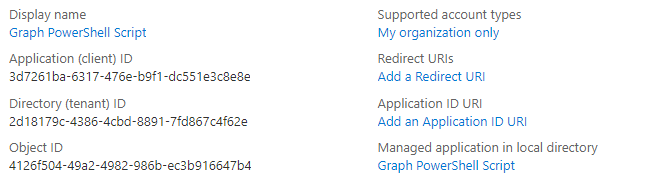
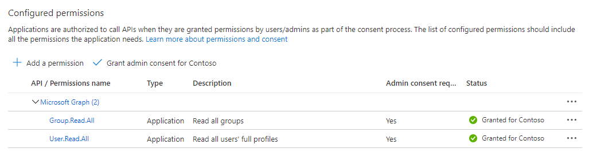

# Use app-only authentication with the Microsoft Graph PowerShell SDK

The PowerShell SDK supports two types of authentication: [delegated access](..\auth-v2-user.md), and [app-only access](..\auth-v2-service.md). This guide will focus on the configuration needed to enable app-only access.

> [!IMPORTANT]
> App-only access grants permissions directly to an application, and requires an administrator to consent to the required permission scopes. For more information on app-only access, see [Microsoft identity platform and the OAuth 2.0 client credentials flow](/azure/active-directory/develop/v2-oauth2-client-creds-grant-flow).

Let's walk through configuring app-only access for a simple script to list users and groups in your Microsoft 365 tenant.

## Configuration

Before you can use app-only access with the SDK, you need the following.

- A certificate to use as a credential for the application. This can be a self-signed certificate or a certificate from an authority. Refer to the [See also](#see-also) section for guidance on how to create a self-signed certificate.
- [Register an application](/azure/active-directory/develop/app-objects-and-service-principals) in Azure AD, configure it with the permission scopes your scenario requires, and share the public key for your certificate.

### Certificate

You will need an X.509 certificate installed in your user's trusted store on the machine where you will run the script. You'll also need the certificate's public key exported in .cer, .pem, or .crt format. You'll need the value of the certificate subject or its thumbprint.

### Register the application

You can register the application either in the [Azure Active Directory portal](https://aad.portal.azure.com), or using PowerShell.

<!-- markdownlint-disable MD025 -->
# [Portal](#tab/azure-portal)

1. Open a browser and navigate to the [Azure Active Directory admin center](https://aad.portal.azure.com) and login using a Microsoft 365 tenant organization admin.

1. Select **Azure Active Directory** in the left-hand navigation, then select **App registrations** under **Manage**.

    

1. Select **New registration**. On the **Register an application** page, set the values as follows.

    - Set **Name** to `Graph PowerShell Script`.
    - Set **Supported account types** to **Accounts in this organizational directory only**.
    - Leave **Redirect URI** blank.

    

1. Select **Register**. On the **Graph PowerShell Script** page, copy the values of the **Application (client) ID** and **Directory (tenant) ID** and save them.

    

1. Select **API Permissions** under **Manage**. Choose **Add a permission**.

1. Select **Microsoft Graph**, then **Application Permissions**. Add **User.Read.All** and **Group.Read.All**, then select **Add permissions**.

1. In the **Configured permissions**, remove the delegated **User.Read** permission under **Microsoft Graph** by selecting the **...** to the right of the permission and selecting **Remove permission**. Select **Yes, remove** to confirm.

1. Select the **Grant admin consent for...** button, then select **Yes** to grant admin consent for the configured application permissions. The **Status** column in the **Configured permissions** table changes to **Granted for ...**.

    

1. Select **Certificates & secrets** under **Manage**. Select the **Upload certificate** button. Browse to your certificate's public key file and select **Add**.

# [PowerShell](#tab/powershell)
<!-- markdownlint-enable MD025 -->

> [!NOTE]
> You must have the Microsoft Graph PowerShell SDK [installed](installation.md) before following these steps.

You may be wondering: "I can use the PowerShell SDK to register an app, so that I can use the PowerShell SDK?" Yes! In this case, you're using the PowerShell SDK with delegated access, logging in as an administrator, and creating the app registration. Then, using that app registration, you're able to use the PowerShell SDK with app-only access, allowing for unattended scripts.

1. Use a text editor to create a new file named **RegisterAppOnly.ps1**. Paste the following code into the file.

    :::code language="powershell" source="RegisterAppOnly.ps1":::

1. Save the file. Open PowerShell in the directory that contains **RegisterAppOnly.ps1** and run the following command.

    ```powershell
    .\RegisterAppOnly.ps1 -AppName "Graph PowerShell Script" -CertPath "PATH_TO_PUBLIC_KEY_FILE"
    ```

1. Open your browser as prompted. Sign in with an administrator account and accept the permissions.

1. Review the output for the prompt `Please go to the following URL in your browser to provide admin consent`. Copy the URL provided and paste it in your browser. Sign in with an administrator account to grant admin consent to your newly registered application.

    > [!NOTE]
    > After granting admin consent, the browser will redirect back to `http://localhost` and display a **Not Found** error. This error can be ignored as long as the URL contains `admin_consent=True`.

1. Review the rest of the PowerShell output for `Connect-MgGraph` command pre-filled with the values for your app registration.

    > [!TIP]
    > If the script returns an error stating `New-MgServicePrincipal : Unable to find target address`, re-run the script with the additional `-TenantId` parameter. For details, see [How to find your Azure Active Directory tenant ID](/azure/active-directory/fundamentals/active-directory-how-to-find-tenant).

---

## Authenticate

You should have three pieces of information after completing the configuration steps above.

- Certificate subject or thumbprint of the certificate uploaded to your Azure AD app registration.
- Application ID for your app registration.
- Your tenant ID.

Let's use those to test authentication. Open PowerShell and run the following command, replacing the placeholders with your information.

```powershell
Connect-MgGraph -ClientID YOUR_APP_ID -TenantId YOUR_TENANT_ID -CertificateName YOUR_CERT_SUBJECT ## Or -CertificateThumbprint instead of -CertificateName
```

If this succeeds, you will see `Welcome To Microsoft Graph!`. Run `Get-MgContext` to verify that you've authenticated with app-only. The output should look like the following.

```powershell
ClientId              : YOUR_APP_ID
TenantId              : YOUR_TENANT_ID
CertificateThumbprint :
Scopes                : {Group.Read.All, User.Read.All}
AuthType              : AppOnly
CertificateName       : YOUR_CERT_SUBJECT
Account               :
AppName               : Graph PowerShell Script
ContextScope          : Process
```

## Create the script

Create a new file named **GraphAppOnly.ps1** and add the following code.

```powershell
# Authenticate
Connect-MgGraph -ClientID YOUR_APP_ID -TenantId YOUR_TENANT_ID -CertificateName YOUR_CERT_SUBJECT

Write-Host "USERS:"
Write-Host "======================================================"
# List first 50 users
Get-MgUser -Property "id,displayName" -PageSize 50 | Format-Table DisplayName, Id

Write-Host "GROUPS:"
Write-Host "======================================================"
# List first 50 groups
Get-MgGroup -Property "id,displayName" -PageSize 50 | Format-Table DisplayName, Id

# Disconnect
Disconnect-MgGraph
```

Replace the placeholders in the `Connect-MgGraph` command with your information. Save the file, then open PowerShell in the directory where you created the file. Run the script with the following command.

```powershell
.\GraphAppOnly.ps1
```

The script outputs a list of users and groups similar to the output below (truncated for brevity).

```powershell
Welcome To Microsoft Graph!
USERS:
======================================================

DisplayName              Id
-----------              --
Conf Room Adams          88d1ba68-8ff5-4de2-90ed-768c00abcfae
Adele Vance              3103c7b9-cfe6-4cd3-a696-f88909b9a609
MOD Administrator        da3a885e-2d97-41de-9347-5271ef321b58
...

GROUPS:
======================================================

DisplayName                         Id
-----------                         --
App Development                     06dce3e5-d310-4add-ab2c-be728fb9076e
All Employees                       1a1cd42d-9801-4e9d-9b77-5215886174ef
Mark 8 Project Team                 2bf1b0d0-81f6-4e80-b971-d1db69f8d651
...
```


## See also

+ [How to: Create a self-signed public certificate to authenticate your application](/azure/active-directory/develop/howto-create-self-signed-certificate)
