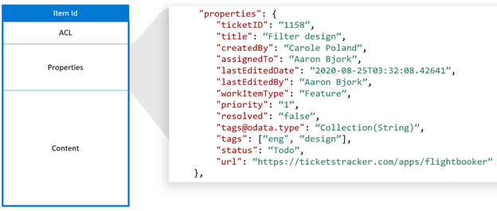

# Create, update, and delete items added by your application in the Microsoft Graph Connection

Items added by your application to the Microsoft Search service are represented by the [externalItem](/graph/api/resources/externalitem?view=graph-rest-beta) resource in Microsoft Graph.

[!INCLUDE [search-api-preview-signup](../includes/search-api-preview-signup.md)]

Once you have created a connection, you can add your content. Each item from your data source must be represented as an [externalItem](/graph/api/resources/externalitem?view=graph-rest-beta) in Microsoft Graph with a unique item id. This id is used to create, update or delete the item from Microsoft Graph. You can use the primary key from your data source as the itemId or derive it from one or more fields. An [externalItem](/graph/api/resources/externalitem?view=graph-rest-beta) has three key components: access control list, properties, and content.

## Access control list
The access control list is used to specify whether the given roles are granted or denied access to view items in Microsoft experiences. It is an array of access control entries, each representing an Azure Active Directory `User` or `Group`. There is a third access control entry *type* `Everyone` that represents all the users in the tenant.


The *accessType* `deny` takes precedence over `grant`. For example, in the item shown above, while `Everyone` is granted access and a specific `User` is denied access, the effective permission for this `User` is `deny`.

If your data source has non Azure Active Directory groups, such as teams within your helpdesk system, used to set permissions for the item, you can create external groups in Microsoft Graph using the ExternalGroup sync APIs to replicate the `allow` or `deny` permissions. Avoid expanding the membership of your external groups directly into the access control lists of individual items since each group membership update could lead to a storm of item updates. 

External groups can consist of another external group, Azure Active Directory users, and Azure Active Directory groups. If you have non Azure Active Directory users, you must translate them to Azure Active Directory users in your access control list. 

## Properties
The Properties component is used to add item metadata that is useful in Microsoft Graph experiences. You must [register the schema](/graph/concepts/search-index-manage-schema.md) for the connection before adding items into it and convert datatypes into [supported datatypes](https://docs.microsoft.com/en-us/graph/api/resources/property?view=graph-rest-beta). 



## Content
The content component is used to add the bulk of the item that needs to be full text indexed. Examples include ticket description, parsed text from a file body, or a wiki page body. 

Content is one of the key fields influencing [relevance](/graph/concepts/search-index-manage-schema.md) across Microsoft experiences. We support content of the *type* `text` and `HTML`. If your data source has binary files, you can parse them to text before adding them to the Microsoft Graph. 

Content cannot be directly added into a search result template, but you can use a generated result snippet which is a dynamically generated preview of the relevant sections within content.


*Result snippet generated from content*

When content in your data source changes, you must sync it with your connection items. You can either update the entire item or update one or more of its components- access control list, properties, and content. Once your content has been added to Microsoft Graph, you can search for it through Microsoft Search experience after setting up [verticals and result types](https://docs.microsoft.com/en-us/MicrosoftSearch/customize-search-page) or using the [Microsoft Graph Search API](https://docs.microsoft.com/en-us/graph/api/resources/search-api-overview?view=graph-rest-beta).


## Add an item

You can add an item to the index by [creating an externalItem](/graph/api/externalconnection-put-items?view=graph-rest-beta). When you create an item, you assign a unique identifier in the URL.

For example, your application may index helpdesk tickets using the ticket number. If a ticket has the ticket number `SR00145`, the request may look like the following.

```http
PUT /external/connections/contosohelpdesk/items/SR00145
Content-Type: application/json

{
  "title": "WiFi outage in Conference Room A",
  "status": "New",
  "assignee": "meganb@contoso.com"
}
```

> ![NOTE]
> Before indexed items can be found in the Microsoft Search UI, an administrator must [customize the search results page](/MicrosoftSearch/configure-connector#next-steps-customize-the-search-results-page) for the corresponding connection.

## Update an item

When an item is updated in the external service (helpdesk ticket is reassigned, or a product description is updated), you can update its entry in the index by [updating the externalItem](/graph/api/externalitem-update?view=graph-rest-beta), using the unique identifier assigned to the item when you created it.

```http
PATCH /external/connections/contosohelpdesk/items/SR00145
Content-Type: application/json

{
  "assignee": "alexw@contoso.com"
}
```

## Delete an item

You can remove items from the index by [deleting the externalItem](/graph/api/externalitem-delete?view=graph-rest-beta), using the unique identifier assigned to the item when you created it.

```http
DELETE /external/connections/contosohelpdesk/items/SR00145
```

## Next steps

- [Query using the Microsoft Search API](search-concept-overview.md#why-use-the-microsoft-search-api)
- [Review the Indexing API reference](/graph/api/resources/indexing-api-overview?view=graph-rest-beta)
- [Customize Microsoft Search results page](/MicrosoftSearch/configure-connector#next-steps-customize-the-search-results-page)
- [Search custom types (externalItem)](search-concept-custom-types.md)
- Download the [sample search connector](https://github.com/microsoftgraph/msgraph-search-connector-sample) from GitHub
