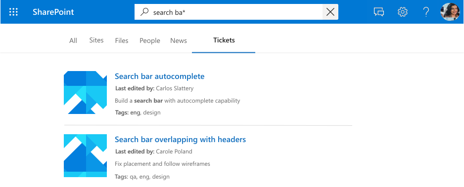
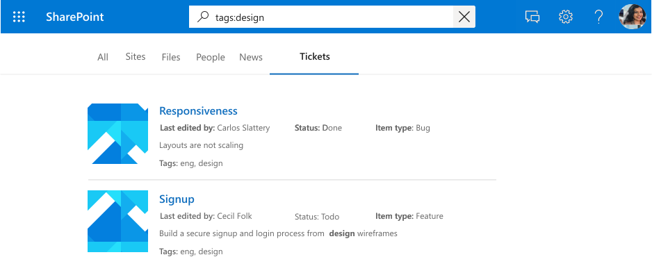

# Register schema for a Microsoft Graph Connection
The connection [schema](/graph/api/resources/schema?view=graph-rest-beta) determines how your content will be used in various Microsoft Graph experiences. Schema is a flat list of all the properties that you plan to add to the connection along with their attributes, labels, and aliases. You must register the schema before adding items into the connection.

[!INCLUDE [search-api-preview-signup](../includes/search-api-preview-signup.md)]

| Property       	| Type             	| Searchable 	| Queryable 	| Retrievable 	| Refinable 	| Labels               	| Aliases    	|
|----------------	|------------------	|------------	|-----------	|-------------	|-----------	|----------------------	|------------	|
| ticketId       	| String           	|            	|           	|             	|           	|                      	| ID         	|
| title          	| String           	| ✓          	| ✓         	| ✓           	|           	| title                	|            	|
| createdBy      	| String           	| ✓          	| ✓         	|             	|           	| createdBy            	| creator    	|
| assignedTo     	| String           	| ✓          	| ✓         	|             	|           	|                      	|            	|
| lastEditedDate 	| DateTime         	|            	| ✓         	| ✓           	| ✓         	| lastModifiedDateTime 	| editedDate 	|
| lastEditedBy   	| String           	| ✓          	| ✓         	| ✓           	|           	| lastModifiedBy       	| edited     	|
| workItemType   	| String           	|            	| ✓         	| ✓           	|           	|                      	| ticketType 	|
| priority       	| Int64            	| ✓          	|           	|             	|           	|                      	|            	|
| tags           	| StringCollection 	|            	| ✓         	| ✓           	| ✓         	|                      	|            	|
| status         	| String           	|            	| ✓         	| ✓           	|           	|                      	|            	|
| url            	| String           	|            	|           	|             	|           	| url                  	|            	|
| resolved       	| Boolean          	|            	| ✓         	| ✓           	|           	|                      	|            	|

## Property attributes
### Searchable
If a property is searchable, its value is added to the full text index. When a user performs a search, we return results if there is a search hit in one of the searchable fields or its [content]((search-index-manage-item.md#content)).

*A search for “design” displaying results for hits against properties (`title`, `tags`) and content*

### Queryable
If a property is queryable, you can query against it using knowledge query language (KQL). KQL consists of 1 or more free text keywords (words or phrases) or property restrictions. The property name must be included in the query, either specified in the query itself or included in the query programmatically. You can use prefix matching with the wildcard operator(*). Note: suffix matching is not supported.

*A search for “search ba`*`” displaying results that match this prefix*

*A search for “tags:design” scoping down results to items with "design" in the tags property*

### Retrievable
If a property is retrievable, its value can be returned in search results. Any property that you want to add in the display template or be returned from the query and be relevant in search results must be retrievable. Marking large properties, such as `editHistory`, or too many properties as retrievable will increase search latency. Be selective and choose relevant properties. 

*A set of retrievable properties (`title`, `lastEditedBy` etc.) rendered as a result*

### Refinable
If a property is refinable, an admin can configure it as a custom filter in the Microsoft Search results page.

*Refine results by `tags`, a refinable property*

## Labels 
A label is a well known tag published by Microsoft that you can add against a property in your schema. Adding a label helps various Microsoft products understand the property and provide a better experience. 

| Label                	| Description                                                                         	|
|----------------------	|-------------------------------------------------------------------------------------	|
| title                	| The title of the item that you want shown in search & other experiences             	|
| url                  	| The target URL of the item in the data source                                       	|
| createdBy            	| Name of the person who created the item in the data source                          	|
| lastModifiedBy       	| Name of the person who most recently edited the item in the data source             	|
| authors              	| Name of all the people who participated/collaborated on the item in the data source 	|
| createdDateTime      	| Date & time that the item was created in the data source                            	|
| lastModifiedDateTime 	| Date & time the item was last modified in the data source                           	|
| fileName             	| In case of a file, the name of the file in the data source                          	|
| fileExtension        	| In case of a file, the extension of the file in the data source                     	|

For example, the connection property *lastEditedBy* has the same meaning as the Microsoft label *lastModifiedBy*. 

Add as many labels as you can, but ensure that they are accurately mapped to properties. Do not add a label aganinst a property if it doesn't make sense. Incorrect mappings will deteriorate the experience. Note: all the properties that you map to labels must be retrievable.

### Relevance
By applying as many accurately mapped labels as possible, you can also improve the discovery of your content through search. We highly recommend defining as many of the below labels as possible, listed by potential impact on discovery in descending order:
- 	title
- lastModifiedDateTime
- 	lastModifiedBy
- 	url
- 	filename
- 	fileExtension

For discovery, i.e. search scenarios, please note:
-  Ensure that your mappings are accurate.
- When you use a property as label that contains large content, you might increase search latency and have to wait longer for search to return results. See [Retrievable](#Retrievable).
- Especially in the scenario where you configure a custom vertical that allows search over more than one connection, the search outcomes greatly benefit from appointing as many labels as possible.

### Default Result Types
Labels also affect how default result types are generated. Adding the *title* label and content at a minimum will ensure that a result type is created for your connection.

*A default result type with `title` and a result snippet*

Your default result type will provide a better experience when you define these labels, when applicable, listed by ascending order:
1.	title
2.	url
3.	lastModifiedBy
4.	lastModifiedDateTime
5.	fileName
6.	fileExtension

Finally, when assigning labels, please ensure the following:
1.	The properties that you select to function as labels need to be marked retrievable. See  [Retrievable](#Retrievable). 
2.	The properties and their assigned labels must have the same datatype.
3.	You can map exactly one label to exactly one property. 

## Aliases 
Aliases are friendly names for properties that you assign. These will be used in queries and selections in refinable property filters.

## Next steps
- [Add items to the connection](/graph/concepts/search-index-manage-items.md)
- [Review the Graph Connectors API reference](/graph/api/resources/indexing-api-overview?view=graph-rest-beta)
- [Customize Microsoft Search results page](/MicrosoftSearch/configure-connector#next-steps-customize-the-search-results-page)
- [Search custom types (externalItem)](search-concept-custom-types.md)
- Download the [sample search connector](https://github.com/microsoftgraph/msgraph-search-connector-sample) from GitHub
