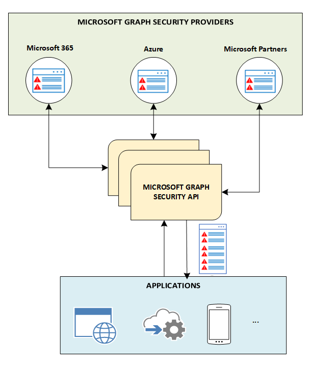

# Microsoft Graph Security API overview

You can use the Microsoft Graph Security API to connect Microsoft security products, services, and partners to streamline security operations and improve threat protection, detection, and response capabilities. The Microsoft Graph Security API is an intermediary service (or broker) that provides a single programmatic interface to connect multiple [Microsoft Graph Security providers](/graph/api/resources/securityvendorinformation?view=graph-rest-1.0) (also called security providers or providers). Requests to the Microsoft Graph Security API are federated to all applicable security providers. The results are aggregated and returned to the requesting application in a common schema, as shown in the following diagram. For details, see [Microsoft Graph Security API data flow](security-dataflow.md).

For information about authorization, see [Authorization and the Microsoft Graph Security API](security-authorization.md). For information about permissions, including delegated and application permissions, see [Permissions](permissions-reference.md#security-permissions).

> [!VIDEO https://www.youtube-nocookie.com/embed/oYXPGwH9Ho0]

## Why use the Microsoft Graph Security API?

The [Microsoft Graph Security API](/graph/api/resources/security-api-overview?view=graph-rest-1.0) makes it easy to connect with security solutions from Microsoft and partners. It allows you to more readily realize and enrich the value of these solutions. You can connect easily with the Microsoft Graph Security API by using one of the following approaches, depending on your requirements:

- [Write code](https://aka.ms/graphsecuritysdk) – Find [code samples](https://aka.ms/graphsecurityapicode) in C#, Java, NodeJS, and more.
- [Connect using scripts](https://aka.ms/graphsecuritypowershellsampleblog) – Find [PowerShell samples](https://aka.ms/graphsecuritypowershellsample).
- [Drag and drop into workflows and playbooks](https://aka.ms/graphsecurityconnectorsblogpost) – Use [Microsoft Graph Security connectors](/azure/connectors/connectors-integrate-security-operations-create-api-microsoft-graph-security) for [Azure Logic Apps](/azure/logic-apps/logic-apps-overview), [Microsoft Flow](https://flow.microsoft.com/), and [PowerApps](https://powerapps.microsoft.com/).
- [Get data into reports and dashboards](https://aka.ms/graphsecuritypowerbiconnectorblogpost) – Use the [Microsoft Graph Security connector for Power BI](/power-bi/connect-data/desktop-connect-graph-security).
- [Connect using Jupyter notebooks](https://jupyter.org/) – Find [Jupyter notebook samples](https://aka.ms/graphsecurityjupyternotebooks).  

### Unify and standardize alert tracking

Connect once to integrate alerts from any Microsoft Graph-integrated security solution and keep alert status and assignments in sync across all solutions. You can also stream alerts to security information and event management (SIEM) solutions, such as Splunk using Microsoft Graph Security API connectors. For more info about solution integrations with the security API entities, see [Security solution integrations using the Microsoft Graph Security API](security-integration.md).

### Correlate security alerts to improve threat protection and response

Correlate alerts across security solutions more easily with a unified alert schema. This not only allows you to receive actionable alert information but allows security analysts to pivot and enrich alerts with asset and user information, enabling faster response to threats and asset protection.  

### Update alert tags, status, and assignments

Tag alerts with additional context or threat intelligence to inform response and remediation. Ensure that comments and feedback on alerts are captured for visibility to all workflows. Keep alert status and assignments in sync so that all integrated solutions reflect the current state. Use webhook subscriptions to get notified of changes.  

### Unlock security context to drive investigation

Dive deep into related security-relevant inventory (like users, hosts, and apps), then add organizational context from other Microsoft Graph providers (Azure AD, Microsoft Intune, Microsoft 365) to bring business and security contexts together and improve threat response.

### Automate security workflows and reporting

Automate security management, monitoring, and investigations to improve operational efficiencies-and response times. Get deeper insights and context by integrating Microsoft Graph Security into your reports and dashboards.

### Get deep insights to train security solutions

Visualize your data across different security products running in your organization to get deeper security insights. Discover opportunities to learn from the data and train your security solutions. The schema provides multiple properties to pivot on to build rich exploratory datasets using your security data.

### Utilize your threat intelligence in Microsoft security solutions (preview)

Automatically send your threat indicators to Microsoft security solutions to enable `alert`, `block`, or `allow` actions. Use the Microsoft Graph Security API directly or take advantage of integrations with leading threat intelligence platforms.

### Act quickly in response to new threats (preview)

Enable swift action to defend against new threats, such as actions to block files, URLs, domains, or IP addresses from within your security tools and workflows.

### Proactively manage security risks (preview)

Use the Microsoft Secure Score (preview) to provide visibility into your organization’s security needs and get suggestions for how to improve it, and project an improved score after those suggestions are incorporated. Easily measure your progress over time and get insights on specific changes that led to improvement in your score.

## Benefits of using the Microsoft Graph Security API

The following table lists the benefits that different security solutions can access by integrating with the Microsoft Graph Security API.  

|**Area**     | **Benefits**|
|:---------------|:---------|
|**Managed Security Service Providers (MSSPs)**|<ul><li>Streamlined integration with security operations tools, workflows, and reporting.</li> <li>Reduced deployment and maintenance time and efforts.</li> <li>Automated response to alerts by taking action on threats.</li> <li>Ability to deliver more value to MSSP customers.</li></ul>|
|**SIEM and IT Risk management solutions**|<ul><li>Smooth integration with Microsoft security solutions and ecosystem partners.</li> <li>Rich alert metadata.</li> <li>Better alert correlation.</li></ul>|
|**Applications**  (Threat intelligence, mobile, cloud, IOT, fraud detection, identity & access, risk & compliance, firewall, and so on)|<ul><li>Unified threat management, prevention, and risk management across various security solutions.</li> <li>Alerts, actions, and customer threat intelligence exposed through Microsoft Graph.</li> <li>Instant integration with Microsoft Graph-enabled solutions.</li> <li>Gain deep security insights to train other security solutions.</li> </ul>|

## API reference
Looking for the API reference for this service?

- [Security API in Microsoft Graph v1.0](/graph/api/resources/security-api-overview?view=graph-rest-1.0)
- [Security API in Microsoft Graph beta](/graph/api/resources/security-api-overview?view=graph-rest-beta)

## Next steps

- [Use the Microsoft Graph Security API](/graph/api/resources/security-api-overview?view=graph-rest-1.0)
- Explore [Microsoft Graph Security API samples](https://aka.ms/graphsecurityapicode)
- Interested in becoming a security provider? Reach out to [graphsecfeedback](mailto:graphsecfeedback@microsoft.com).
