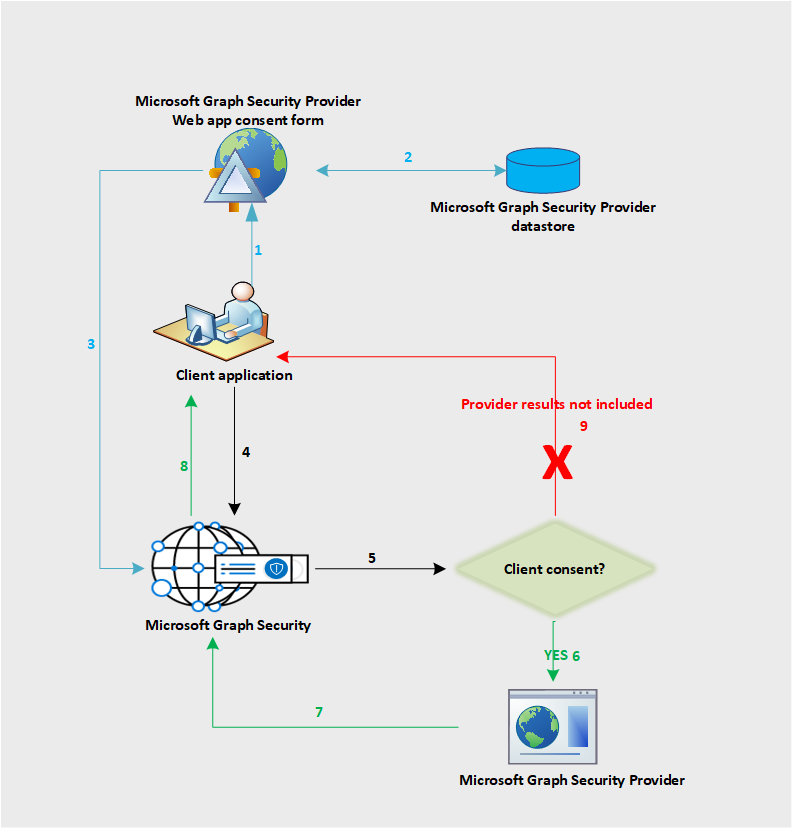

# Microsoft Graph Security API data flow

The Microsoft Graph Security API federates requests to all providers in the Microsoft Graph Security ecosystem. This is based on the security provider consent provided by the application, as shown in the following diagram. The consent workflow only applies to non-Microsoft providers.

The following is a description of the flow:

1. The application user signs in to the provider application to view the consent form from the provider. This consent form experience or UI is owned by the provider and applies to non-Microsoft providers only to get explicit consent from their customers to send requests to Microsoft Graph Security API.
2. The client consent is stored on the provider side.
3. The provider consent service calls the Microsoft Graph Security API to inform consent approval for the respective customer.
4. The application sends a request to the Microsoft Graph Security API.
5. The Microsoft Graph Security API checks for the consent information for this customer mapped to various providers.
6. The Microsoft Graph Security API calls all those providers the customer has given explicit consent to via the provider consent experience.
7. The response is returned from all the consented providers for that client.
8. The result set response is returned to the application.
9. If the customer has not consented to any provider, no results from those providers are included in the response.
