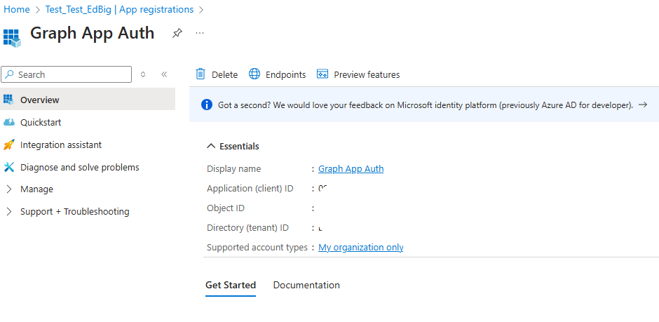
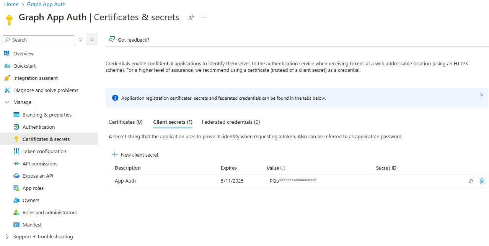
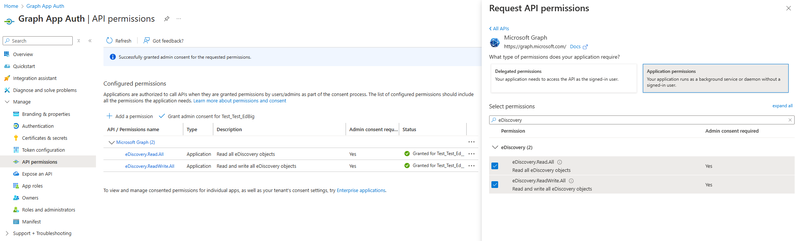
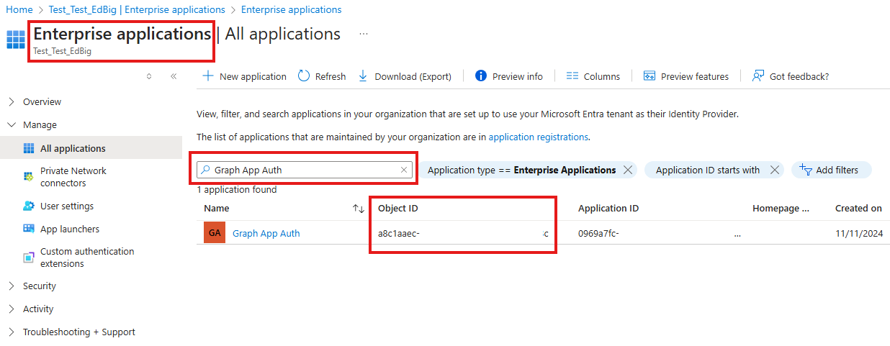
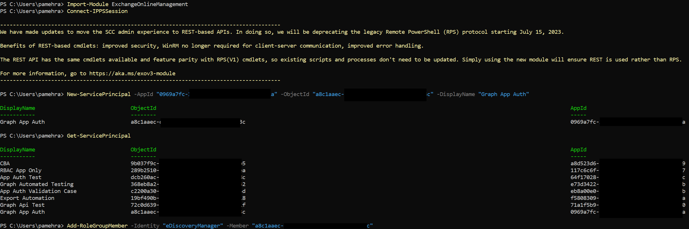

# Set up app-only access for Microsoft Purview eDiscovery 

The Microsoft Purview APIs for eDiscovery in Microsoft Graph enable organizations to automate repetitive tasks and integrate with their existing eDiscovery tools to build repeatable workflows that industry regulations might require.

To better ensure secure and efficient access to resources, you can implement app-only access by using the Microsoft Graph API. This article walks you through how to set up app-only access for Microsoft Purview eDiscovery to help ensure that your applications are compliant and secure.

## Why app-only access?

### Enhancing security and compliance

App-only access enhances the security landscape of Microsoft Purview eDiscovery by implementing robust authentication protocols that standard user credentials can't match. By using application (client) IDs and certificates for authentication, you minimize the risk of credential theft, which is a common vulnerability in standard authentication methods. This approach not only helps to secure the application against unauthorized access, but also better ensures that the data integrity is maintained during the eDiscovery process.

### Streamlining access and integration

App-only access streamlines the integration of eDiscovery services with other applications and systems. It facilitates automated, script-based interactions that are crucial for large-scale legal investigations and compliance audits. By allowing secure, token-based access to eDiscovery resources, organizations can automate workflows, reduce manual errors, and ensure consistent enforcement of compliance policies across all digital environments.

## Implement app-only access

Implementing app-only access involves registering the app in Azure portal, creating client secret/certificates, assigning API permissions, setting up a service principal, and then using app-only access to call Microsoft Graph APIs. The following steps explain how to implement app-only access.

### Step 1: Register a new application in Azure

1. Go to the Azure portal and sign in with your Microsoft account.

2. On the left pane of the Azure portal, select **Microsoft Entra ID**.

3. On the left pane, expand **App registrations**, and select **New registration**.

4. Provide a meaningful name for your application and select **Register** to create your new app registration. This process generates essential details such as the Application (client) ID and Directory (tenant) ID, which are important for the next steps.

You can now see the newly created app registration and the details.



### Step 2: Create client secrets or certificates

Now that your app is registered, on the left pane in the Azure portal, expand **Manage**, and then select **Certificates & secrets**. Here, you can create a client secret or upload a certificate, depending on your authentication needs:

For a client secret, select **New client secret**, add a description, and select **Add** to save it. Make sure to copy and securely store the secret value for authentication later. Otherwise, you might have to create a new secret.

You can optionally upload a certificate to use along with the application ID for automation purposes.



### Step 3: Assign API permissions

You need to set the correct API permissions for your application. Expand **Manage** and select **API permissions**, then add `eDiscovery.Read.All` and `eDiscovery.ReadWrite.All`. These permissions enable your app to read and write eDiscovery data, respectively. The tenant admin must consent to these application permissions to enable them for use.



### Step 4: Set up a service principal

1. Permission assignments for your app come in two parts - Microsoft Graph-level permissions, which you have already granted, and Purview-level case and role permissions. To do this, you need the object ID of your application. This value is different from the **appId** (named **client ID** in the Microsoft Entra admin center). To retrieve the app object ID, open the Azure portal > in the **Microsoft Entra ID** section > select **Enterprise applications** > search for your application by name and get the **Object ID** associated with your application from the list.



2. Open a new PowerShell session. Install and import the [ExchangeOnlineManagement](https://www.powershellgallery.com/packages/ExchangeOnlineManagement) module using the following cmdlets. The `Install-Module` cmdlet recommends upgrading the package if the module is already installed.

    ```powershell
    Install-Module ExchangeOnlineManagement
    Import-Module ExchangeOnlineManagement
    Connect-IPPSSession
    ```

3. Use the [New-ServicePrincipal](/powershell/module/exchange/new-serviceprincipal) cmdlet to create a service principal with your app's details and verify it by using [Get-ServicePrincipal](/powershell/module/exchange/get-serviceprincipal) cmdlet.  
  
    Run the following cmdlets, replacing the **AppId**, **ObjectId**, and **DisplayName** arguments in the first cmdlet.

    ```powershell
    New-ServicePrincipal -AppId "0969a7fc-3e17-424f-92a4-54e583b2142a" -ObjectId "a8c1aaec-d18a-47fa-aec5-8651d755223c" -DisplayName "Graph App Auth"
    Get-ServicePrincipal
    ```

4. Add the Service Principal Object ID to the eDiscoveryManager role by using the [Add-RoleGroupMember](/powershell/module/exchange/add-rolegroupmember) cmdlet and verify by using the [Get-RoleGroupMember](/powershell/module/exchange/get-rolegroupmember) cmdlet.

    Run the following cmdlets, replacing the **Member** argument in the first cmdlet.

    ```powershell
    Add-RoleGroupMember -Identity "eDiscoveryManager" -Member "a8c1aaec-d18a-47fa-aec5-8651d755223c"
    Get-RoleGroupMember -Identity "eDiscoveryManager"
    ```

5. Add the Service Principal Object ID to the eDiscoveryAdministrator role by using the [Add-eDiscoveryCaseAdmin](/powershell/module/exchange/add-ediscoverycaseadmin) cmdlet and verify by using the [Get-eDiscoveryCaseAdmin](/powershell/module/exchange/get-ediscoverycaseadmin) cmdlet.

    Run the following cmdlets, replacing the **User** argument in the first cmdlet.

    ```powershell
    Add-eDiscoveryCaseAdmin -User "a8c1aaec-d18a-47fa-aec5-8651d755223c"
    Get-eDiscoveryCaseAdmin
    ```



### Step 5: Connect to Microsoft Graph API using app-only access

Use the [Connect-MgGraph](/powershell/module/microsoft.graph.authentication/connect-mggraph) cmdlet to authenticate and connect to Microsoft Graph using the app-only access method in PowerShell. This setup enables your app to interact with Microsoft Graph securely.

### Step 6: Invoke Microsoft Graph API requests

After you're connected, you can start making calls to the Microsoft Graph API by using the [Invoke-MgGraphRequest](/powershell/module/microsoft.graph.authentication/invoke-mggraphrequest) cmdlet. This cmdlet allows you to perform various operations required by eDiscovery services in your organization.

## Related content

Explore [Microsoft Graph tutorials](/graph/tutorials) to create basic applications that access data in app-only scenarios. For more information about app-only authentication, see [Get access without a user](/graph/auth-v2-service)

To test APIs on Postman, see [Use Postman with the Microsoft Graph API](/graph/use-postman).
