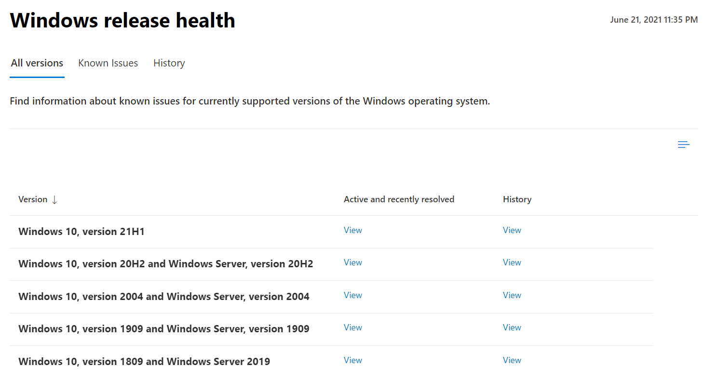
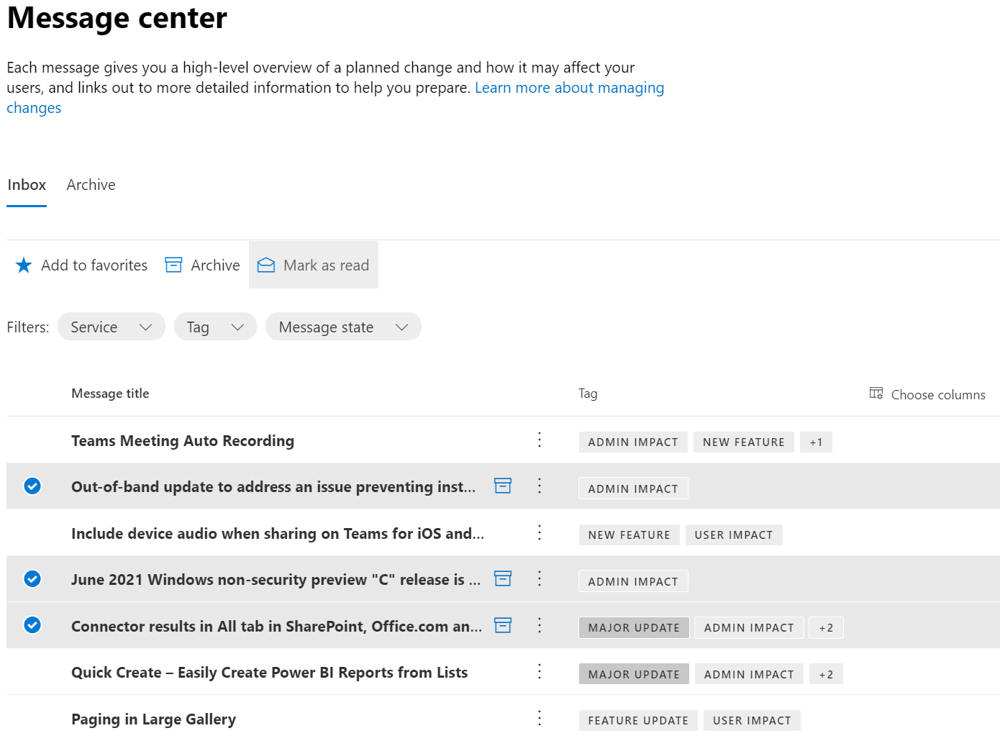

# Overview for accessing service health and communications in Microsoft Graph
You can use the service communications API in Microsoft Graph to access the health status and message center posts about Microsoft cloud services. The actual health status and posts correspond to the Microsoft 365 and Dynamics 365 services that are supported by the API and subscribed by the tenant.

## Why integrate with service health and communications data?

### Get service health and message center posts for a tenant
Customers can get current or historical health data of supported Microsoft services. When experiencing problems with a Microsoft service, they can check its health status to verify if an issue has been identified with a resolution in progress, before calling for support or spending time troubleshooting. 

Customers can regularly review message center posts to keep track of upcoming new features and updates, and other important announcements. They can then anticipate how these changes may affect users and plan accordingly.

### Integrate service communications data into custom workflows
App developers can integrate active service health issues directly into custom applications, allowing administrators to triage and share status information with impacted audiences.

Apps can enable custom workflows for administrators to review, assign, and triage change communications from the message center.

### Build customer-facing dashboards

Create applications with customer-facing dashboards to show the health of Microsoft services, and let customers keep track of upcoming changes and other important announcements about the services.

## Dashboards examples in Microsoft 365 admin center
This section shows examples in the [Microsoft 365 admin center](https://admin.microsoft.com/Adminportal/Home?source=applauncher#/homepage) that uses the service communications API to build respective health dashboards. Sign in to the admin center with an admin account, then click **Health** to see the following dashboards:
- [Service health](#service-health-dashboard)
- [Windows release health](#windows-release-health-dashboard)
- [Message center](#message-center-dashboard)

### Service health dashboard

From the **Service health** dashboad, you can view the health of your subscribed Microsoft services, which can include Office on the web, Yammer, Microsoft Dynamics CRM, and mobile device management cloud services. See examples as demarcated in figure 1.

**Figure 1. Service health dashboard in Microsoft 365 admin center**

### Windows release health dashboard

From the **Windows release health** dashboad, you can view essential information about monthly quality and feature updates, and the latest features and enhancements for Windows. See an example as demarcated in figure 2.

**Figure 2. Windows release health dashboard in Microsoft 365 admin center**

### Message center dashboard
From the **Message center** dashboad, you can view upcoming changes, including new and changed features, planned maintenance, and other important announcements. See examples as demarcated in figure 3.

**Figure 3. Message center dashboard in Microsoft 365 admin center**

## Next steps

- Try service communications sample queries in [Graph Explorer](https://developer.microsoft.com/graph/graph-explorer/?request=admin%2FserviceAnnouncement%2FhealthOverviews&version=v1.0).

- Learn more about the [service communications API in v1.0](/graph/api/resources/service-communications-api-overview?view=graph-rest-1.0&preserve-view=true).

- Learn more about the [service communications API in beta](/graph/api/resources/service-communications-api-overview?view=graph-rest-beta&preserve-view=true).

