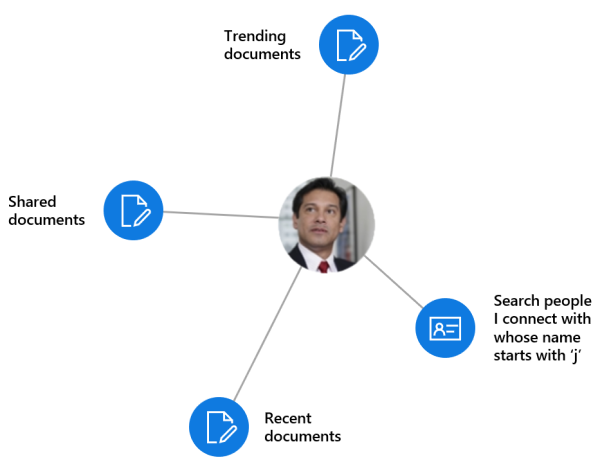

# Overview of people and workplace intelligence in Microsoft Graph

The hundreds of millions of users of Microsoft 365 cloud services form part of the core of Microsoft Graph. The users' data is carefully managed, protected, and with proper authorization, made available by Microsoft Graph services to drive productivity and creativity in businesses. 

The profile API lets you, as app developers, model and represent people in Microsoft 365 services, and the profile card API lets administrators control the information showing on users' profile cards in the organization.

As ubiquitous the user's data is in Microsoft Graph, data derived from the user's social interactions is particularly interesting. It provides intelligent insights that can answer questions such as the following:

- "Search for People who’s name starts with ‘J’"
- "Which documents are most interesting to this person?"

You can use the people API and insights API in Microsoft Graph to build smarter apps that can, respectively, access the relevant people and documents for a user.

The people API returns people ordered by relevance to a user, based on that user's contacts, social networks, organization directory, and recent communications on email. This is particularly useful for people-picking scenarios.

The insights API uses advanced analytics and machine learning to provide the most relevant files users need throughout their work day. The API powers familiar Microsoft 365 experiences, including Office Delve, SharePoint Home, the Discover view in OneDrive for Business, and Outlook on the web.



## Why integrate with people data?

The people API returns data of a single entity, [person](/graph/api/resources/person), which includes typical data of an individual in today's business world. What makes this **person** data especially useful is its _relevance_ with respect to a Microsoft Graph user. Relevance is noted in a relevance score of each person, calculated based on the user's communication and collaboration patterns and business relationships. There are 3 main types of application of this _relevance_ data.

### Browse people by relevance

You can browse people who are related to the signed-in user or to some other user in the signed-in user's organization, provided you have got the appropriate [authorization](people-example.md#authorization). You get a collection of **person** objects that are ordered by relevance. You can further [customize](people-example.md#browse-people) the collection of **person** objects that is returned in the response by specifying the query parameters `top`, `skip`, `orderby`, `select`, and `filter`.

### Fuzzy searches based on people criteria

The people API lets you search for people relevant to the signed-in user, provided that your app has got permissions by that user. (Read more on [people permissions](permissions-reference.md#people-permissions).)

Fuzzy searches return results based on an exact match and also on inferences about the intent of the search. To illustrate this, the following example returns **person** objects relevant to the signed-in user whose name, _or email address_, contains a word that starts with 'j'.

<!-- { "blockType": "ignored" } -->
```http
GET /me/people/?$search=j
```

## Why integrate with the profile API (preview)?

The [profile](/graph/api/resources/profile) API represents the next generation in modeling and representing people in Microsoft 365 services. Profile data can be used together with people data to build customized experiences based on Microsoft Graph.

## Why configure profile cards in your organization (preview)?

Profile cards let users in an organization see information about one another, such as their names and contact information. Administrators can use the [profile card](/graph/api/resources/profilecardproperty) API to customize how information about their organization surfaces within Microsoft 365 people experiences.

## Why integrate with document-based insights?

### Use intelligence to improve collaboration

During a typical work day, users often interact with large amounts of information stored across many documents and collaborate with other users in many different ways. It's important that they can always can find what they need, when they need it.

You can use the insights API, which includes the [trending](/graph/api/resources/insights-trending), [shared](/graph/api/resources/insights-shared), and [used](/graph/api/resources/insights-used) APIs, to surface files from across Microsoft 365 based on your users' current context and needs, making users more productive and improving collaboration in your organization. Organizations can [customize privacy settings](insights-customize-item-insights-privacy.md) for these document-based insights, and control the availability of these insights in specific Microsoft 365 experiences.

It is easy to render the results from the insights API in your app. Every result comes with a set of common visualization properties, like a preview image URL or preview text.

### Make relevant content visible

In Microsoft 365, Delve uses the _trending_ insight to help users discover the documents that are most interesting to them right now. See figure 1.

Programmatically, you can use the [trending](/graph/api/resources/insights-trending) entity in the insights API to provide your app customers a similar experience. Use the **trending** entity to connect to documents that are trending around and relevant to the user. [Listing trending documents](/graph/api/insights-list-trending) returns those files stored on OneDrive or SharePoint team sites, sorted by relevance with the most important ones first. 

**Figure 1. Delve in Microsoft 365 showing popular documents for a user**


### Allow users to collaborate and get back to work

The new Microsoft 365 people cards tap into the _used_ and _shared_ insights to connect the dots between people and units of knowledge. The people card identifies and displays relevant documents about a person. Users can see people cards across the suite, for example, in Outlook on the web. See figure 2.

The insights API provides a similar functionality with the [used](/graph/api/resources/insights-used) and [shared](/graph/api/resources/insights-shared) entities. They return what a user has been viewing or working on most recently, or what colleagues have shared with the user most recently in Microsoft 365.

**Figure 2. Outlook on the web showing a people card for a user**


## Why integrate with MyAnalytics (preview)?

[MyAnalytics](/workplace-analytics/myanalytics/index) provides insight into how people spend their time and who they spend it with. This data can help people plan their day, gain insights into their different work patterns, and help them balance work and life.

The analytics API enables you to synchronize or integrate user analytics data with a custom, third-party app to support a wide range of scenarios that can help improve user productivity and collaboration. For example, you could integrate MyAnalytics data with mobile device activities to help users keep track of all their work and social activities and plan their day all within one app.
 
## API reference

Looking for the API reference for these services?

- [Use the Microsoft Graph API to integrate people and workplace intelligence in an app](/graph/api/resources/social-overview)
- The People API [person](/graph/api/resources/person) resource
- [Profile (preview)](/graph/api/resources/profile) resource
- [Profile card property (preview)](/graph/api/resources/profilecardproperty) resource
- [Insights API](/graph/api/resources/officegraphinsights)
- [Analytics API (preview)](/graph/api/resources/useranalytics)

## Next steps

* Use the [Graph Explorer](https://developer.microsoft.com/graph/graph-explorer) to try out the people, insights, and analytics APIs with your own files. Sign in, expand **People** or **Insights** in the column on the left, and try their sample queries.
* Find more about the [people API](people-example.md).
* See how to [customize the profile card](add-properties-profilecard.md).
* Find out more about [item insights](item-insights-overview.md), [customizing item insights privacy for users (preview)](insights-customize-item-insights-privacy.md), and the [item insights settings API (preview)](/graph/api/resources/iteminsightssettings?view=graph-rest-beta&preserve-view=true) that supports the customization.
* Find more about the [analytics API](/graph/api/resources/social-overview?view=graph-rest-beta&preserve-view=true#help-users-balance-work-and-life).
* Find more about the [profile API](/graph/api/resources/profile?view=graph-rest-beta&preserve-view=true).
